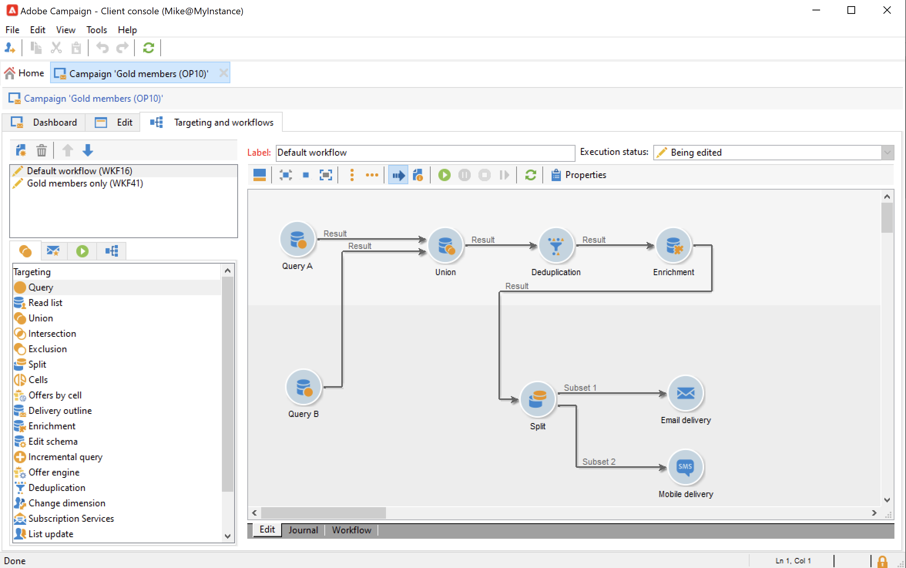
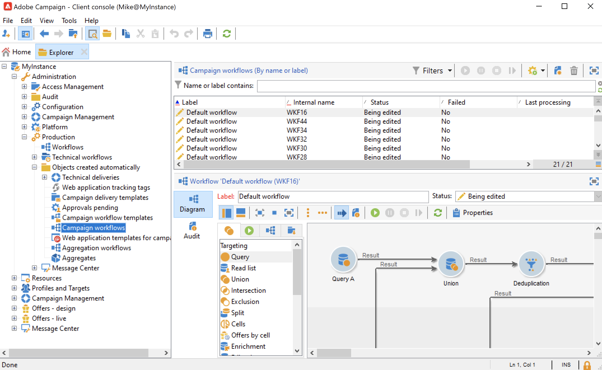

# Kampagnen-Workflows {#campaign-workflows}

Für jede Kampagne können Sie Workflows erstellen, die über die Registerkarte Zielgruppenbestimmungen **[!UICONTROL Workflows ausgeführt]**. Diese Workflows sind kampagnenspezifisch.

Dieser Tab enthält dieselben Aktivitäten für alle Workflows. [Mehr dazu](#implementation-steps-)

Zusätzlich zur Zielgruppenbestimmung von Kampagnen ermöglichen Kampagnen-Workflows die Erstellung und Konfiguration von Sendungen vollständig für alle verfügbaren Kanäle. Sobald sie im Workflow erstellt wurden, sind diese Sendungen im Dashboard der Kampagne verfügbar.

Alle Kampagnen-Workflows werden zentral im Knoten **[!UICONTROL Administration > Betreibung > Automatisch erstellte Objekte > Kampagnen-Workflows]** gespeichert.

Ausführliche Informationen zu Campaign-Workflows und Implementierungsbeispiele finden Sie in [diesem Abschnitt](../campaigns/marketing-campaign-target.md).
