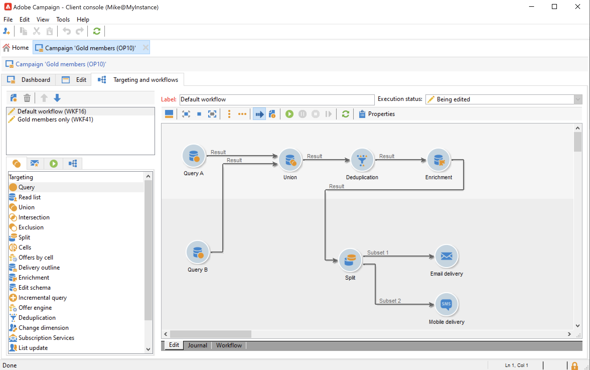

# Kampagnen-Workflows {#campaign-workflows}

Sie können für jede Kampagne Workflows erstellen, die über den Tab **[!UICONTROL Zielbestimmungen und Workflows]** ausgeführt werden. Workflows gelten nur für die jeweilige Kampagne.

Dieser Tab enthält dieselben Aktivitäten für alle Workflows. [Mehr dazu](#implementation-steps-)

Neben der Zielgruppenbestimmung ermöglichen Kampagnen-Workflows die Erstellung und Konfiguration aller Sendungen einer Kampagne, unabhängig vom gewählten Kanal. Diese Sendungen sind nach ihrer Erstellung über das Dashboard der Kampagne verfügbar.

Alle Kampagnen-Workflows werden zentral im Knoten **[!UICONTROL Administration > Betreibung > Automatisch erstellte Objekte > Kampagnen-Workflows]** gespeichert.

Kampagnen-Workflows und Implementierungsbeispiele werden im Abschnitt [diesem Abschnitt](../campaigns/marketing-campaign-target.md).
