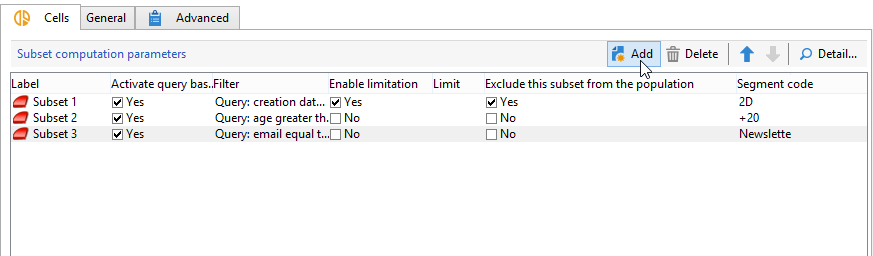
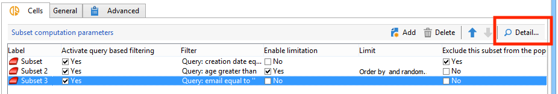
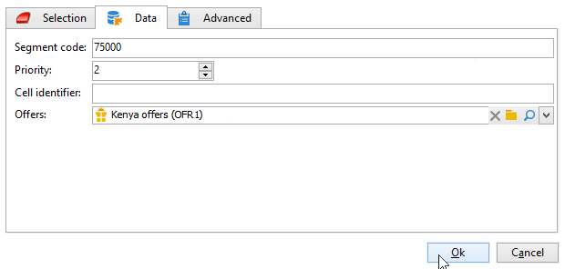

# Segmente{#cells}

Die Aktivität **[!UICONTROL Segmente]** bietet eine Ansicht der verschiedenen Teilmengen in Form von Datenspalten. Dies erleichtert die Bearbeitung von Teilmengen und ermöglicht die Nutzung von Personalisierungsfunktionen.



Diese Aktivität kann so konfiguriert werden, dass bestimmte Parameter entsprechend den Benutzeranforderungen eingegeben werden. Standardmäßig werden die Details der einzelnen Teilmengen in einem eigenen Fenster über die Registerkarten **[!UICONTROL Segmente]** und **[!UICONTROL Erweitert]** angezeigt.



Im folgenden Beispiel wurde das Eingabeformular geändert: Es wurde die Registerkarte **[!UICONTROL Daten]** hinzugefügt, um für jede Teilmenge die Zuordnung eines Angebots und einer Prioritätsstufe zu ermöglichen.



Für diese Konfiguration wurden im Knoten **[!UICONTROL Administration > Konfigurationen > Eingabeformulare]** des Explorers von Adobe Campaign die folgenden Informationen zum Workflow-Formular hinzugefügt:

```
<container img="nms:miniatures/mini-enrich.png" label="Data">
                <input xpath="@code"/>
                <container xpath="select/node[@alias='@numTest']">
                  <input alwaysActive="true" expr="'long'" type="expr" xpath="@type"/>
                  <input alwaysActive="true" expr="'Priority'" type="expr" xpath="@label"/>
                  <input label="Priority" maxValue="12" minValue="0" type="number"
                         xpath="@value" xpathEditFromType="@type"/>
                </container>
                <container xpath="select/node[@alias='@test']">
                  <input alwaysActive="true" expr="'string'" type="expr" xpath="@type"/>
                  <input alwaysActive="true" expr="'Identifier'" type="expr" xpath="@label"/>
                  <input label="Cell identifier" xpath="@value"/>
                </container>
                <container xpath="select/node[@alias='linkTest']">
                  <input alwaysActive="true" expr="'link'" type="expr" xpath="@type"/>
                  <input alwaysActive="true" expr="'nms:offer'" type="expr" xpath="@dataType"/>
                  <input alwaysActive="true" expr="'Offre'" type="expr" xpath="@label"/>
                  <input computeStringAlias="@valueLabel" label="Offers" notifyPathList="@_cs|@valueLabel"
                         schema="nms:offer" type="linkEdit" xpath="@value"/>
                </container>
```

Die Personalisierung von Eingabeformularen sollte erfahrenen Personen vorbehalten bleiben.