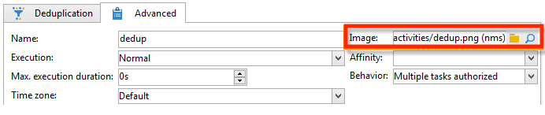

# Ändern von Aktivitätsbildern{#change-activity-images}

Die in Workflow-Diagrammen verwendeten Bilder können angepasst werden. Sie müssen jedoch gewisse Auflagen erfüllen. Gehen Sie wie folgt vor:

* Gehen Sie zur Wahl eines anderen Hintergrundbilds in den betroffenen Workflow und klicken Sie auf die Schaltfläche **[!UICONTROL Eigenschaften]**.

   

   Das Symbol **[!UICONTROL Verknüpftes Element auswählen]** rechts vom Feld **[!UICONTROL Hintergrundbild]** ermöglicht die Auswahl eines neuen Bilds.

   >[!NOTE]
   >
   >Die Breite des Hintergrundbilds muss ein Vielfaches von 4 Pixeln betragen.

   

   Klicken Sie auf **[!UICONTROL Verknüpftes Element öffnen]**, um eine Vorschau des neuen Bilds anzuzeigen.

* Bilder von Aktivitäten können angepasst werden, indem Sie auf dem entsprechenden Objekt einen Doppelklick machen. Gehen Sie dann in den **[!UICONTROL Erweitert]**-Tab.

   Das Symbol **[!UICONTROL Verknüpftes Element auswählen]** rechts vom Feld **[!UICONTROL Bild]** ermöglicht die Auswahl eines neuen Bilds.

   

   Klicken Sie auf **[!UICONTROL Verknüpftes Element öffnen]**, um eine Vorschau des neuen Bilds anzuzeigen.

   

>[!NOTE]
>
>Um verfügbar zu sein, müssen die Bilder im Knoten **[!UICONTROL Administration > Konfiguration > Bilder]** des Navigationsbaums gespeichert werden.
>  
>Sie müssen im Format PNG mit einer Größe von 48 x 48 Pixeln, mit 16 Mio. Farben und einem transparenten Hintergrund vorliegen.
