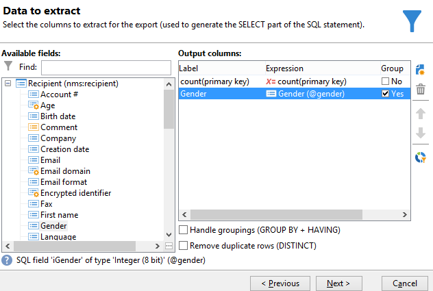
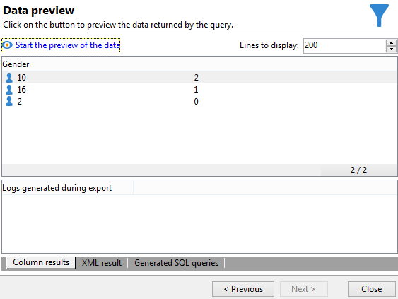

# Durchführen der Aggregat-Berechnung {#performing-aggregate-computing}

In diesem Beispiel wird die Anzahl der Empfänger gesucht, die in Berlin wohnen, geordnet nach Geschlecht.

* Welche Tabelle soll ausgewählt werden?

   Die Empfängertabelle (**nms:recipient**)

* Welche Felder sollen in der Ausgabespalte ausgewählt werden?

   Primärschlüssel (mit Zählung) und Geschlecht

* Nach welchen Kriterien sind die Empfänger zu filtern?

   Empfänger, die in Berlin wohnhaft sind

Gehen Sie wie folgt vor:

1. Konfigurieren Sie im Fenster **[!UICONTROL Zu extrahierende Daten]** wie im vorangehenden Beispiel eine Primärschlüssel-Zählung. Fügen Sie das Feld **[!UICONTROL Geschlecht]** zu den Ausgabespalten hinzu. Kreuzen Sie die Option **[!UICONTROL Gruppieren]** der Spalte **[!UICONTROL Geschlecht]** an. Auf diese Weise werden die Empfänger nach Geschlecht angeordnet.

   

1. In diesem Beispiel ist keine **[!UICONTROL Sortierung]** erforderlich. Sie können somit direkt auf **[!UICONTROL Weiter]** klicken.
1. Konfigurieren Sie nun die Filterbedingung. Hier soll die Auswahl auf Empfänger beschränkt werden, die in Berlin wohnen.

   

   >[!NOTE]
   >
   >Bei der Angabe von Werten ist die Groß- und Kleinschreibung zu beachten. Wenn Sie z. B. &#39;berlin&#39; eingeben, die Stadt Berlin in der Empfängerliste jedoch großgeschrieben ist, wird die Abfrage keine Ergebnisse ausgeben.

1. Auch im Fenster **[!UICONTROL Datenformatierung]** können Sie direkt auf **[!UICONTROL Weiter]** klicken.
1. Klicken Sie anschließend auf **[!UICONTROL Datenvorschau starten]**.

   Bei einer Sortierung nach Geschlecht sind drei verschiedene Werte möglich: **2** für weiblich, **1** für männlich und **0**, wenn das Geschlecht nicht angegeben wurde. Diese Liste enthält 31 Frauen, 38 Männer und 1 Person ohne Geschlechtsangabe.

   
