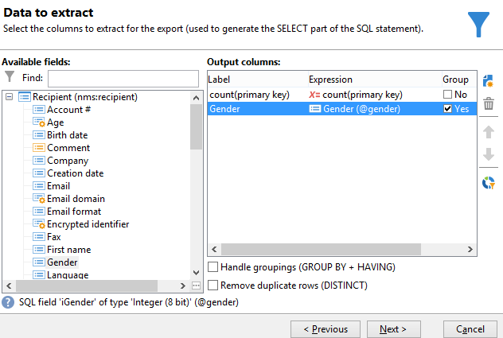
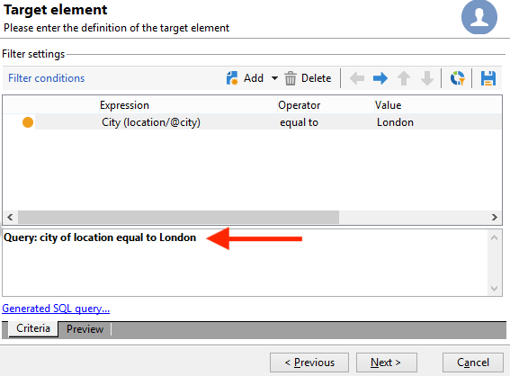
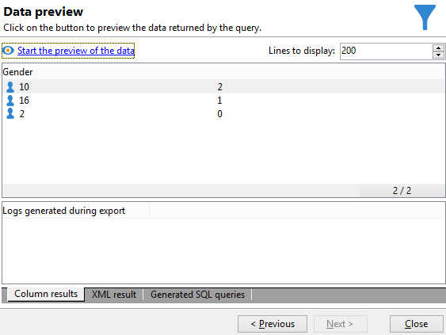

# Durchführen der Aggregat-Berechnung {#performing-aggregate-computing}

In diesem Beispiel wird die Anzahl der Empfänger gesucht, die in Berlin wohnen, geordnet nach Geschlecht.

* Welche Tabelle soll ausgewählt werden?

  Die Empfängertabelle (**nms:recipient**)

* Welche Felder sollen in der Ausgabespalte ausgewählt werden?

  Primärschlüssel (mit Zählung) und Geschlecht

* Nach welchen Kriterien sind die Empfänger zu filtern?

  Empfänger, die in Berlin wohnhaft sind

Gehen Sie wie folgt vor:

1. Konfigurieren Sie im Fenster **[!UICONTROL Zu extrahierende Daten]** wie im vorangehenden Beispiel eine Primärschlüssel-Zählung. Fügen Sie das Feld **[!UICONTROL Geschlecht]** zu den Ausgabespalten hinzu. Kreuzen Sie die Option **[!UICONTROL Gruppieren]** der Spalte **[!UICONTROL Geschlecht]** an. Auf diese Weise werden die Empfänger nach Geschlecht angeordnet.

   

1. In diesem Beispiel ist keine **[!UICONTROL Sortierung]** erforderlich. Sie können somit direkt auf **[!UICONTROL Weiter]** klicken.
1. Konfigurieren Sie einen Datenfilter. Hier möchten Sie die Auswahl auf Kontakte beschränken, die in London leben.

   

   >[!NOTE]
   >
   >Bei Werten wird zwischen Groß- und Kleinschreibung unterschieden. Wenn der Wert „London“ in die Bedingung ohne Großbuchstaben eingegeben wird und die Empfängerliste das Wort „London“ mit einem Großbuchstaben enthält, schlägt die Abfrage fehl.

1. Auch im Fenster **[!UICONTROL Datenformatierung]** können Sie direkt auf **[!UICONTROL Weiter]** klicken.
1. Klicken Sie anschließend auf **[!UICONTROL Datenvorschau starten]**.

   Es gibt drei separate Werte für jede Sortierung nach Geschlecht: **2** für weiblich, **1** für männlich und **0** wenn das Geschlecht unbekannt ist. In diesem Beispiel enthält die Liste 10 Frauen, 16 Männer und 2 Personen, deren Geschlecht nicht bekannt ist.

   
