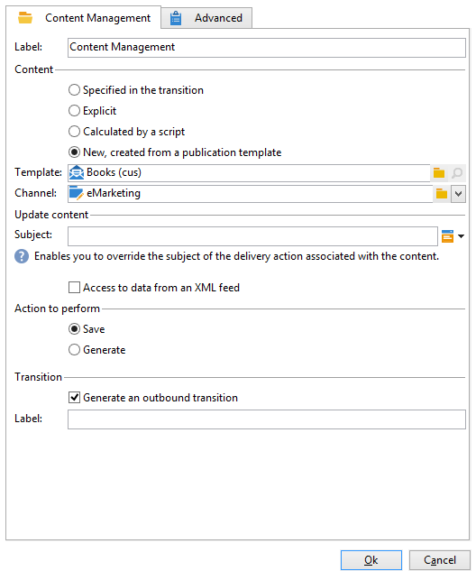

# Content Management{#content-management}

Mithilfe der Aktivität **Content Management** lassen sich Inhalte erstellen und bearbeiten sowie Inhaltsdateien erzeugen. Die Inhalte können dann im Ramen einer Versandaktivität genutzt werden.

>[!CAUTION]
>
>Das Content Management ist ein optionales Modul von Adobe Campaign. Bitte prüfen Sie Ihren Lizenzvertrag.

Die Konfiguration der Aktivität gliedert sich in drei Schritte:

* **Inhalt auswählen**: Der Inhalt kann zuvor erstellt worden sein oder in der Aktivität erstellt werden.
* **Inhalt aktualisieren**: Die Aufgabe kann den Betreff des Inhalts ändern oder den gesamten XML-Inhalt importieren.
* **Auszuführende Aktion**: Der Inhalt kann gespeichert oder erzeugt werden.

  

1. **Content**

   * **[!UICONTROL Wird durch die Transition angegeben]**

     Bei Auswahl dieser Option wird der durch die eingehende Transition übermittelte Inhalt verwendet. Dies bedeutet, dass das Ereignis, welches das Content Management aktiviert, eine **[!UICONTROL contentId]**-Variable enthalten muss. Diese kann durch eine vorangehende Content-Management-Aktivität oder durch ein beliebiges Script bestimmt worden sein.

   * **[!UICONTROL Explizit]**

     Mit dieser Option können Sie einen bereits erstellten Inhalt über die **[!UICONTROL Inhalt]** -Feld. Dieses Feld ist nur sichtbar, wenn die **[!UICONTROL Explizit]** ausgewählt ist.

     

   * **[!UICONTROL Wird durch ein Script erstellt]**

     Die Kennung des Inhalts wird mithilfe eines Skripts berechnet. Die **[!UICONTROL Skript]** -Feld können Sie eine JavaScript-Vorlage definieren, die die Kennung (den Primärschlüssel) des Inhalts auswertet. Dieses Feld ist nur sichtbar, wenn die **[!UICONTROL Wird durch ein Skript berechnet]** ausgewählt ist.

     

   * **[!UICONTROL Neu, basierend auf einer Veröffentlichungsvorlage erstellt]**

     Erstellt ausgehend von einer Veröffentlichungsvorlage einen neuen Inhalt. Dieser neue Inhalt wird in der Datei gespeichert, die im **[!UICONTROL Zeichenfolge]** -Feld. Die **[!UICONTROL Vorlage]** gibt die Veröffentlichungsvorlage an, die zum Erstellen des Inhalts verwendet werden soll.

     

1. **Bereich Inhalt aktualisieren**

   * **[!UICONTROL Betreff]**

     Hier kann der Betreff der dem Inhalt entsprechenden Versandaktion überschrieben werden.

   * **[!UICONTROL Zugriff auf Daten eines XML-Streams]**

     Mit dieser Option können Sie den Inhalt aus einem XML-Dokument erstellen, das über ein XSL-Stylesheet heruntergeladen wurde. Wenn diese Option ausgewählt ist, wird die **[!UICONTROL URL]** gibt das XML-Inhalts-Download-URL an. Die **[!UICONTROL XSL-Stylesheet]** ermöglicht die Angabe des Stylesheets, das für die Umwandlung des heruntergeladenen XML-Dokuments verwendet werden soll. Diese Eigenschaft ist optional.

     

1. **Auszuführende Aktion**

   * **[!UICONTROL Speichern]**

     Der erstellte oder geänderte Inhalt wird gespeichert.

     In diesem Fall wird die ausgehende Transition einmal aktiviert. In der Variable **[!UICONTROL contentId]** wird die Kennung des Inhalts gespeichert.

   * **[!UICONTROL Erzeugen]**

     Der Inhalt wird gespeichert und die Ausgabedateien für alle Umwandlungsvorlagen mit dem Veröffentlichungstyp &#39;Datei&#39; werden erzeugt.

     

     In diesem Fall wird die ausgehende Transition für jede erzeugte Datei aktiviert. In der Variable **[!UICONTROL contentId]** wird die Kennung des Inhalts und in der Variable **[!UICONTROL filename]** der Name der Datei gespeichert.

## Eingabeparameter {#input-parameters}

* contentId

Kennung des zu verwendenden Inhalts, wenn die Option **[!UICONTROL Wird durch die Transition angegeben]** ausgewählt wurde.

## Ausgabeparameter {#output-parameters}

* contentId

  Kennung des Inhalts.

* filename

  Vollständiger Name der erzeugten Datei, wenn die Aktion **[!UICONTROL Erzeugen]** ausgewählt wurde.
