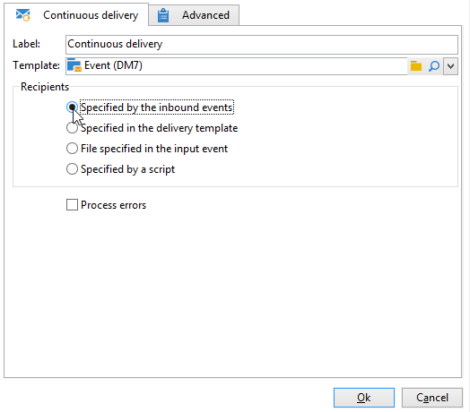
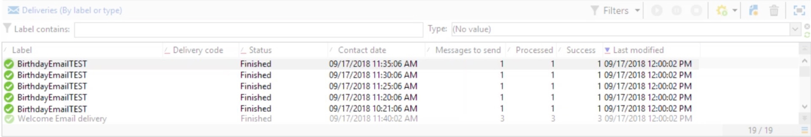

# Versand (fortlaufend){#continuous-delivery}

Mit **Aktion** fortlaufender Versand“ können Sie einem bestehenden Versand neue Empfänger hinzufügen. Durch diesen Versand müssen Sie nicht jedes Mal einen neuen Versand erstellen. Dieser Modus ist häufig effizienter, insbesondere bei Warnungen oder Benachrichtigungen mit geringem Volumen, die bei Bedarf gesendet werden.

 [Funktion im Video kennenlernen](#continuous-delivery-video).

Auf der Ebene der Versandvorlagen können Sie ein Script zur Berechnung der Beschriftung (und des Kampagnenordners) des zugehörigen Versands angeben. Wenn das Script einen Versand berechnet, der noch nicht vorhanden ist, wird er sofort erstellt.

Die Option **[!UICONTROL Fehler verarbeiten]** zeigt eine bestimmte Transition an, die aktiviert wird, wenn ein Fehler erzeugt wird. In diesem Fall wechselt der Workflow nicht in den Fehlermodus und wird anschließend ausgeführt.

Dies gilt für Fehler des Dateisystems (Datei kann nicht verschoben werden, Zugriff auf das Verzeichnis nicht möglich usw.).

Fehler, die aus der Konfiguration der Aktivität resultieren, beispielsweise durch Angabe von ungültigen Werten (z. B. inexistentes Verzeichnis), werden nicht verarbeitet.

## Eingabeparameter {#input-parameters}

* tableName
* schema

Jedes eingehende Ereignis muss eine durch diese Parameter definierte Zielgruppe angeben.

Dies gilt nur, wenn die Option **[!UICONTROL Wird durch das Eingangsereignis angegeben]** angekreuzt wurde.

## Ausgabeparameter {#output-parameters}

* tableName
* schema
* recCount

Anhand der drei Werte lässt sich die durch den unmittelbaren Versand ermittelte Zielgruppe identifizieren. **[!UICONTROL tableName]** ist der Name der Tabelle, die die Zielkennungen speichert, **[!UICONTROL schema]** ist das Schema der Population (normalerweise nms:recipient) und **[!UICONTROL recCount]** die Anzahl der Elemente in der Tabelle.

Die Transition des Komplements weist die gleichen Parameter auf.

## Einrichten eines Versands (fortlaufend)

In diesem Abschnitt wird beschrieben, wie Sie einen Versand (fortlaufend) einrichten.

Beim **fortlaufenden Versand** können Sie einem bestehenden Versand neue Empfänger hinzufügen, sodass Sie nicht jedes Mal einen neuen Versand erstellen müssen, wenn ein neuer Empfänger hinzugefügt wird. Sie können die kreativen Inhalte direkt im Kampagnen-Workflow aktualisieren, wodurch die Vorlage im Ressourcen-Ordner für Versandvorlagen aktualisiert wird.

Bei einem fortlaufenden Versand wird EIN Versand erstellt. Versandlogs (Broadlog) und Trackinglogs, die auf diesen Versand verweisen, werden bei jeder Ausführung hinzugefügt.

## Anleitungsvideo {#continuous-delivery-video}

In diesem Video wird gezeigt, wie Sie einen fortlaufenden Versand mit einer inkrementellen Abfrage konfigurieren.

>[!VIDEO](https://video.tv.adobe.com/v/25039?quality=12)

Weitere Anleitungsvideos zu Campaign finden Sie [hier](https://experienceleague.adobe.com/docs/campaign-learn/tutorials/getting-started/introduction-to-adobe-campaign.html?lang=de){target="_blank"}.
