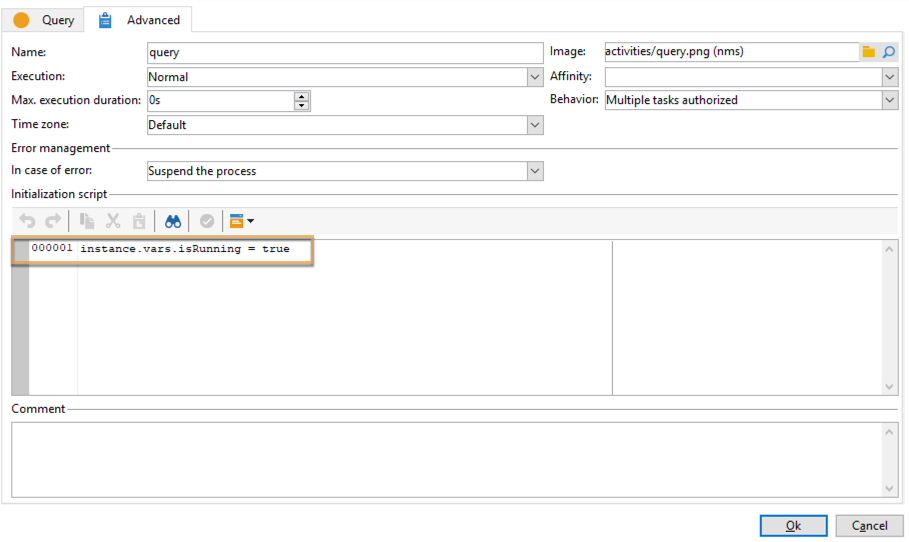

# Koordinieren von Datenaktualisierungen{#coordinating-data-updates}

Das folgende Anwendungsbeispiel erläutert die Erstellung eines Workflows, mit dem begleitende Aktualisierungen bei der mehrmaligen Ausführung eines Workflows verwaltet werden können.

Dabei muss sichergestellt werden, dass eine Aktualisierung beendet ist, bevor eine weitere durchgeführt wird. Wir werden zu diesem Zweck eine Instanzvariable erstellen und im Workflow testen, ob die Instanz ausgeführt wird, um zu entscheiden, ob die Ausführung des Workflows fortgesetzt und die Aktualisierung durchgeführt werden soll.

Der vorliegende Workflow besteht aus folgenden Aktivitäten:

* **Planung:** Hiermit wird der Workflow zu bestimmten Zeiten durchgeführt.
* **Test:** Hiermit wird geprüft, ob der Workflow bereits ausgeführt wird.
* **Abfrage** und **Daten-Update:** falls der Workflow noch nicht ausgeführt wird; gefolgt von der Aktivität **Ende,** durch die die Instanzvariable des Workflows auf false zurückgesetzt wird.
* **Ende:** falls der Workflow bereits ausgeführt wird.

Gehen Sie zur Erstellung des Workflows wie folgt vor:

1. Fügen Sie die Aktivität **Planung** hinzu und konfigurieren Sie deren Häufigkeit nach Bedarf.
1. Fügen Sie die Aktivität **Test** hinzu, um zu prüfen, ob der Workflow bereits durchgeführt wird, und konfigurieren Sie sie gemäß den unten stehenden Angaben.

   >[!NOTE]
   >
   >&quot;isRunning&quot; ist die für dieses Beispiel ausgewählte Instanzvariable, und keine integrierte Variable.

   

1. Fügen Sie zur **Nein**-Verzweigung die Aktivität **Ende** hinzu, damit nichts ausgeführt wird, falls der Workflow bereits ausgeführt wird.
1. Fügen Sie die gewünschten Aktivitäten zur **Ja**-Verzweigung hinzu. Für unser Beispiel sind dies die Aktivitäten **Abfrage** und **Daten-Update**.
1. Öffnen Sie die erste Aktivität und fügen Sie den Befehl **instance.vars.isRunning = true** auf dem Tab **[!UICONTROL Erweitert]** hinzu. Auf diese Weise wird die Instanzvariable auf „wird ausgeführt“ gesetzt.

   

1. Fügen Sie am Ende der **[!UICONTROL Ja]**-Verzweigung eine **Ende**-Aktivität an und geben Sie danach den Befehl **instance.vars.isRunning = false** im Tab **[!UICONTROL Erweitert]** ein.

   Dadurch wird keine Aktion aufgeführt, solange der Workflow ausgeführt wird.

   

**Verwandte Themen:**

* [Mehrere gleichzeitige Ausführungen verhindern](monitor-workflow-execution.md#preventing-simultaneous-multiple-executions)
* [Aktivität &quot;Daten-Update&quot;](update-data.md)
