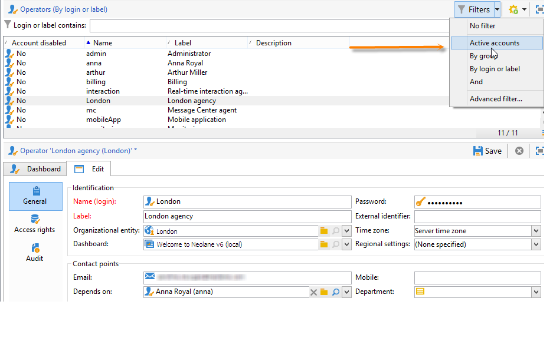
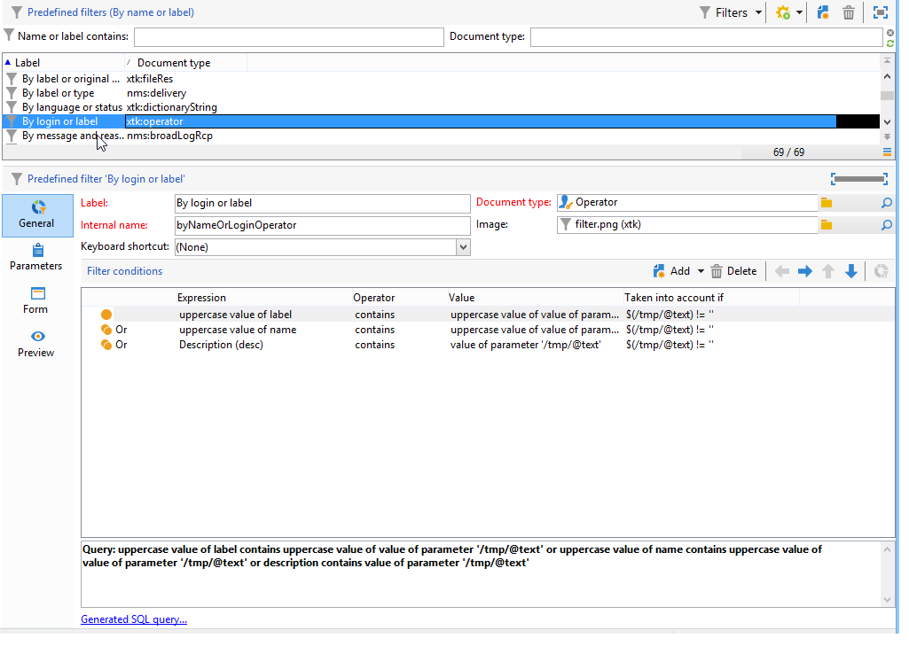
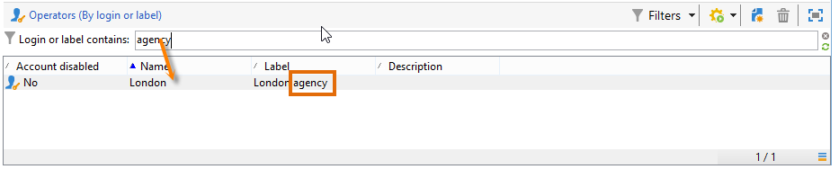
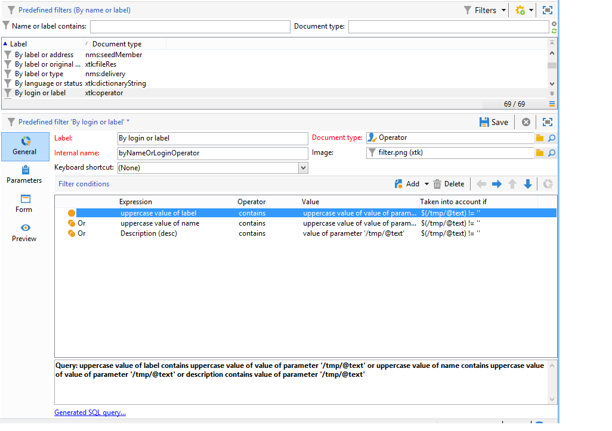
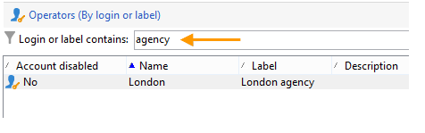

# Erstellen von Filtern {#creating-a-filter}

Die in Adobe Campaign verfügbaren Filter werden über Filterbedingungen definiert, die mit demselben Betriebsmodus erstellt werden wie beim Erstellen von Abfragen im [Abfrage-Editor](../../v8/start/query-editor.md).

Der Knoten **[!UICONTROL Administration > Konfiguration > Vordefinierte Filter]** enthält alle Standardfilter. Einige davon werden in Listen und Übersichten verwendet. Weitere Informationen über [integrierte vordefinierte Filter](../../v8/audiences/create-filters.md).

Beispielsweise kann die Benutzerliste nach **[!UICONTROL Aktiven Konten]** gefiltert werden:

Der entsprechende Filter enthält die Abfrage bezüglich des Werts **[!UICONTROL Gesperrtes Konto]** des **[!UICONTROL Benutzer]**-Schemas:

Dieselbe Liste kann mit dem Filter **[!UICONTROL Nach Login oder Titel]** nach dem im Eingabefeld erfassten Wert durchsucht werden:

Dieser Filter wird wie folgt konfiguriert:

Um dem Filter zu entsprechen, muss das Benutzerkonto eine der folgenden Bedingungen erfüllen:

* Der Titel enthält die im Eingabefeld erfassten Zeichen;
* der Benutzername enthält die im Eingabefeld erfassten Zeichen;
* die Beschreibung enthält die im Eingabefeld erfassten Zeichen.

>[!NOTE]
>
>Bei Verwendung der Funktion **[!UICONTROL Upper]** werden bei einer Abfrage Groß- und Kleinschreibung nicht beachtet.

Die Spalte **[!UICONTROL Berücksichtigt wenn]** ermöglicht die Konfiguration von Voraussetzungen dafür, dass die Filterbedingungen zum Tragen kommen. Die Zeichen **$(/tmp/@text)** entsprechen dem Inhalt des dem Filter zugeordneten Eingabefelds:

Hier ist **$(/tmp/@text)=&#39;Filiale&#39;**.

Der Ausdruck **$(/tmp/@text)!=&#39;&#39;** wendet jede Bedingung an, wenn das Eingabefeld nicht leer ist.
