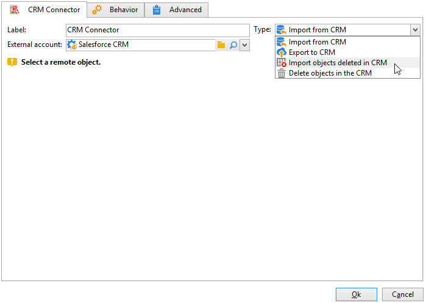
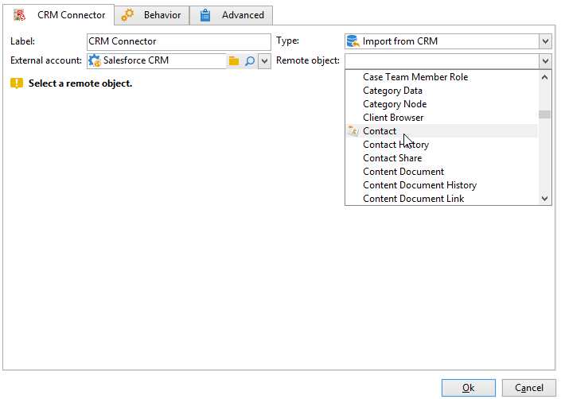

# CRM-Connector{#crm-connector}

Die Aktivität **CRM-Connector** ermöglicht die Konfiguration einer Datensynchronisation zwischen Adobe Campaign und einem CRM-System.

Mit dieser Aktivität können Sie folgende Aufgaben erledigen:

* Import aus dem CRM
* Export in das CRM
* Import der im CRM gelöschten Objekte
* Löschung von Objekten im CRM

Wählen Sie zunächst das externe Konto aus, das dem CRM-System entspricht, mit dem Sie eine Synchronisation konfigurieren möchten, und anschließend das zu synchronisierende Objekt (Konten, Opportunities, Kontakte etc.).

Weiterführende Informationen zu CRM-Connectoren in Adobe Campaign finden Sie in [diesem Abschnitt](https://experienceleague.adobe.com/docs/campaign/campaign-v8/connect/ac-crm/crm.html?lang=de){target="_blank"}.
