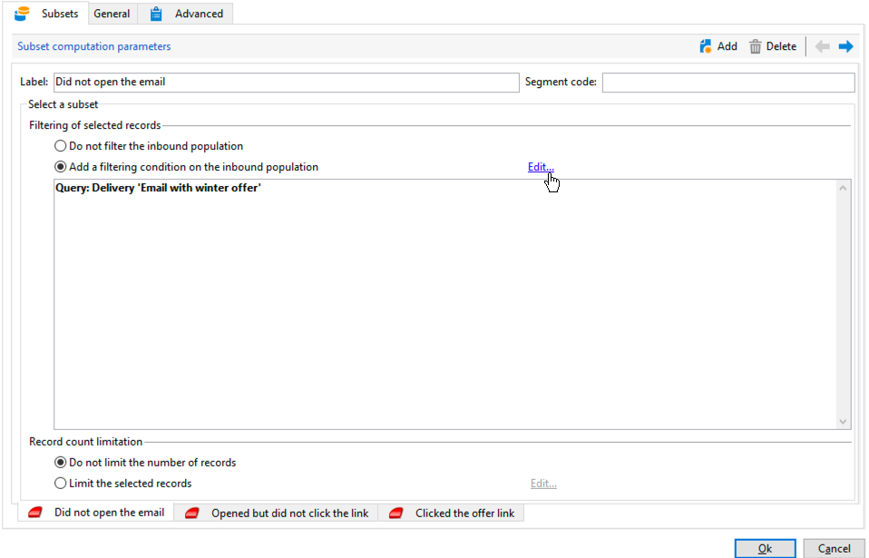

# Workflow für einen kanalübergreifenden Versand{#cross-channel-delivery-workflow}

In diesem Anwendungsbeispiel wird ein Workflow zum kanalübergreifenden Versand beschrieben. Das allgemeine Konzept kanalübergreifender Sendungen finden Sie in [diesem Abschnitt](cross-channel-deliveries.md).

Das Ziel besteht darin, aus den Empfängern der Datenbank eine Audience auszuwählen und diese in gesonderte Gruppen zu unterteilen, um der einen Gruppe eine E-Mail und der anderen Gruppe eine SMS zukommen zu lassen.

Die Umsetzung des Anwendungsbeispiels gliedert sich in folgende Schritte:

1. Erstellen der Aktivität **[!UICONTROL Abfrage]**, um eine Audience auszuwählen.
1. Erstellen der Aktivität **[!UICONTROL E-Mail-Versand]**, wobei die Nachricht einen Link zu einem Angebot enthalten soll.
1. Verwenden der Aktivität **[!UICONTROL Aufspaltung]**, um:

   * Den Empfängern, die die erste E-Mail nicht geöffnet haben, eine weitere zu senden.
   * Den Empfängern, die die E-Mail geöffnet, aber nicht auf den Link zum Angebot geklickt haben, eine SMS zu senden.
   * Die Empfänger, die die E-Mail geöffnet und den Link angeklickt haben, zur Datenbank hinzuzufügen.

## Schritt 1: Auswählen einer Audience {#step-1--targeting-the-audience}

Um Ihre Zielgruppe zu bestimmen, erstellen Sie eine Abfrage zur Identifizierung der Empfänger.

1. Kampagne erstellen. Weitere Informationen hierzu finden Sie im Abschnitt  .
1. Fügen Sie im Tab **[!UICONTROL Zielbestimmungen und Workflows]** Ihrer Kampagne eine **Abfrage-** Aktivität zu Ihrem Workflow hinzu. Weiterführende Informationen zur Verwendung dieser Aktivität finden Sie in [diesem Abschnitt](query.md).
1. Definieren Sie die Empfänger, die Ihre Sendungen erhalten sollen. Wählen Sie beispielsweise Gold-Mitglieder als Zieldimension aus.
1. Fügen Sie Filterbedingungen zu Ihrer Abfrage hinzu. Wählen Sie in diesem Beispiel Empfänger, die eine E-Mail-Adresse und eine Mobiltelefonnummer haben.

   

1. Speichern Sie Ihre Änderungen.

## Schritt 2: Erstellen einer E-Mail mit einem Angebot {#step-2--creating-an-email-including-an-offer}

1. Erstellen Sie ein ** .
1. Gestalten Sie die Nachricht und fügen Sie einen Link einschließlich eines Angebots in den Inhalt ein.

   

   Weiterführende Informationen zur Integration von Angeboten in den Nachrichten-Textkörper finden Sie im Abschnitt .

1. Speichern Sie Ihre Änderungen.
1. Klicken Sie mit der rechten Maustaste auf die Aktivität **[!UICONTROL E-Mail-Versand]**, um sie zu öffnen.
1. Wählen Sie die Option **[!UICONTROL Ausgehende Transition erzeugen]** aus, um die Population und die Trackinglogs abzurufen.

   

   Mit diesen Informationen können Sie abhängig vom Verhalten des Empfängers beim Erhalt der ersten E-Mail eine weitere Nachricht senden.

1. Fügen Sie eine **[!UICONTROL Warten]**-Aktivität hinzu, um dem Empfänger einige Tage Zeit zu geben, die E-Mail zu öffnen.

   

## Schritt 3: Segmentieren der resultierenden Audience {#step-3--segmenting-the-resulting-audience}

Sobald Ihre Zielgruppe feststeht und Ihr erster Versand bereit ist, müssen Sie die Zielgruppe mithilfe von Filterbedingungen in unterschiedliche Populationen unterteilen.

1. Fügen Sie zum Workflow die Aktivität **Aufspaltung** hinzu und öffnen Sie sie. Weiterführende Informationen zur Verwendung dieser Aktivität finden Sie in [diesem Abschnitt](split.md).
1. Erstellen Sie aus der zuvor in der Abfrage berechneten Population drei Segmente.

   

1. Wählen Sie für die erste Teilmenge die Option **[!UICONTROL Filterbedingung für die Eingangspopulation hinzufügen]** aus und danach **[!UICONTROL Bearbeiten]**.

   

1. Wählen Sie **[!UICONTROL Versandempfänger]** als den Einschränkungsfilter und danach **[!UICONTROL Weiter]** aus.

   

1. Wählen Sie in den Filterparametern in der Dropdown-Liste **[!UICONTROL Verhalten]** die Option **[!UICONTROL Empfänger, die weder geöffnet noch geklickt haben (E-Mail)]** aus. Wählen Sie danach die zu sendende E-Mail mit dem Angebot aus der Versandliste aus. Wählen Sie **[!UICONTROL Beenden]**.

   

1. Gehen Sie für die zweite Teilmenge analog vor, wählen Sie aber aus der Dropdown-Liste **[!UICONTROL Verhalten]** die Option **[!UICONTROL Empfänger, die nicht geklickt haben (E-Mail)]** aus.

   

1. Wählen Sie für die dritte Teilmenge zuerst **[!UICONTROL Filterbedingung für die Eingangspopulation hinzufügen]** und **[!UICONTROL Bearbeiten]** aus und danach die Option **[!UICONTROL Spezifische Filterdimension verwenden]**.
1. Wählen Sie aus der Dropdown-Liste **[!UICONTROL Filterdimension]** die Option **[!UICONTROL Trackinglogs der Empfänger]** aus und selektieren Sie in der **[!UICONTROL Liste der Einschränkungsfilter]** die Option **[!UICONTROL Filterbedingungen]** und wählen Sie **[!UICONTROL Weiter]** aus.

   

1. Wählen Sie die Filterbedingungen folgendermaßen aus:

   

1. Klicken Sie auf **[!UICONTROL Beenden]**, um Ihre Änderungen zu speichern.

## Schritt 4: Fertigstellen des Workflows {#step-4--finalizing-the-workflow}

1. Fügen Sie im Anschluss an die drei Teilmengen aus der Aktivität **[!UICONTROL Aufspaltung]** die jeweiligen Aktivitäten zu Ihrem Workflow hinzu:

   * Fügen Sie die Aktivität **[!UICONTROL E-Mail-Versand]** hinzu, um eine Erinnerungsmail an die erste Teilmenge zu senden.
   * Fügen Sie die Aktivität **[!UICONTROL Mobiltelefon-Versand]** hinzu, um eine SMS an die zweite Teilmenge zu senden.
   * Fügen Sie die Aktivität **[!UICONTROL Listen-Update]** hinzu, um die entsprechenden Empfänger zur Datenbank hinzuzufügen.

1. Doppelklicken Sie auf die Versandaktivitäten in Ihrem Workflow, um sie zu bearbeiten. Weiterführende Informationen zur Erstellung von E-Mails und SMS finden Sie im Abschnitt .
1. Doppelklicken Sie auf die Aktivität **[!UICONTROL Listen-Update]** und wählen Sie die Option **[!UICONTROL Ausgehende Transition erzeugen]** aus.

   Sie können die resultierenden Empfänger dann aus Adobe Campaign in die Adobe Experience Cloud exportieren. Beispielsweise können Sie die Zielgruppe in Adobe Target verwenden, indem Sie ein ** hinzufügen.

1. Verwenden Sie die Schaltfläche **Starten** in der Symbolleiste, um den Workflow auszuführen.

Die von der Aktivität **Abfrage** ausgewählte Population wird segmentiert und erhält je nach Empfängerverhalten eine E-Mail oder eine SMS. Die restliche Population wird mit der Aktivität **[!UICONTROL Listen-Update]** zur Datenbank hinzugefügt.
