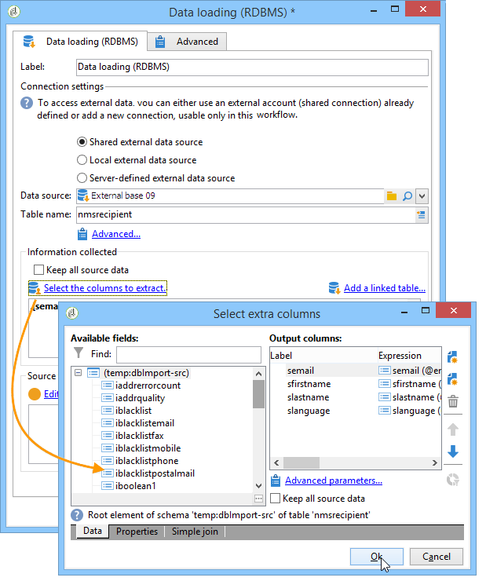

# Laden (DBMS){#data-loading-rdbms}

Die Aktivität **[!UICONTROL Laden (DBMS)]** dient dem Abruf von für die Zielgruppenbestimmung erforderlichen Daten durch Zugriff auf externe Datenbanken.

Um eine korrekte Leistung sicherzustellen, ist die Verwendung einer Abfrageaktivität vorzuziehen, die ebenfalls den Abruf externer Daten erlaubt. Weitere Informationen hierzu finden Sie unter [Zugriff auf externe Datenbanken (FDA)](accessing-an-external-database--fda-.md).

Gehen Sie wie folgt vor:

1. Wählen Sie aus der Dropdown-Liste die Datenquelle aus und geben Sie den Namen der Tabelle an, die die zu extrahierenden Daten enthält.

   

   Der Name der Tabelle dient als Vorlage zum Abruf der externen Daten. Der Name der Tabelle, die tatsächlich vom Workflow verarbeitet wird, kann berechnet oder von einer eingehenden Transition übermittelt werden. Um die zu verwendende Tabelle auszuwählen, klicken Sie auf **[!UICONTROL Erweitert...]**. und wählen Sie die Option **[!UICONTROL Wird durch die Transition angegeben]** oder **[!UICONTROL Explizit]**.

   

1. Klicken Sie auf den Link **[!UICONTROL Zu extrahierende Spalten auswählen...]**, um die abzurufenden Daten auszuwählen.

   

1. Durch Klick auf **[!UICONTROL Abfrage bearbeiten...]** können die Daten gefiltert werden.

   Derart abgerufene Daten sind im weiteren Verlauf des Workflows verwendbar.
