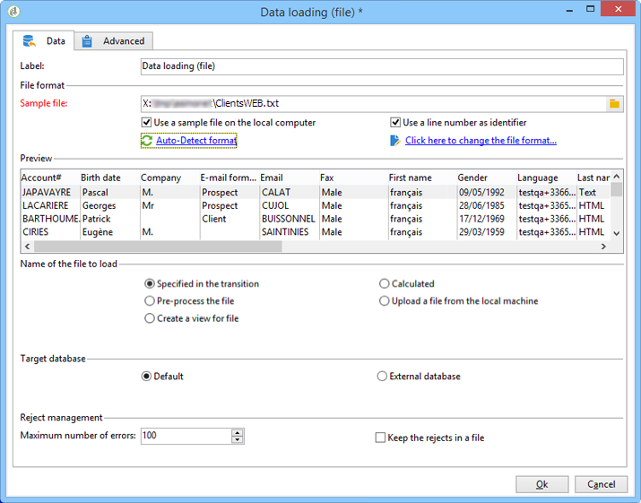
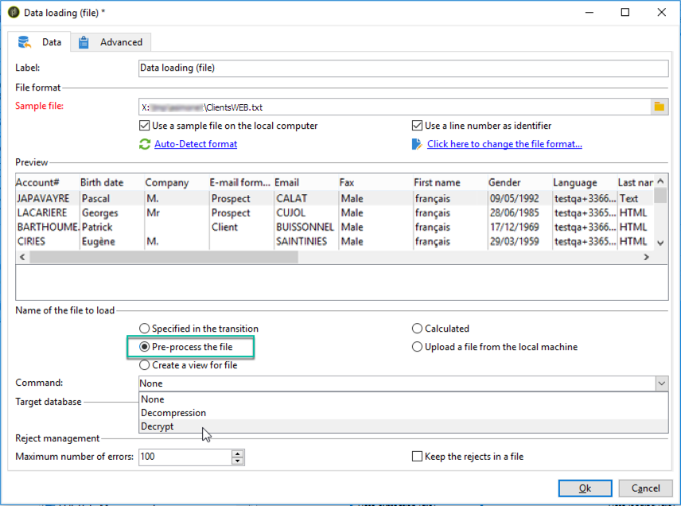
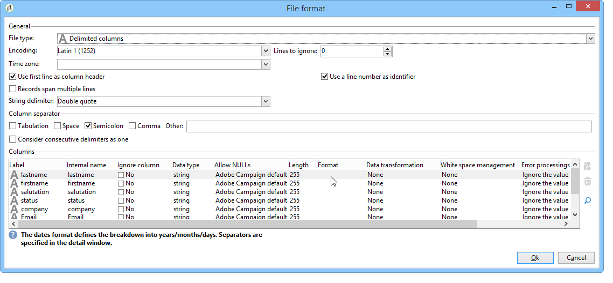
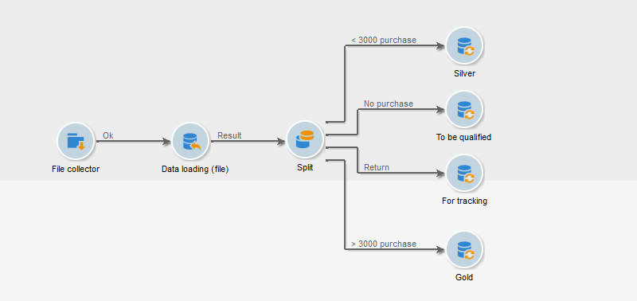
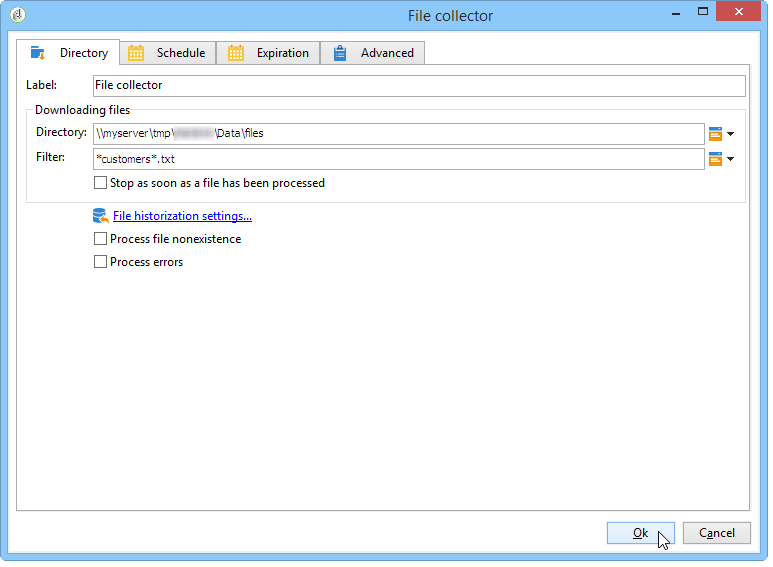
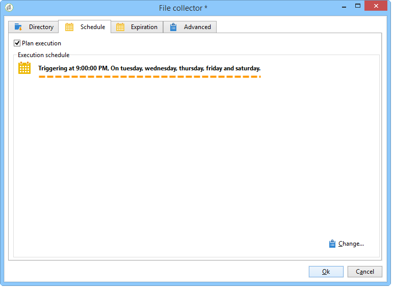
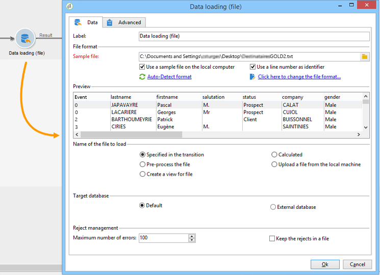
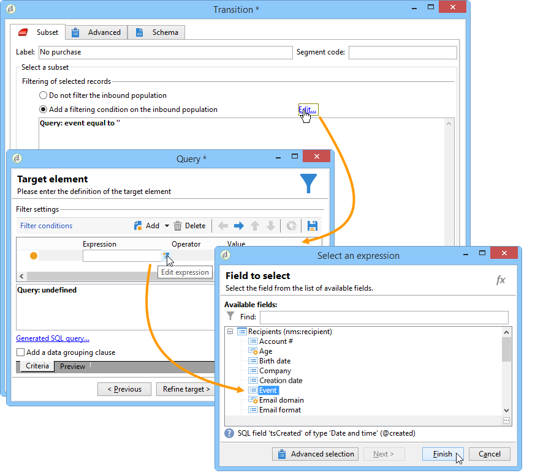
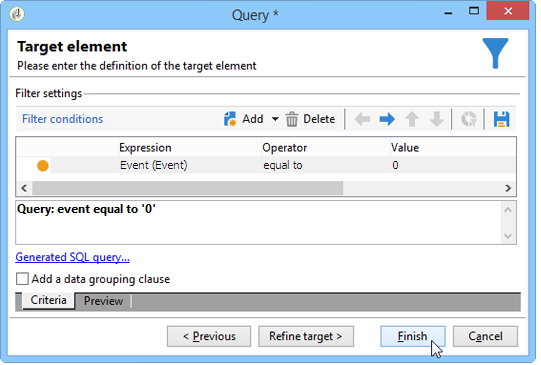
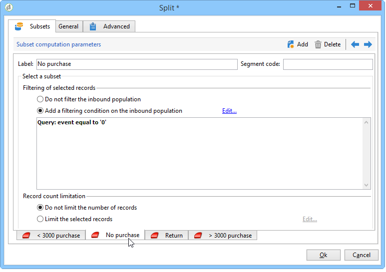

# Laden (Datei){#data-loading-file}

## Verwendung {#use}

Mit der Aktivität **[!UICONTROL Laden (Datei)]** können Sie direkt auf eine Quelle externer Daten zugreifen und diese in Adobe Campaign nutzen. So befinden sich nicht immer alle für Targeting-Vorgänge erforderlichen Daten in der Adobe Campaign-Datenbank; sie können aber in externen Dateien verfügbar gemacht werden.

Die zu ladende Datei kann durch die Transition angegeben oder während der Ausführung dieser Aktivität berechnet werden. Beispielsweise kann es sich um die Liste der 10 Lieblingsprodukte eines Kunden handeln, deren Käufe in einer externen Datenbank verwaltet werden.

Im oberen Bereich des Konfigurationsfensters für diese Aktivität können Sie das Dateiformat definieren. Verwenden Sie dazu eine Beispieldatei mit demselben Format wie die zu importierende Datei. Diese Datei kann lokal oder auf dem Server gespeichert werden.

>[!CAUTION]
>
>Unterstützt werden ausschließlich Dateiformate mit einfach strukturierten Daten (z. B. CSV, TXT etc.). Die Verwendung des XML-Formats wird nicht empfohlen. Mit der Client-Konsole können Sie Dateien mit einer Größe von bis zu 150 MB laden. In der Web-Benutzeroberfläche ist die Aktivität „Datei laden“ auf 50 MB beschränkt. [Weitere Informationen](https://experienceleague.adobe.com/docs/campaign-web/v8/wf/design-workflows/load-file.html?lang=de){target="_blank"}

Es besteht die Möglichkeit, eine Vorab-Bearbeitung zu definieren, die während des Dateiimports ausgeführt werden soll. Hierbei kann es sich z. B. darum handeln, dass die Datei nicht auf dem Server, sondern im Zuge der Dateiverarbeitung entpackt wird (was Speicherplatz für die entpackte Datei spart). Wählen Sie die Option **[!UICONTROL Datei vorab bearbeiten]** und wählen Sie dann eine der drei Optionen: **[!UICONTROL Keine]**, **[!UICONTROL Dekomprimierung]** (zcat) oder **[!UICONTROL Entschlüsseln]** (gpg).

>[!IMPORTANT]
>
>Sie können keine komprimierte Dateien entpacken, die größer als 4 GB sind.

## Datei formatieren {#defining-the-file-format}

Beim Laden einer Datei wird das Spaltenformat automatisch mit den Standardparametern für jeden Datentyp erkannt. Diese Standardparameter können angepasst werden, um einen bestimmten Umgang mit gewissen Daten vorzuschreiben, insbesondere in Bezug auf Fehler oder Leerwerte.

Wählen Sie dazu im Hauptfenster der Aktivität **&#x200B;**&#x200B;Laden (Datei)“ die Option **[!UICONTROL Hier klicken, um das Dateiformat zu ändern…]** aus. Daraufhin wird das Fenster mit den Formatdetails geöffnet.

Sie haben nun die Möglichkeit, allgemeine Formatierungsoptionen der Datei sowie das Format der einzelnen Spalten anzupassen.

In den allgemeinen Formatierungsoptionen kann beispielsweise die Art der Spaltenerkennung definiert werden (Kodierung der Datei, verwendete Trennzeichen etc.).

Verschiedene Optionen zum Umgang mit den Spaltenwerten stehen zur Auswahl:

>[!NOTE]
>
>Sie können beliebig viele Spalten hinzufügen. Die maximale Länge der Werte in jeder Spalte wird durch den ausgewählten Datentyp bestimmt.

* **[!UICONTROL Spalte ignorieren]**: Spalte wird beim Laden der Daten nicht berücksichtigt.
* **[!UICONTROL Datentyp]**: Angabe des in der Spalte erwarteten Datentyps.
* **[!UICONTROL NULL erlauben]**: Angabe des Umgangs mit leeren Werten.

   * **[!UICONTROL Adobe Campaign-Standardeinstellung]**: Erzeugt nur bei numerischen Feldern einen Fehler. Fügt bei anderen Feldern den Wert NULL ein.
   * **[!UICONTROL Leerer Wert zulässig]**: Autorisiert leere Werte. Der Wert NULL wird eingefügt.
   * **[!UICONTROL Leer nicht erlaubt]**: Erzeugung eines Fehlers bei leeren Werten.

* **[!UICONTROL Länge]**: Angabe der maximal zulässigen Anzahl an Zeichen für den Datentyp **String**.
* **[!UICONTROL Format]**: Definition des Formats von Uhrzeit und Datum.
* **[!UICONTROL Formatierung]**: Definition der Groß- und Kleinschreibung bei Daten vom Typ **String**.

   * **[!UICONTROL Keine Angabe]**: Der importierte String wird nicht geändert.
   * **[!UICONTROL Ersten Buchstaben großschreiben]**: Der erste Buchstabe aller Worte des Strings wird großgeschrieben.
   * **[!UICONTROL Großbuchstaben]**: Alle Buchstaben des Strings werden großgeschrieben.
   * **[!UICONTROL Kleinbuchstaben]**: Alle Buchstaben des Strings werden kleingeschrieben.

* **[!UICONTROL Umgang mit Leerzeichen]**: Angabe, ob gewisse Leerzeichen einem String ignoriert werden sollen. Der Wert **[!UICONTROL Leerzeichen ignorieren]** erlaubt es nur, Leerzeichen am Anfang und am Ende eines Strings zu ignorieren.
* **[!UICONTROL Umgang mit Fehlern]**: Definition des Verhaltens beim Auftritt von Fehlern.

   * **[!UICONTROL Wert ignorieren]**: Der Wert wird ignoriert. Im Ausführungsprotokoll des Workflows wird ein Hinweis erzeugt.
   * **[!UICONTROL Zeile zurückweisen]**: Die gesamte Zeile wird nicht verarbeitet.
   * **[!UICONTROL Bei Fehler Standardwert verwenden]**: Der den Fehler verursachende Wert wird durch den im Feld **[!UICONTROL Standardwert]** gespeicherten Wert ersetzt.
   * **[!UICONTROL Bei fehlender Neukodifizierung Zeile zurückweisen]**: Die gesamte Zeile wird nicht verarbeitet, es sei denn, für den fehlerhaften Wert wurde ein Mapping definiert (siehe nachfolgend die Option **[!UICONTROL Mapping]**).
   * **[!UICONTROL Bei fehlender Neukodifizierung Standardwert verwenden]**: Der den Fehler verursachende Wert wird durch den im Feld **[!UICONTROL Standardwert]** gespeicherten Wert ersetzt, es sei denn, für den fehlerhaften Wert wurde ein Mapping definiert (siehe nachfolgend die Option **[!UICONTROL Mapping]**).

* **[!UICONTROL Standardwert]**: Angabe des Standardwerts, der im Bezug auf den jeweils definierten Umgang mit Fehlern zum Tragen kommt.
* **[!UICONTROL Zuordnung]**: Dieses Feld ist nur in der Spaltendetailkonfiguration verfügbar (Zugriff erfolgt per Doppelklick oder über die Optionen rechts neben der Spaltenliste). Dadurch werden bestimmte Werte beim Importieren umgewandelt. Sie können beispielsweise &quot;drei&quot; in &quot;3&quot; umwandeln.

## Anwendungsbeispiel: Daten abrufen und in die Datenbank laden {#example--collecting-data-and-loading-it-in-the-database}

Im folgenden Beispiel können Sie täglich eine Datei auf dem Server erfassen, ihren Inhalt laden und die Daten in der Datenbank entsprechend den enthaltenen Informationen aktualisieren. Die zu erhebende Datei enthält Informationen über Kunden, die möglicherweise Einkäufe getätigt haben (für mehr oder weniger als 3.000 Euro), eine Rückerstattung bei einem Kauf beantragt haben oder den Shop besucht haben, ohne etwas zu kaufen. Abhängig von diesen Informationen werden verschiedene Prozesse auf ihr Profil in der Datenbank angewendet.

1. Die Datei-Wächter-Aktivität dient dazu, in definierten Zeitabständen die in einem bestimmten Verzeichnis gespeicherten Dateien abzurufen.

   Die Registerkarte **[!UICONTROL Verzeichnis]** enthält Informationen zu den Dateien, die wiederhergestellt werden sollen. In unserem Beispiel werden alle Dateien im Textformat wiederhergestellt, deren Namen das Wort „Kunden“ enthalten und die im Verzeichnis tmp/Adobe/Data/Files des Servers gespeichert sind.

   Weiterführende Informationen zum Thema **[!UICONTROL Datei-Wächter]** finden Sie im Abschnitt [Datei-Wächter](file-collector.md).

   

   Im **[!UICONTROL Planung]**-Tab wird die Ausführungshäufigkeit des Datei-Wächters konfiguriert, d. h. in welchen Abständen das Vorhandensein derartiger Dateien überprüft wird.

   Hier soll der Datei-Wächter an allen Tagen, an denen die Geschäfte geöffnet haben, um 21 Uhr ausgelöst werden.

   

   Klicken Sie auf die Schaltfläche **[!UICONTROL Ändern...]** rechts unten im Editor, um die Planung entsprechend zu konfigurieren.

   Weitere Informationen hierzu finden Sie im Abschnitt [Planung](scheduler.md).

1. Konfigurieren Sie dann die Aktivität Laden (Datei) , um anzugeben, wie die erfassten Dateien gelesen werden sollen. Wählen Sie dazu eine Beispieldatei mit derselben Struktur wie die zu ladenden Dateien aus.

   

   Im vorliegenden Beispiel besteht die Datei aus fünf Spalten:

   * Die erste Spalte enthält einen dem Ereignis entsprechenden Code: Kauf (Transaktionsbetrag kleiner oder größer als 3000 Euro), Kein Kauf oder Rückgabe eines oder mehrerer Artikel.
   * Die anderen Spalten enthalten jeweils die Vornamen, Nachnamen und E-Mail-Adressen der Kunden sowie die Kundennummern.

   Die Format-Konfiguration der zu ladenden Datei geschieht auf die gleiche Weise wie bei einem Datenimport in Adobe Campaign.

1. Positionieren Sie im Anschluss eine Aufspaltungsaktivität und geben Sie je nach Wert in der **Ereignis**-Spalte die zu erstellenden Teilmengen an.

   Die Funktionsweise dieser Aktivität wird im Abschnitt beschrieben.

   

   Erstellen Sie eine Teilmenge pro Wert in der **Ereignis**-Spalte.

   

   Die **[!UICONTROL Aufspaltung]** stellt sich somit wie folgt dar:

   

1. Definieren Sie dann die auszuführenden Prozesse für jeden Populationstyp. In unserem Beispiel werden wir in der Datenbank die **[!UICONTROL Daten aktualisieren]**. Platzieren Sie dazu die Aktivität **[!UICONTROL Daten-Update]** am Ende jeder ausgehenden Transition der Aktivität „Aufspaltung“.

   Die Aktivität **[!UICONTROL Daten-Update]** wird im Abschnitt [Daten-Update](update-data.md) genauer beschrieben.
