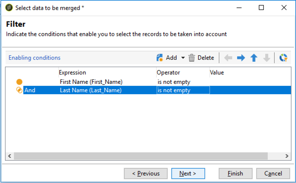

# Verwenden der Zusammenführungsfunktion der Deduplizierungsaktivität {#deduplication-merge}

## Über dieses Anwendungsbeispiel {#about-this-use-case}

In diesem Anwendungsfall wird beschrieben, wie Sie die Funktion **[!UICONTROL Zusammenführen]** in der Aktivität **[!UICONTROL Deduplizierung]** verwenden.

Weiterführende Informationen dazu finden Sie in [diesem Abschnitt](deduplication.md#merging-fields-into-single-record).

Die Aktivität **[!UICONTROL Deduplizierung]** wird zum Entfernen von Duplikat-Zeilen aus einem Datensatz verwendet. In diesem Anwendungsfall werden die unten angezeigten Daten anhand des E-Mail-Felds dupliziert.

| Datum der letzten Änderung | Vorname | Nachname | E-Mail | Mobiltelefon | Telefon |
|-----|------------|-----------|-------|--------------|------|
| 19.5.2020 | Robert | Tisner | bob@mycompany.com | 444-444-444 | 777-777-7777 |
| 22.7.2020 | Bobby | Tisner | bob@mycompany.com |  | 777-777-7777 |
| 3.10.2020 | Bob |  | bob@mycompany.com |  | 888-888-8888 |

Mit der Funktion **[!UICONTROL Zusammenführen]** der Deduplizierungsaktivität können Sie einen Regelsatz für das Deduplizieren konfigurieren, um eine Feldgruppe zu definieren, die zu einem einzigen Ergebnisdatensatz zusammengeführt werden soll. Bei einer Reihe von Duplikat-Datensätzen können Sie beispielsweise entscheiden, jeweils die älteste Telefonnummer oder den neuesten Namen beizubehalten.

## Aktivieren der Zusammenführungsfunktion {#activating-merge}

Um die Zusammenführungsfunktion zu aktivieren, müssen Sie zunächst die Aktivität **[!UICONTROL Deduplizierung]** konfigurieren. Gehen Sie dazu wie folgt vor:

1. Öffnen Sie die Aktivität und klicken Sie dann auf den Link **[Konfiguration bearbeiten]**.

1. Wählen Sie das für das Deduplizierung zu verwendende Abgleichungsfeld aus und klicken Sie dann auf **[!UICONTROL Weiter]**. In diesem Beispiel möchten wir die Duplizierung basierend auf dem E-Mail-Feld deduplizieren.

   

1. Klicken Sie auf den Link **[!UICONTROL Erweiterte Parameter]** und aktivieren Sie dann die Optionen **[!UICONTROL Datensätze zusammenführen]** und **[!UICONTROL Mehrere Kriterien zum Zusammenführen von Datensätzen verwenden]**.

   

1. Die Registerkarte **[!UICONTROL Zusammenführen]** wird dem Konfigurationsbildschirm **[!UICONTROL Deduplizierung]** hinzugefügt. Auf dieser Registerkarte können Sie die Daten angeben, die beim Ausführen der Deduplizierung zusammengeführt werden sollen.

## Konfigurieren der zusammenzuführenden Felder {#configuring-rules}

Hier sind die Regeln, mit denen die Daten in einen einzigen Datensatz zusammengeführt werden sollen:

* Belassen Sie den neuesten Namen (Vorname- und Nachname-Felder),
* Behalten Sie die neueste Mobiltelefonnummer bei,
* Behalten Sie die älteste Telefonnummer bei,
* Alle Felder in einer Gruppe müssen ungleich null sein, damit sie für den endgültigen Datensatz infrage kommen.

Gehen Sie wie folgt vor, um diese Regeln zu konfigurieren:

1. Öffnen Sie die Registerkarte **[!UICONTROL Zusammenführen]** und klicken Sie dann auf die Schaltfläche **[!UICONTROL Hinzufügen]**.

   

1. Geben Sie die Kennung und die Bezeichnung der Gruppe von Feldern an, die zusammengeführt werden sollen.

   

1. Geben Sie die Bedingungen für die Auswahl der zu berücksichtigenden Datensätze an.

   

1. Sortieren Sie nach dem Datum der letzten Änderung, um den neuesten Namen auszuwählen.

   

1. Wählen Sie die zusammenzuführenden Felder aus. In diesem Beispiel möchten wir die Felder für Vor- und Nachnamen beibehalten.

   

1. Die Felder werden dem Datensatz hinzugefügt, der zusammengeführt werden soll, und dem Workflow-Schema wird ein neues Element hinzugefügt.

   Wiederholen Sie diese Schritte, um die Felder für Mobil- und Festnetztelefonnummern zu konfigurieren.

   

   

## Ergebnisse {#results}

Nach dem Konfigurieren dieser Regeln werden die folgenden Daten am Ende der Aktivität **[!UICONTROL Deduplizierung]** empfangen.

| Änderungsdatum | Vorname | Nachname | E-Mail | Mobiltelefon | Telefon |
|-----|------------|-----------|-------|--------------|------|
| 19.5.2020 | Robert | Tisner | bob@mycompany.com | 444-444-444 | 777-777-7777 |
| 22.7.2020 | Bobby | Tisner | bob@mycompany.com |  | 777-777-7777 |
| 3.10.2020 | Bob |  | bob@mycompany.com |  | 888-888-8888 |

Das Ergebnis wird aus den drei Datensätzen gemäß den zuvor konfigurierten Regeln zusammengeführt. Nach dem Vergleich wird der Schluss gezogen, dass der aktuelle Name und das Mobiltelefon zusammen mit der ursprünglichen Telefonnummer verwendet werden.

| Vorname | Nachname | E-Mail | Mobiltelefon | Telefon |
|------------|-----------|-------|--------------|------|
| Bobby | Tisner | bob@mycompany.com | 444-444-4444 | 888-888-8888 |

>[!NOTE]
>
> Beachten Sie, dass der Vorname nach der Zusammenführung &quot;Bobby&quot; ist, da wir eine &quot;Name&quot;-Regel konfiguriert haben, die sowohl aus dem Vor- als auch dem Nachnamen besteht.
>
>Daher konnte &quot;Bob&quot; (der letzte Vorname) nicht berücksichtigt werden, da das zugehörige Feld für den Nachnamen leer war. Die neueste Kombination aus Vor- und Nachnamen wurde im finalen Datensatz zusammengeführt.
