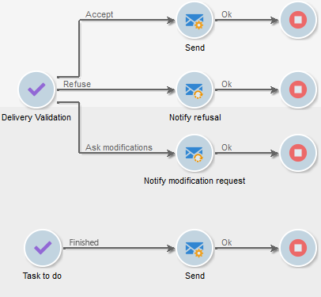
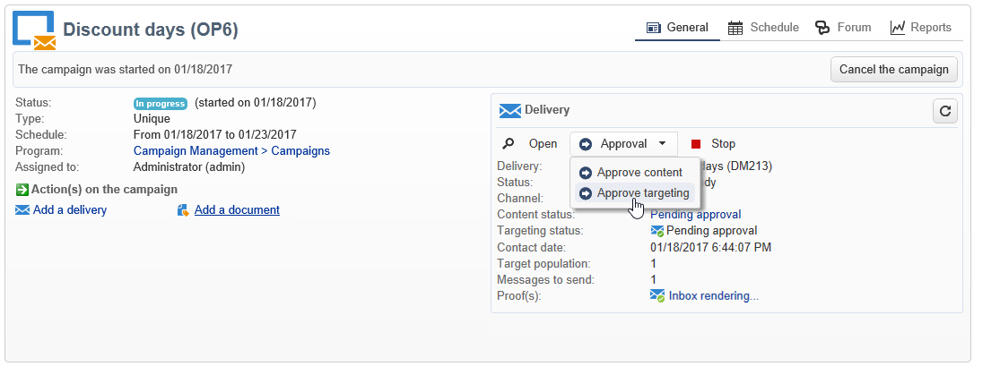
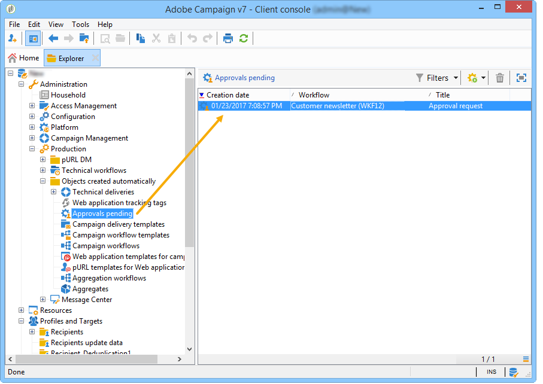
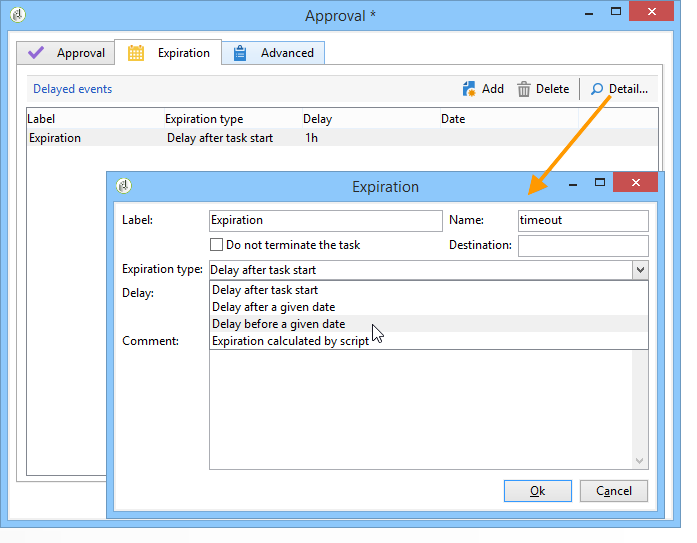

# Definieren von Validierungen {#defining-approvals}


Validierungen bieten Benutzern die Gelegenheit, an bestimmten Etappen des Workflows Entscheidungen zu treffen oder einen Vorgang zur Ausführung freizugeben.

Eine Nachricht wird an eine Benutzergruppe gesendet und der Workflow wartet auf eine Antwort, bevor er fortgesetzt wird. Der Workflow wird nicht angehalten und andere Vorgänge können ausgeführt werden. Beispielsweise stehen möglicherweise mehrere gleichzeitige Genehmigungen aus.

Eine Validierung kann mehrere Optionen enthalten, die der Benutzer auswählen kann. Es ist jedoch möglich, die Anzahl der Auswahlmöglichkeiten auf eine zu beschränken, um eine Aufgabe an einen Benutzer zu senden, z. B. die Durchführung von Targeting. Der Benutzer kann dann nach Ausführung der Aufgabe reagieren (der Prozess wird dann fortgesetzt). Das folgende Beispiel veranschaulicht diese Arten von Genehmigungen:



In Kampagnen ist der Validierungsablauf für alle Aktivitäten identisch.



Zur Validierung können Benutzer entweder den Webzugriff mithilfe des in der Benachrichtigung enthaltenen Links nutzen oder aber die Clientkonsole.

>[!NOTE]
>
>Nach Speicherung der Antwort kann diese nicht mehr geändert werden.

## Validierungen per E-Mail {#sending-emails}

Es ist möglich, eine Validierungsnachricht mit einem Link zu einer Webseite zu erhalten, über die eine Antwort möglich ist. Damit der Zielgruppenbenutzer eine E-Mail zur Validierung erhält, muss die E-Mail-Adresse des Benutzers vollständig sein. Ist dies nicht der Fall, muss der Benutzer die Konsole als Antwort verwenden.

Validierungs-E-Mails werden kontinuierlich gesendet. Die Standardvorlage heißt **[!UICONTROL notifyAssignee]** und ist im Knoten **[!UICONTROL Administration > Kampagnenverwaltung > Vorlagen technischer Sendungen]** zugänglich. Es wird empfohlen, die Vorlage nicht zu ändern, sondern sie zu duplizieren und für jede Aktivität eine gesonderte Benachrichtigungsvorlage zu erstellen.

Auf der genannten Vorlage basierende Sendungen werden im Knoten **[!UICONTROL Administration > Betreibung > Automatisch erstellte Objekte > Technische Sendungen > Workflow-Benachrichtigungen]** gespeichert.

## Validierungen in der Client-Konsole {#approval-via-the-console}

In Kampagnen sind die ausstehenden Validierungen im Dashboard ersichtlich.

Bei technischen Workflows können Benutzer auf zu validierenden Aufgaben im Knoten **[!UICONTROL Administration > Betreibung > Automatisch erstellte Objekte > Ausstehende Validierungen]** zugreifen.



## Gruppen {#groups}

Validierungen können einem einzelnen Benutzer, einer Benutzergruppe oder verschiedenen, durch eine Filterbedingung ermittelten Benutzern zugewiesen werden.

1. Für die einfachste Form der Validierung ist die Aufgabe abgeschlossen, sobald der Benutzer antwortet. Jeder andere Benutzer, der versucht zu antworten, wird benachrichtigt, dass jemand es bereits getan hat.
1. Für mehrfache Validierungen siehe Abschnitt [Mehrfach-Validierungen](#multiple-approval).

Die Benutzergruppen für Genehmigungen sollten als Rollen oder Funktionen und nicht als benannte Einzelpersonen gekennzeichnet sein. Beispielsweise ist eine Gruppe „Kampagnenbudget“ besser geeignet als „Harry-Gruppe“. Es wird empfohlen, mindestens zwei Personen in einer Gruppe zu haben, die eine Aufgabe genehmigen können. Auf diese Weise kann, wenn das eine fehlt, das andere reagieren.

## Gültigkeit {#expirations}

Ein Ablauf ist eine spezifische Transition, die für verschiedene Aktivitätstypen (insbesondere Genehmigungen) verwendet wird. Über einen Ablauf können Sie bestimmen, dass nach dem Verstreichen einer bestimmen Zeit, in der keine Antwort eingeht, eine Aktion ausgelöst wird. So können sie mit seiner Hilfe beispielsweise auch den Workflow durchführen oder einer anderen Gruppe eine Genehmigung zuweisen.

Auf der zweiten Registerkarte in den Eigenschaften der Aktivitätsvalidierung können Sie eine oder mehrere Gültigkeitsdauern definieren. Tatsächlich können Sie mehrere Gültigkeitsarten definieren.



Um eine neue Gültigkeit hinzuzufügen, klicken Sie auf **[!UICONTROL Hinzufügen]**. Zu jeder der erstellten Gültigkeiten wird eine Transition hinzugefügt. Sie haben folgende Möglichkeiten:

* die vorgeschlagenen Parameter direkt in der Liste zu ändern, indem Sie in die entsprechende Zelle klicken,
* oder das Ablauffenster zu öffnen, indem Sie auf die Schaltfläche **[!UICONTROL Detail...]** klicken.

>[!NOTE]
>
>Es ist nicht notwendig, die Ablauffristen zu ordnen, sie werden automatisch in chronologischer Reihenfolge verarbeitet.

Die Option **[!UICONTROL Aufgabe nicht beenden]** lässt die Genehmigung aktiv, wenn die Verzögerung überschritten wird. Dieser Modus ermöglicht die Verwaltung von Erinnerungen, während die Validierung aktiv bleibt: Benutzer können weiterhin antworten. Diese Option ist standardmäßig deaktiviert, was bedeutet, dass die Aufgabe nach Ablauf als abgeschlossen gilt und die Benutzer möglicherweise nicht mehr reagieren.

Vier verschiedene Arten der Berechnung der Ablauffrist stehen zur Auswahl:

* **Nach Beginn der Aufgabe** - die Ablauffrist wird ausgehend vom Aktivierungsdatum der Validierung unter Hinzufügung der angegebenen Dauer berechnet;
* **Nach einem bestimmten Datum** - die Ablauffrist wird ausgehend vom angegebenen Datum unter Hinzufügung der angegebenen Dauer berechnet;
* **Vor einem bestimmten Datum** - die Ablauffrist wird ausgehend vom angegebenen Datum unter Abzug der angegebenen Dauer berechnet;
* **Durch ein Script berechnet** - die Ablauffrist wird mithilfe eines JavaScripts berechnet.

  Das folgende Script berechnet eine Ablauffrist von 24 Stunden vor Start eines Versands (identifiziert durch **vars.deliveryId**):

  ```
  var delivery = nms.delivery.get(vars.deliveryId)
  var expiration = delivery.scheduling.contactDate
  var oneDay = 1000*60*60*24
  expiration.setTime(expiration.getTime() - oneDay)
  return expiration
  ```

## Mehrfach-Validierungen {#multiple-approval}

Die Mehrfachvalidierung ist ein Mechanismus, der es allen Validierungsbenutzern ermöglicht, zu reagieren. Für jede Antwort wird eine Transition aktiviert.

Mehrfache Validierungen sind für Abstimmungs- oder Umfragemechanismen nützlich. Sie können Antworten zählen und ihre Ergebnisse nach einem bestimmten Zeitraum verarbeiten, indem Sie eine Frist hinzufügen.

## Erforderliche Berechtigungen {#required-rights}

Um auf eine Validierungsanfrage antworten zu können, müssen Benutzer mindestens über die folgenden Berechtigungen verfügen:

* Lesen von Workflows,
* Lesen und Schreiben im Ordner der zu validierenden Aufgaben.

Die Gruppe „Workflow-Ausführung“ hat diese Rechte. Ein Benutzer, der dieser Gruppe hinzugefügt wurde, kann auf eine Genehmigungsanfrage antworten.
