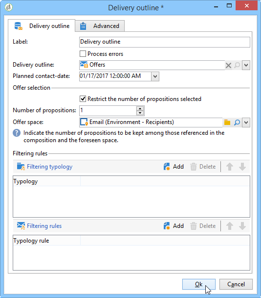

# Versandentwurf{#delivery-outline}

Mit **Versandentwurf** können Sie einen Versandentwurf in einem Kampagnen-Workflow verwenden. Der Versandentwurf muss zuvor in der Kampagne erstellt worden sein.

Zur Konfiguration der Aktivität wählen Sie einfach den gewünschten Versandentwurf sowie das geplante Kontaktdatum aus. Sie können Filterregeln hinzufügen, indem Sie Typologien oder Typologieregeln hinzufügen.

## Anwendungsbeispiel: Einfügung eines Angebots mithilfe eines Versandentwurfs {#example--inserting-an-offer-via-a-delivery-outline}

Die in Kampagnen-Workflows zur Verfügung stehende Aktivität **Versandentwurf** erlaubt es, Angebote zu unterbreiten, die in einem Versandentwurf der aktuellen Kampagne referenziert wurden.

>[!NOTE]
>
>Für das vorliegende Anwendungsbeispiel benötigen Sie das **Interaction**-Package.

1. Platzieren Sie hierfür im Workflow die Versandentwurfsaktivität vor einer Versandaktivität.
1. Geben Sie in der Versandentwurfsaktivität den gewünschten Entwurf an.
1. Füllen Sie die verfügbaren Felder Ihrem Versand entsprechend aus.
1. Sie haben zwei Möglichkeiten:

   * Wenn das Angebotsmodul aufgerufen werden soll, aktivieren Sie das Kontrollkästchen **[!UICONTROL Anzahl der ausgewählten Vorschläge]**. Geben Sie die Platzierung und die Anzahl der Vorschläge an, die im Versand unterbreitet werden sollen.

     Gewichtung und Eignungsregeln der Angebote werden vom Angebotsmodul berücksichtigt.

   * Versand ohne Abfrage an das Angebotsmodul: Alle im Versandentwurf enthaltenen Angebote werden unterbreitet.

   Die Vorschau berücksichtigt die Anzahl der im Versand angegebenen Angebote. Beim Ausführen eines Workflows wird die im Versandentwurf angegebene Zahl berücksichtigt.

   
