# Versand{#delivery}

Mit **Aktivität** Versand“ können Sie eine Versandaktion erstellen. Sie kann mithilfe von ursprünglichen Elementen eingerichtet werden.

Öffnen Sie die Aktivität und wählen Sie in den verschiedenen Bereichen die gewünschten Optionen aus.

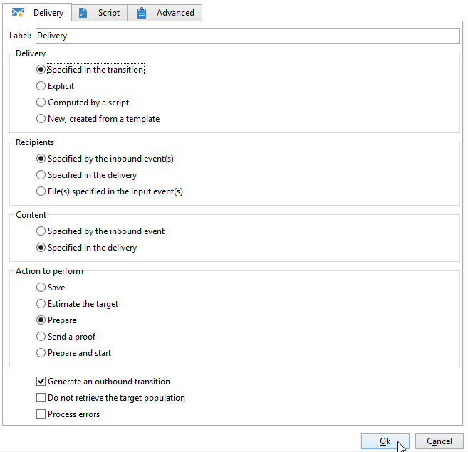

1. **Versand**

   Sie haben folgende Möglichkeiten:

   * Handeln Sie gemäß dem in der eingehenden Transition angegebenen Versand. Wählen Sie dazu die erste Option im Abschnitt **[!UICONTROL Versand]** des Fensters aus.

     Diese Option kann verwendet werden, wenn eine frühere Workflow-Aktivität den Versand bereits erstellt oder angegeben hat. Dies kann, wie im folgenden Beispiel, durch eine Aktivität desselben Typs erfolgen, die eine ausgehende Transition erzeugt hat.

     Im folgenden Beispiel wird der Versand erstmals erstellt. Die Population und der Inhalt werden später definiert. Als Nächstes werden die Informationen für diese drei Elemente über die eingehende Transition in eine neue Versandaktivität eingegeben, sodass sie gesendet werden können.

     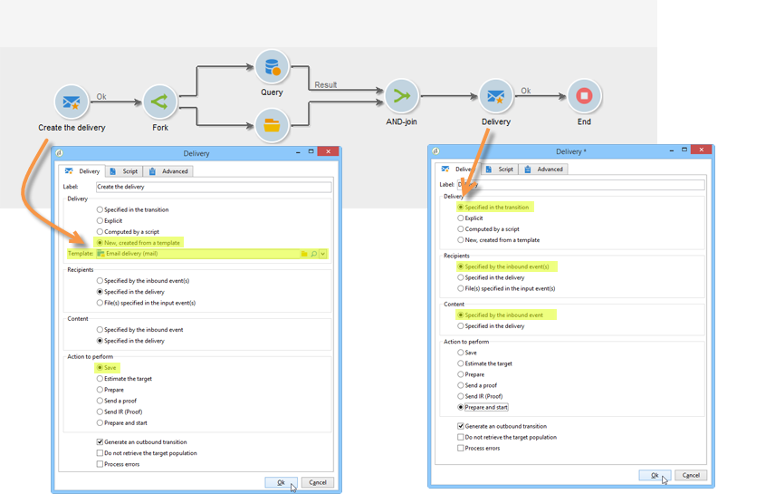

   * Wählen Sie den betreffenden Versand direkt aus. Wählen Sie in diesem Fall einen zuvor erstellten Versand aus der Dropdown-Liste des Felds **[!UICONTROL Versand]** aus.****

     Standardmäßig enthält die Liste die im Ordner **Sendungen** gespeicherten Kommunikationen, die noch nicht abgeschlossen sind. Klicken Sie auf das Symbol **[!UICONTROL Verknüpftes Element auswählen]**, um auf andere Ordner zugreifen zu können.

     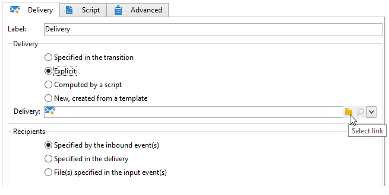

     Wählen Sie im Feld **[!UICONTROL Ordner]** den gewünschten Ordner aus oder klicken Sie auf **[!UICONTROL Unterordner anzeigen]**, um alle in den Unterordnern enthaltenen Sendungen anzuzeigen:

     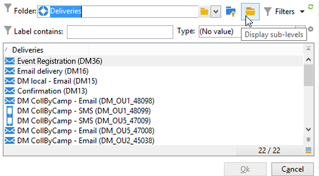

     Nach der Auswahl des gewünschten Versands können Sie diesen durch Klick auf das Symbol **[!UICONTROL Verknüpftes Element öffnen]** anzeigen.

   * Erstellen Sie ein Script zur Berechnung des Versands. Wählen Sie dazu die Option **[!UICONTROL Wird durch ein Script erstellt]** und geben Sie das Script ein. Sie können ein Eingabefenster öffnen, indem Sie auf **[!UICONTROL Bearbeiten...]** klicken. Im folgenden Beispiel wird die Versandkennung wiederhergestellt:

     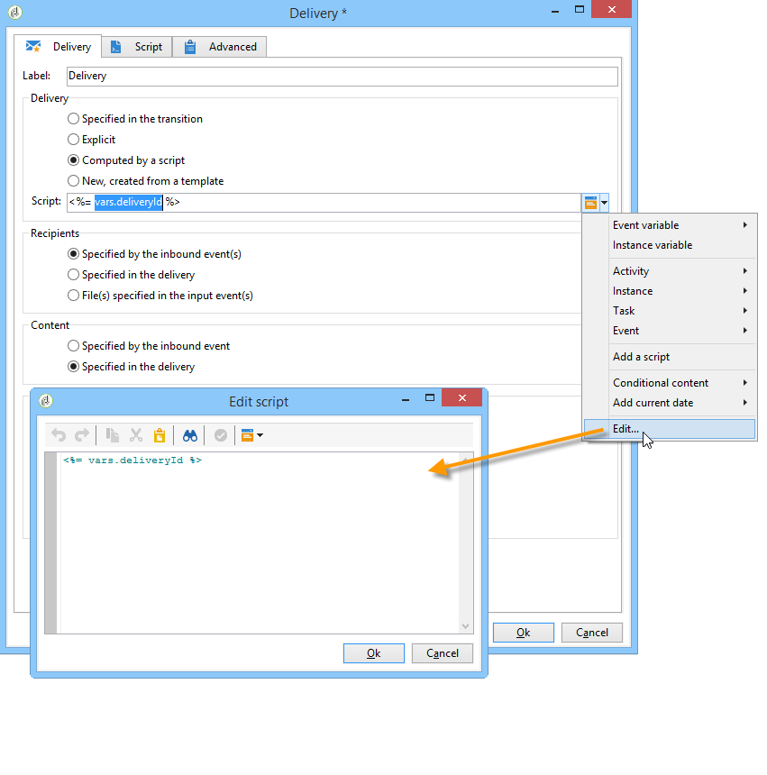

   * Erstellen Sie einen neuen Versand. Wählen Sie die gewünschte Versandvorlage aus.****

     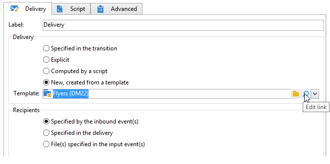

     Klicken Sie auf das Symbol **[!UICONTROL Verknüpftes Element auswählen]**, um die Ordner zu durchsuchen und auf **[!UICONTROL Verknüpftes Element öffnen]**, um die ausgewählte Vorlage anzuzeigen.

1. **Bereich Empfänger**

   Empfänger können durch die Eingangsereignisse, z. B. nach einem Dateiimport, oder durch die Versandaktion angegeben werden. Sie können auch in einer oder mehreren Dateien gespeichert werden.

   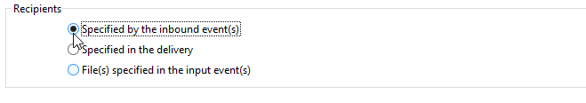

1. **Content**

   Der Versandinhalt kann entweder direkt im Versand oder über das eingehende Ereignis definiert werden.

   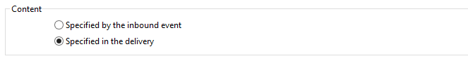

1. **Auszuführende Aktion**

   Der Versand kann gespeichert, vorbereitet oder gestartet werden. Weitere Optionen sind die Schätzung der Zielgruppe und das Auslösen eines Testversands.

   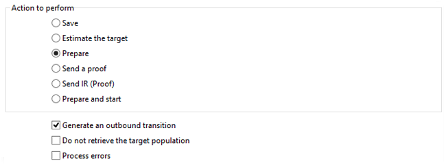

   Wählen Sie eine der möglichen Optionen aus:

   * **[!UICONTROL Speichern]**: Mit dieser Option können Sie den Versand erstellen und speichern. Er wird sie nicht analysieren oder liefern.
   * **[!UICONTROL Zielgruppe schätzen]**: Die Zielgruppe wird berechnet, um das Potential der Kampagne einschätzen zu können (erste Phase der Analyse). Diese Aktion entspricht den Optionen **[!UICONTROL Zielpopulation schätzen]** und **[!UICONTROL Analysieren]** in einem klassischen Versand an eine Hauptzielgruppe mit dem **Delivery**-Modul.
   * **[!UICONTROL Vorbereiten]**: Mit dieser Option können Sie den gesamten Analyseprozess ausführen (Zielgruppenberechnung und Inhaltsvorbereitung). Der Versand wird nicht gesendet. Diese Aktion entspricht den Optionen **[!UICONTROL Sendungen schnellstmöglich abschicken]** und **[!UICONTROL Analysieren]** in einem klassischen Versand an eine Hauptzielgruppe mit **Versand**.
   * **[!UICONTROL Testversand durchführen]**: Dieser Befehl ermöglicht den Versand eines Testversands. Diese Aktion entspricht dem Klicken auf die **[!UICONTROL Testversand durchführen]** in der Symbolleiste eines Versands mit **Versand**
   * **[!UICONTROL Vorbereiten und Starten]**: Diese Option startet den gesamten Analyseprozess (Zielgruppenberechnung und Inhaltsvorbereitung) und sendet den Versand. Diese Aktion entspricht den Optionen **[!UICONTROL Sendungen schnellstmöglich abschicken]**, **[!UICONTROL Analysieren]** und **[!UICONTROL Absendung bestätigen]** in einem klassischen Versand an eine Hauptzielgruppe mit **Versand**.

   Eine im weiteren Verlauf des Workflows platzierte Aktivität des Typs **[!UICONTROL Versand bearbeiten]** erlaubt die Ausführung der für den Versandstart noch fehlenden Etappen (Zielgruppenberechnung, Inhaltsvorbereitung, Versand). Weitere Informationen hierzu finden Sie unter [Versand bearbeiten](delivery-control.md).

   Darüber hinaus stehen folgende Optionen für die Aktivität zur Verfügung:

   * **[!UICONTROL Ausgehende Transition erzeugen]**

     Erstellt eine ausgehende Transition, die am Ende der Ausführung aktiviert wird. Sie können auswählen, ob die Zielgruppe des ausgehenden Versands abgerufen werden soll oder nicht.

   * **[!UICONTROL Zielgruppe nicht übermitteln]**

     Die Zielgruppe wird nicht mit der ausgehenden Transition übermittelt.

   * **[!UICONTROL Fehler verarbeiten]**

     Siehe [Versand bearbeiten](delivery-control.md).

   Im Tab **Script** können die Versandparameter angepasst werden.

   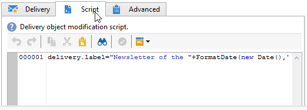

## Beispiel: Versand-Workflow {#example--delivery-workflow}

Erstellen Sie einen neuen Workflow und fügen Sie Aktivitäten aus der unten dargestellten Grafik hinzu:

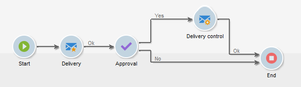

Öffnen Sie die **Versand**-Aktivität und definieren Sie die Eigenschaften folgendermaßen:

* Aktivieren Sie im Bereich **[!UICONTROL Versand]** die Option **[!UICONTROL Neu, basierend auf einer Vorlage erstellt]** und wählen danach Sie eine Versandvorlage aus.
* Aktivieren Sie im Bereich **[!UICONTROL Empfänger]** die Option **[!UICONTROL Im Versand angegeben]**.
* Behalten Sie im Bereich **[!UICONTROL Auszuführende Aktion]** die Standardoption **[!UICONTROL Vorbereiten]** bei.

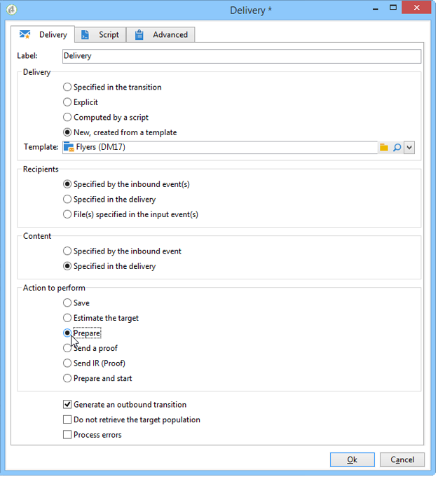

Klicken Sie **[!UICONTROL OK]**, um das Eigenschaftenfenster zu schließen. Sie haben gerade eine Aktivität konfiguriert, die aus der Erstellung und Vorbereitung eines neuen Versands basierend auf einer Versandvorlage besteht, deren Zielgruppe darin angegeben werden soll.

Öffnen Sie die Aktivität **Validierung** und definieren Sie folgende Eigenschaften:

1. Wählen **[!UICONTROL im Feld]** eine Gruppe aus, in der Sie registriert sind. Wenn Sie über das Konto „admin“ mit dem Konto verbunden sind, wählen Sie die Gruppe Administration aus.
1. Vergeben Sie einen Titel und geben Sie folgenden Text in den Nachrichten-Textkörper ein:

   ```
   Do you wish to approve delivery (<%= vars.recCount %> recipient(s))?
   ```

   Es handelt sich hierbei um eine Nachricht mit einem JavaScript-Ausdruck: **[!UICONTROL vars.recCount]** bezeichnet die Anzahl an Empfängern, die in der vorangehenden Aktivität in die Zielgruppe des Versands aufgenommen wurden. Weitere Informationen zu JavaScript-Ausdrücken finden Sie unter [Scripts/JavaScript-Templates](javascript-scripts-and-templates.md).

   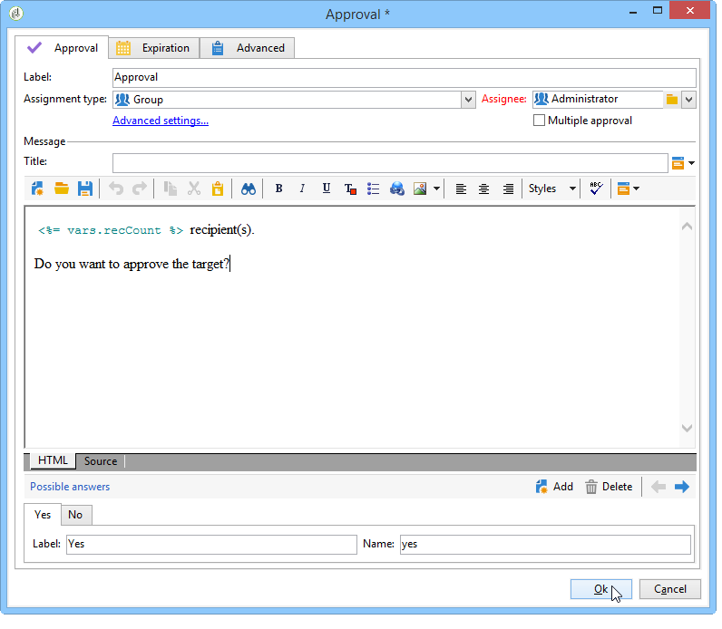

   Weiterführende Informationen zur Validierungsaufgabe finden Sie unter [Validierung](approval.md).

## Eingabeparameter {#input-parameters}

Kennung des Versands, wenn im Bereich **[!UICONTROL Versand]** die Option **[!UICONTROL Wird durch die Transition angegeben]** ausgewählt wurde.

* deliveryId
* tableName
* schema

Jedes eingehende Ereignis muss eine durch diese Parameter definierte Zielgruppe angeben.

>[!NOTE]
>
>Dieser Parameter erscheint nur, wenn im Bereich **[!UICONTROL Empfänger]** die Option **[!UICONTROL Werden durch das oder die Eingangsereignis(se) angegeben]** angekreuzt wurde.

* filename

  Vollständiger Name der erzeugten Datei, wenn im Bereich **[!UICONTROL Empfänger]** die Option **[!UICONTROL Dateien werden durch die Eingangsereignisse angegeben]** angekreuzt wurde.

* contentId

  Kennung des Inhalts, wenn im Bereich **[!UICONTROL Inhalt]** die Option **[!UICONTROL Wird durch das Eingangsereignis angegeben]** angekreuzt wurde.

## Ausgabeparameter {#output-parameters}

* tableName
* schema
* recCount

Anhand der drei Werte lässt sich die durch den Versand ermittelte Zielgruppe identifizieren. **[!UICONTROL tableName]** ist der Name der Tabelle, die die Kennungen der Zielgruppe speichert, **[!UICONTROL schema]** ist das Schema der Population (normalerweise nms:recipient) und **[!UICONTROL recCount]** die Anzahl der Elemente in der Tabelle.

Die Transition des Komplements weist die gleichen Parameter auf.

>[!NOTE]
>
>Wenn die Option **[!UICONTROL Zielgruppe nicht übermitteln]** aktiviert wurde, gibt es keine Ausgabeparameter.
