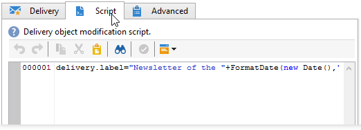

# Versand{#delivery}


Die Aktivität **Versand** wird je nach Kontext zur Konfiguration oder zum Start eines Versands verwendet. Dabei können Elemente aus eingehenden Transitionen verwendet werden.

Öffnen Sie die Aktivität und wählen Sie in den verschiedenen Bereichen die gewünschten Optionen aus.


1. **Versand**

   Sie haben folgende Möglichkeiten:

   * Zur Auswahl des zu bearbeitenden Versands stehen folgende Optionen zur Verfügung: **[!UICONTROL Wird durch die Transition angegeben]**.

      Diese Option kann verwendet werden, wenn eine vorangehende Workflow-Aktivität bereits den Versand erstellt oder bezeichnet. Dies kann wie in unten stehendem Beispiel durch eine Aktivität des gleichen Typs erfolgen, die eine ausgehende Transition erzeugt.

      Im Beispiel wird zunächst der Versand erstellt. Dann werden die Zielgruppe und der Inhalt definiert. Schließlich werden die drei Elemente über die eingehende Transition einer zweiten Versandaktivität übermittelt und der Versand gestartet.

      

   * **[!UICONTROL Explizit]**. Wählen Sie in diesem Fall einen zuvor erstellten Versand aus der Dropdown-Liste des Felds **[!UICONTROL Versand]** aus.

      Standardmäßig enthält die Liste die im Ordner **Sendungen** gespeicherten Kommunikationen, die noch nicht abgeschlossen sind. Klicken Sie auf das Symbol **[!UICONTROL Verknüpftes Element auswählen]**, um auf andere Ordner zugreifen zu können.

      

      Wählen Sie im Feld **[!UICONTROL Ordner]** den gewünschten Ordner aus oder klicken Sie auf **[!UICONTROL Unterordner anzeigen]**, um alle in den Unterordnern enthaltenen Sendungen anzuzeigen:

      

      Nach der Auswahl des gewünschten Versands können Sie diesen durch Klick auf das Symbol **[!UICONTROL Verknüpftes Element öffnen]** anzeigen.

   * Erstellen Sie ein Script zur Berechnung des Versands. Wählen Sie dazu die Option **[!UICONTROL Wird durch ein Script erstellt]** und geben Sie das Script ein. Sie können ein Eingabefenster öffnen, indem Sie auf **[!UICONTROL Bearbeiten...]** klicken. Im folgenden Beispiel wird die Versandkennung wiederhergestellt:

      

   * **[!UICONTROL Neu, basierend auf einer Vorlage erstellt]**. Wählen Sie die gewünschte Versandvorlage aus.

      

      Klicken Sie auf das Symbol **[!UICONTROL Verknüpftes Element auswählen]**, um die Ordner zu durchsuchen und auf **[!UICONTROL Verknüpftes Element öffnen]**, um die ausgewählte Vorlage anzuzeigen.

1. **Bereich Empfänger**

   Die Versandempfänger können durch eingehende Ereignisse angegeben werden, beispielsweise Dateiimport, oder Versand. Sie können außerdem aus einer oder mehreren Dateien stammen.

   

1. **Content**

   Der Versandinhalt kann entweder direkt im Versand oder über das eingehende Ereignis definiert werden.

   

1. **Auszuführende Aktion**

   Der Versand kann gespeichert, vorbereitet oder gestartet werden. Weitere Optionen sind die Schätzung der Zielgruppe und das Auslösen eines Testversands.

   

   Kreuzen Sie eine der möglichen Optionen an:

   * **[!UICONTROL Speichern]**: Der Versand wird erstellt und gespeichert, jedoch weder analysiert noch abgeschickt.
   * **[!UICONTROL Zielgruppe schätzen]**: Die Zielgruppe wird berechnet, um das Potential der Kampagne einschätzen zu können (erste Phase der Analyse). Diese Aktion entspricht den Optionen **[!UICONTROL Zielpopulation schätzen]** und **[!UICONTROL Analysieren]** in einem klassischen Versand an eine Hauptzielgruppe mit dem **Delivery**-Modul.
   * **[!UICONTROL Vorbereiten]**: Der Versand wird vollständig analysiert (Zielgruppenberechnung und Inhaltsvorbereitung). Der Versand wird nicht abgeschickt. Diese Aktion entspricht den Optionen **[!UICONTROL Sendungen schnellstmöglich abschicken]** und **[!UICONTROL Analysieren]** in einem klassischen Versand an eine Hauptzielgruppe mit dem **Delivery**-Modul.
   * **[!UICONTROL Testversand]**: Ein Testversand wird ausgelöst. Diese Aktion entspricht einem Klick auf die Schaltfläche **[!UICONTROL Testversand]** in der Symbolleiste eines klassischen Versands mit dem **Delivery**-Modul.
   * **[!UICONTROL Vorbereiten und starten]**: Der Versand wird vollständig analysiert (Zielgruppenberechnung und Inhaltsvorbereitung) und abgeschickt. Diese Aktion entspricht den Optionen **[!UICONTROL Sendungen schnellstmöglich abschicken]**, **[!UICONTROL Analysieren]** und **[!UICONTROL Absendung bestätigen]** in einem klassischen Versand an eine Hauptzielgruppe mit dem **Delivery**-Modul.

   Eine im weiteren Verlauf des Workflows platzierte Aktivität des Typs **[!UICONTROL Versand bearbeiten]** erlaubt die Ausführung der für den Versandstart noch fehlenden Etappen (Zielgruppenberechnung, Inhaltsvorbereitung, Versand). Weitere Informationen hierzu finden Sie unter [Versand bearbeiten](delivery-control.md).

   Darüber hinaus stehen folgende Optionen für die Aktivität zur Verfügung:

   * **[!UICONTROL Ausgehende Transition erzeugen]**

      Erzeugt eine ausgehende Transition im Anschluss an die Aktivität. Sie haben die Wahl, die Zielgruppe der Versandaktion in der Transition abzurufen, oder nicht.

   * **[!UICONTROL Zielgruppe nicht übermitteln]**

      Die Zielgruppe wird nicht mit der ausgehenden Transition übermittelt.

   * **[!UICONTROL Fehler verarbeiten]**

      Siehe [Versand bearbeiten](delivery-control.md).
   Im Tab **Script** können die Versandparameter angepasst werden.

   

## Beispiel: Versand-Workflow {#example--delivery-workflow}

Erstellen Sie einen neuen Workflow und fügen Sie Aktivitäten aus der unten dargestellten Grafik hinzu:


Öffnen Sie die **Versand**-Aktivität und definieren Sie die Eigenschaften folgendermaßen:

* Aktivieren Sie im Bereich **[!UICONTROL Versand]** die Option **[!UICONTROL Neu, basierend auf einer Vorlage erstellt]** und wählen danach Sie eine Versandvorlage aus.
* Aktivieren Sie im Bereich **[!UICONTROL Empfänger]** die Option **[!UICONTROL Im Versand angegeben]**.
* Behalten Sie im Bereich **[!UICONTROL Auszuführende Aktion]** die Standardoption **[!UICONTROL Vorbereiten]** bei.


Klicken Sie auf **[!UICONTROL OK]**, um die Eingaben zu speichern. Sie haben eine Aktivität konfiguriert, die dazu dient, auf Basis einer Versandvorlage einen neuen Versand zu erstellen und vorzubereiten, dessen Zielgruppe in der Vorlage bestimmt wird.

Öffnen Sie die Aktivität **Validierung** und definieren Sie folgende Eigenschaften:

1. Wählen Sie im Feld **[!UICONTROL Zuweisung]** eine Gruppe aus, der Sie selbst angehören. Wählen Sie beispielsweise die Administrator-Gruppe, wenn Sie mit der Kennung &#39;admin&#39; angemeldet sind.
1. Vergeben Sie einen Titel und geben Sie folgenden Text in den Nachrichten-Textkörper ein:

   ```
   Do you wish to approve delivery (<%= vars.recCount %> recipient(s))?
   ```

   Es handelt sich hierbei um eine Nachricht mit einem JavaScript-Ausdruck: **[!UICONTROL vars.recCount]** bezeichnet die Anzahl an Empfängern, die in der vorangehenden Aktivität in die Zielgruppe des Versands aufgenommen wurden. Weitere Informationen zu JavaScript-Ausdrücken finden Sie unter [Scripts/JavaScript-Templates](javascript-scripts-and-templates.md).

   

   Weiterführende Informationen zur Validierungsaufgabe finden Sie unter [Validierung](approval.md).

## Eingabeparameter {#input-parameters}

Kennung des Versands, wenn im Bereich **[!UICONTROL Versand]** die Option **[!UICONTROL Wird durch die Transition angegeben]** ausgewählt wurde.

* deliveryId
* tableName
* schema

Jedes eingehende Ereignis muss eine durch diese Parameter definierte Zielgruppe angeben.

>[!NOTE]
>
>Dieser Parameter erscheint nur, wenn im Bereich **[!UICONTROL Empfänger]** die Option **[!UICONTROL Werden durch das oder die Eingangsereignis(se) angegeben]** angekreuzt wurde.

* filename

   Vollständiger Name der erzeugten Datei, wenn im Bereich **[!UICONTROL Empfänger]** die Option **[!UICONTROL Dateien werden durch die Eingangsereignisse angegeben]** angekreuzt wurde.

* contentId

   Kennung des Inhalts, wenn im Bereich **[!UICONTROL Inhalt]** die Option **[!UICONTROL Wird durch das Eingangsereignis angegeben]** angekreuzt wurde.

## Ausgabeparameter {#output-parameters}

* tableName
* schema
* recCount

Anhand der drei Werte lässt sich die durch den Versand ermittelte Zielgruppe identifizieren. **[!UICONTROL tableName]** ist der Name der Tabelle, welche die Kennungen der Zielgruppenempfänger speichert, **[!UICONTROL schema]** ist das Schema der Population, (i. d. R. nms:recipient) und **[!UICONTROL recCount]** ist die Anzahl an Elementen in der Tabelle.

Die Transition des Komplements weist die gleichen Parameter auf.

>[!NOTE]
>
>Wenn die Option **[!UICONTROL Zielgruppe nicht übermitteln]** aktiviert wurde, gibt es keine Ausgabeparameter.
