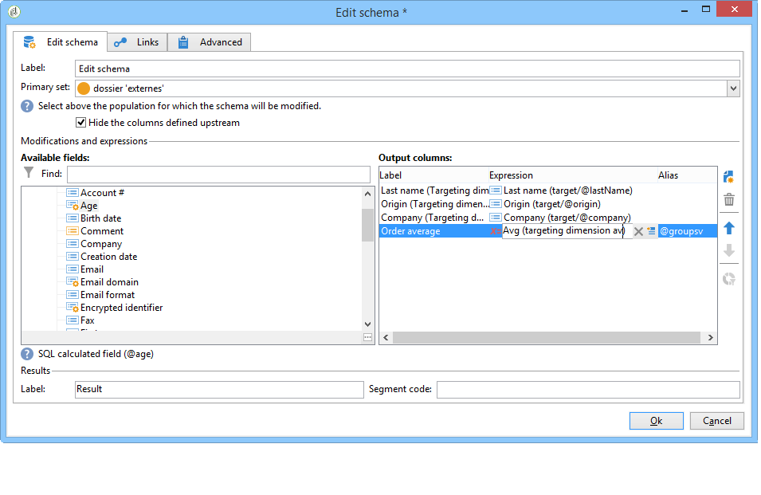

# Schema-Bearbeitung{#edit-schema}

Mithilfe der **[!UICONTROL Schema-Bearbeitung]** lassen sich Daten im Workflow umwandeln, standardisieren und bei Bedarf anreichern. Sie dient im Allgemeinen dazu, die Struktur der Daten zu harmonisieren: Ausgabespalten können umbenannt und ihr Inhalt verändert werden, beispielsweise durch Berechnung eines Durchschnitts oder Aggregats ausgehend von den ursprünglichen Werten.

Diese Aktivität verändert nicht die Daten der Arbeitstabelle, sondern nur ihr Schema, d. h. die logische Darstellung der Daten.

Im Tab **[!UICONTROL Relationen]** können Sie Beziehungen zu anderen Arbeitstabellen herstellen.

Im unteren Bereich werden die Joinbedingungen definiert, d. h. die Kriterien festgelegt, die die Abstimmung zwischen den Tabellendaten ermöglichen.
