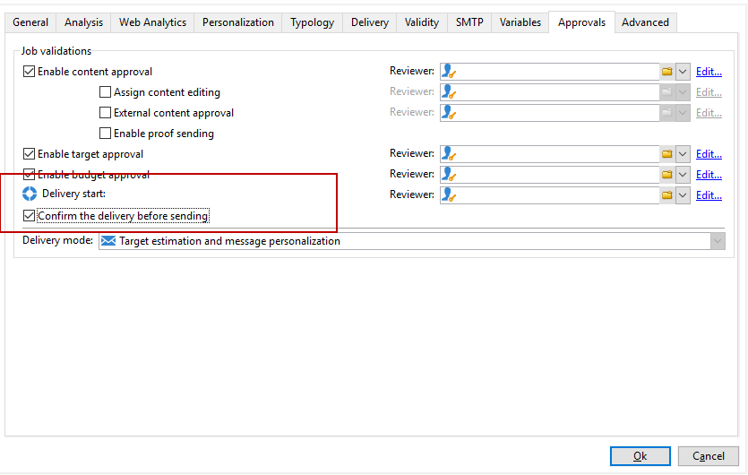
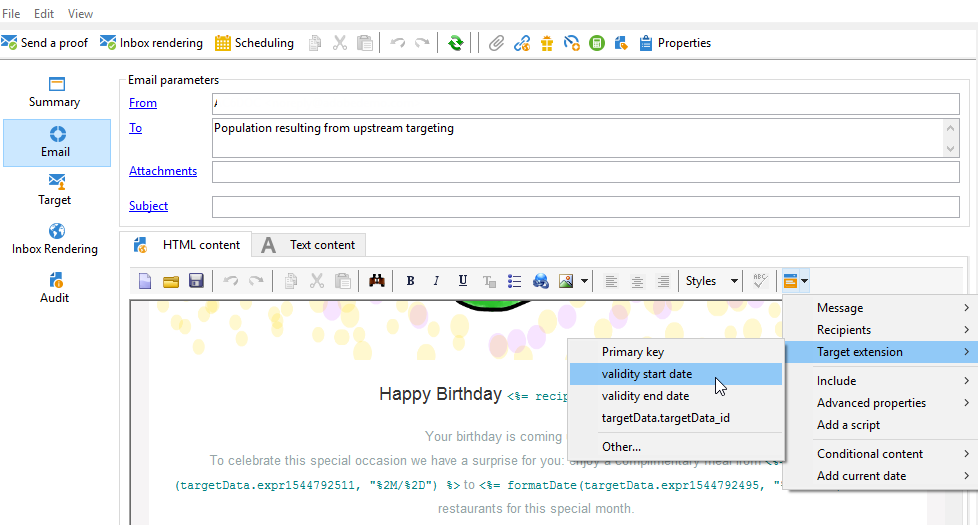

# E-Mail-Anreicherung mit benutzerdefinierten Datumsfeldern{#email-enrichment-with-custom-date-fields}


In diesem Beispiel möchten wir Empfängern, die im aktuellen Monat Geburtstag feiern, eine E-Mail mit benutzerdefinierten Datumsfeldern senden. Die E-Mail soll einen Gutschein enthalten, der bis zu einer Woche vor und nach ihrem Geburtstag gültig ist.

Zunächst müssen mithilfe der Aktivität **[!UICONTROL Aufspaltung]** aus einer Liste Empfänger ausgewählt werden, die im aktuellen Monat Geburtstag haben. Danach wird mit der Aktivität **[!UICONTROL Anreicherung]** das benutzerdefinierte Datumsfeld zur Angabe des Gültigkeitsdatums in der Angebots-E-Mail verwendet.


Gehen Sie wie folgt vor:

1. Fügen Sie im Tab **[!UICONTROL Zielbestimmungen und Workflows]** Ihrer Kampagne per Drag &amp; Drop die Aktivität **[!UICONTROL Liste lesen]** hinzu, um Ihre Empfängerliste auszuwählen.
1. Die zu verarbeitende Liste kann explizit angegeben, von einem Script berechnet oder dynamisch abgerufen werden. Dies hängt von den hier aktivierten Optionen oder angegebenen Parametern ab.

   

1. Fügen Sie die Aktivität **[!UICONTROL Aufspaltung]** hinzu, um die Empfänger, die im aktuellen Monat Geburtstag haben, von den restlichen Empfängern zu trennen.
1. Um Ihre Liste aufzuspalten, wählen Sie in der Kategorie **[!UICONTROL Filterung der Datensätze]** die Option **[!UICONTROL Filterbedingung für die Eingangspopulation hinzufügen]** aus. Klicken Sie danach auf **[!UICONTROL Bearbeiten]**.

   

1. Wählen Sie **[!UICONTROL Filterbedingungen]** aus und danach die Schaltfläche **[!UICONTROL Ausdruck bearbeiten]**, um nach dem Geburtstagsmonat zu filtern.

   

1. Wählen Sie **[!UICONTROL Erweiterte Auswahl]** und danach **[!UICONTROL Formel von einem Ausdruck ausgehend erstellen]** aus und fügen Sie den folgenden Ausdruck hinzu: Month(@birthDate).
1. Wählen Sie in der Spalte **[!UICONTROL Operator]** die Option **[!UICONTROL gleich]** aus.
1. Filtern Sie Ihre Bedingung weiter, indem Sie für den Monat den **[!UICONTROL Wert]** des aktuellen Datums hinzufügen: Month(GetDate()).

   Dadurch werden Empfänger abgerufen, deren Geburtsmonat mit dem aktuellen Monat übereinstimmt.

   

1. Wählen Sie **[!UICONTROL Beenden]** aus. Wählen Sie dann im Tab **[!UICONTROL Allgemein]** der Aktivität **[!UICONTROL Aufspaltung]** in der Kategorie **[!UICONTROL Ergebnisse]** die Option **[!UICONTROL Komplement erzeugen]** aus.

   Mit dem Ergebnis von **[!UICONTROL Komplement]** können Sie eine Versandaktivität hinzufügen oder eine Liste aktualisieren. In unserem Beispiel haben wir einfach die Aktivität **[!UICONTROL Ende]** hinzugefügt.

   

Konfigurieren Sie anschließend die Aktivität **[!UICONTROL Anreicherung]**:

1. Fügen Sie die Aktivität **[!UICONTROL Anreicherung]** nach Ihrer Teilmenge ein, um Ihre benutzerdefinierten Datumsfelder hinzuzufügen.

   

1. Öffnen Sie die Aktivität **[!UICONTROL Anreicherung]**. Wählen Sie in der Kategorie **[!UICONTROL Zusatzinformationen]** die Option **[!UICONTROL Daten hinzufügen]** aus.

   

1. Wählen Sie zuerst **[!UICONTROL Daten in Relation mit der Filterdimension]** und danach **[!UICONTROL Daten der Filterdimension]** aus.
1. Klicken Sie auf die Schaltfläche **[!UICONTROL Hinzufügen]**.

   

1. Fügen Sie einen **[!UICONTROL Titel]** hinzu. Wählen Sie dann in der Spalte **[!UICONTROL Ausdruck]** die Option **[!UICONTROL Ausdruck bearbeiten]** aus.

   

1. Zuerst muss die Woche vor dem Geburtstag als das **Gültigkeitsstartdatum** mit dem folgenden **[!UICONTROL Ausdruck]** ausgewählt werden: `SubDays([target/@birthDate], 7)`.

   

1. Um danach das benutzerdefinierte Datumsfeld **Gültigkeitsenddatum** zu erstellen, mit dem die Woche nach dem Geburtstag ausgewählt wird, muss dieser **[!UICONTROL Ausdruck]** hinzugefügt werden: `AddDays([target/@birthDate], 7)`.

   Sie können Ihren Ausdruck mit einem Titel kennzeichnen.

   

1. Wählen Sie **[!UICONTROL OK]** aus. Ihre Anreicherung ist nun fertig.

Nach der Aktivität **[!UICONTROL Anreicherung]** können Sie einen Versand hinzufügen. In unserem Fall haben wir einen E-Mail-Versand hinzugefügt, mit dem Empfänger, die im aktuellen Monat Geburtstag feiern, ein spezielles Angebot mit Gültigkeitsdaten erhalten.

1. Fügen Sie die Aktivität **[!UICONTROL E-Mail-Versand]** per Drag &amp; Drop nach der Aktivität **[!UICONTROL Anreicherung]** ein.

   

1. Doppelklicken Sie auf die Aktivität **[!UICONTROL E-Mail-Versand]**, um Ihren Versand zu personalisieren.
1. Fügen Sie zu Ihrem Versand einen **[!UICONTROL Titel]** hinzu und wählen Sie dann **[!UICONTROL Fortfahren]** aus.
1. Bestätigen Sie die Erstellung des E-Mail-Versands mithilfe der **[!UICONTROL Speichern]**-Schaltfläche.
1. Vergewissern Sie sich im Tab **[!UICONTROL Validierung]** in den **[!UICONTROL Versandeigenschaften]** der E-Mail, dass die Option **[!UICONTROL Vor dem Start Versand bestätigen]** aktiviert ist.

   Starten Sie dann den Workflow, um Ihre ausgehende Transition mit den ausgewählten Daten anzureichern.

   

Sie können jetzt Ihre E-Mail-Nachricht mit den benutzerdefinierten Feldern gestalten, die Sie in der Aktivität **[!UICONTROL Anreicherung]** erstellt haben.

1. Doppelklicken Sie auf die Aktivität **[!UICONTROL E-Mail-Versand]**.
1. Fügen Sie Ihre Zielgruppenerweiterungen zu Ihrer E-Mail hinzu. Diese sollte sich innerhalb des folgendes Ausdrucks befinden, damit Sie das Format der Gültigkeitsdaten konfigurieren können.

   ```
   <%=
           formatDate(targetData.alias of your expression,"%2D.%2M")  %>
   ```

1. Klicken Sie auf . Wählen Sie **[!UICONTROL Erweiterung des Zieldatensatzes]** und danach die zuvor erstellten benutzerdefinierten Gültigkeitsdaten mit der Aktivität **[!UICONTROL Anreicherung]** aus, um Ihre Erweiterung zum formatDate-Ausdruck hinzuzufügen.

   

1. Konfigurieren Sie Ihren E-Mail-Inhalt nach Bedarf.

   

1. Sehen Sie sich Ihre E-Mail in der Vorschau an, um zu überprüfen, ob die benutzerdefinierten Datumsfelder korrekt konfiguriert wurden.

   

Ihre E-Mail ist jetzt bereit. Sie können mit dem Ausführen Ihrer Testsendungen beginnen und den Versand Ihrer Geburtstags-E-Mails bestätigen.
