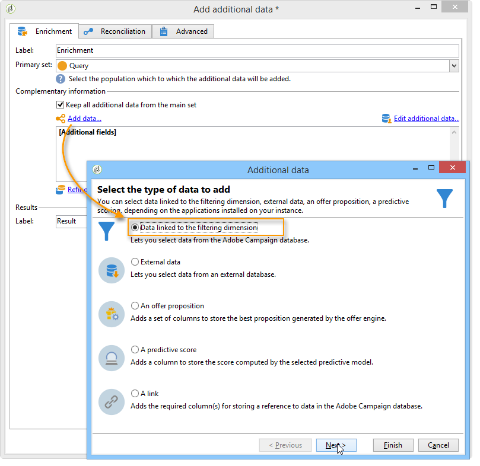
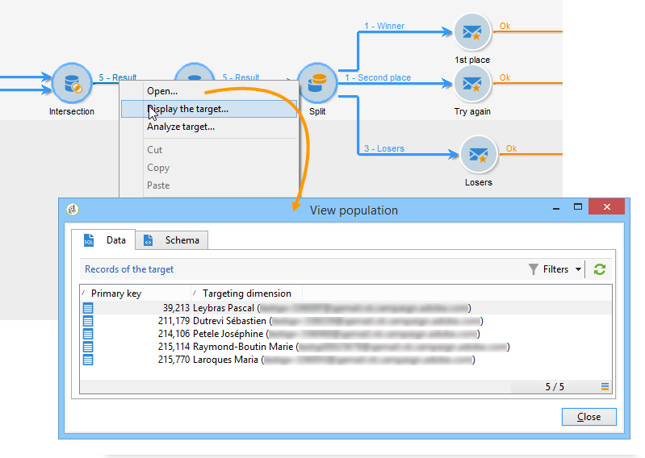
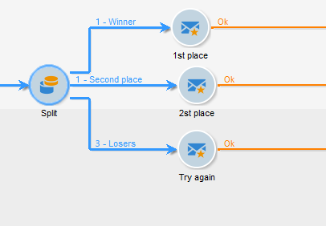

# Anreichern von Daten{#enriching-data}

## Über die Anreicherung von Daten {#about-enriching-data}

In diesem Anwendungsbeispiel werden mögliche Verwendungen der Aktivität **[!UICONTROL Anreicherung]** in einem Zielgruppen-Workflow beschrieben. Weitere Informationen zur Verwendung der Aktivität **[!UICONTROL Anreicherung]** finden Sie unter [Anreicherung](enrichment.md).

In [diesem Abschnitt](email-enrichment-with-custom-date-fields.md) finden Sie außerdem ein Anwendungsbeispiel zur Anreicherung eines E-Mail-Versands mit benutzerdefinierten Datumsangaben.

Den in der Marketing-Datenbank enthaltenen Kontakten soll über eine Webapp ein Preisausschreiben angeboten werden. Die Ergebnisse des Wettbewerbs werden in der Tabelle **[!UICONTROL Wettbewerbsergebnisse]** gespeichert. Diese Tabelle steht in Relation mit der Tabelle der Kontakte (**[!UICONTROL Empfänger]**). Die Tabelle **[!UICONTROL Wettbewerbsergebnisse]** enthält folgende Spalten:

* Wettbewerbsname (@game),
* Versuchnummer (@trial),
* Score (@score).

Ein in der **[!UICONTROL Empfängertabelle]** enthaltener Kontakt kann mehrere Einträge in der Tabelle der **[!UICONTROL Wettbewerbsergebnisse]** aufweisen. Die Relation zwischen beiden Tabellen ist somit vom Typ 1:n. Nachfolgend werden für einen Empfänger beispielhaft die Ergebnislogs dargestellt:

Ziel des vorliegenden Beispiels ist es, den Teilnehmern des letzten Wettbewerbs eine je nach erreichtem Score personalisierte Nachricht zukommen zu lassen. Der Teilnehmer mit dem höchsten Score erhält den ersten Preis, der Teilnehmer mit dem zweithöchsten Score einen Trostpreis und alle anderen Teilnehmer werden aufgefordert, ihr Glück beim nächsten Wettbewerb erneut zu versuchen.

Der Workflow für dieses Anwendungsbeispiel stellt sich wie folgt dar:

Die Workflow-Erstellung gliedert sich in folgende Schritte:

1. Platzierung von zwei **[!UICONTROL Abfragen]** und einer **[!UICONTROL Schnittmenge]** zum Abruf aller neuen Abonnenten, die am letzten Wettbewerb teilgenommen haben.
1. Die Aktivität **[!UICONTROL Anreicherung]** wird verwendet, um Daten hinzuzufügen, die in der Tabelle **[!UICONTROL Wettbewerbsergebnisse]** gespeichert sind. Das Feld **[!UICONTROL Score]**, in dem die Personalisierung des Versands ausgeführt wird, wird der Arbeitstabelle des Workflows hinzugefügt.
1. Mithilfe der Aktivität des Typs **[!UICONTROL Aufspaltung]** werden je nach erreichtem Score Empfänger-Teilmengen erstellt.
1. Jeder Teilmenge wird eine Aktivität **[!UICONTROL Versand]** hinzugefügt.

## &#x200B;1. Schritt: Zielgruppenbestimmung {#step-1--targeting}

In der ersten Abfrage werden Kontakte abgerufen, die innerhalb der letzten sechs Monate in die Datenbank aufgenommen wurden.

In der zweiten Abfrage werden die Kontakte abgerufen, die am letzten Wettbewerb teilgenommen haben.

Die **[!UICONTROL Schnittmenge]** ermittelt dann die Population, die beiden Bedingungen entspricht.

## &#x200B;2. Schritt: Anreicherung {#step-2--enrichment}

In diesem Beispiel erfahren Sie, wie Sie Sendungen entsprechend des Felds **[!UICONTROL Score]** in der Tabelle **[!UICONTROL Wettbewerbsergebnisse]** personalisieren. Diese Tabelle weist eine 1:n-Beziehung mit der Empfängertabelle auf. Die Aktivität **[!UICONTROL Anreicherung]** wird verwendet, um Daten aus einer mit der Filterdimension verknüpften Tabelle zur Arbeitstabelle des Workflows hinzuzufügen.

1. Klicken Sie auf den Link **[!UICONTROL Daten hinzufügen...]** im Bearbeitungsbildschirm der Anreicherung und aktivieren Sie die Option **[!UICONTROL Daten in Relation mit der Filterdimension]**. Klicken Sie dann auf **[!UICONTROL Weiter]**.

   

1. Aktivieren Sie im nächsten Bildschirm wiederum die Option **[!UICONTROL Daten in Relation mit der Filterdimension]**, markieren Sie die Tabelle **[!UICONTROL Wettbewerbsergebnisse]** und klicken Sie auf **[!UICONTROL Weiter]**.

   

1. Geben Sie eine Kennung und einen Titel an und wählen Sie im Feld **[!UICONTROL Abgerufene Daten]** die Option **[!UICONTROL Zeilenanzahl begrenzen]** aus. Geben Sie dann im Feld **[!UICONTROL Abzurufende Zeilen]** den Wert &#39;1&#39; an. Für jeden Empfänger fügt die Anreicherungsaktivität somit genau eine Zeile aus der Tabelle **[!UICONTROL Wettbewerbsergebnisse]** in die Workflow-Arbeitstabelle ein. Klicken Sie auf **[!UICONTROL Weiter]**.

   

1. Im vorliegenden Beispiel soll das beste Ergebnis der Empfänger aus dem letzten Wettbewerb abgerufen werden. Filtern Sie hierzu die Tabelle nach dem Feld **[!UICONTROL Wettbewerb]** und rufen Sie nur die Datensätze ab, die dem letzten Wettbewerb entsprechen. Klicken Sie auf **[!UICONTROL Weiter]**.

   

1. Klicken Sie im Bildschirm **[!UICONTROL Sortierung]** auf die Schaltfläche **[!UICONTROL Hinzufügen]**, wählen Sie das Feld **[!UICONTROL Score]** aus und aktivieren Sie das Kästchen in der Spalte **[!UICONTROL Absteigend]**, um die Elemente der **[!UICONTROL Score]**-Felder in absteigender Reihenfolge zu sortieren. Für jede Empfängerin und jeden Empfänger fügt die Anreicherungsaktivität somit die Zeile ein, die dem höchsten Score für das letzte Spiel entspricht. Klicken Sie auf **[!UICONTROL Weiter]**.

   

1. Doppelklicken Sie im Bildschirm **[!UICONTROL Hinzuzufügende Daten]** auf das Feld **[!UICONTROL Score]**. Auf diese Weise fügt die Anreicherungsaktivität nur das Feld **[!UICONTROL Score]** hinzu. Klicken Sie auf **[!UICONTROL Beenden]**.

   

Klicken Sie mit der rechten Maustaste auf die in die Anreicherungsaktivität eingehende Transition und wählen Sie die Option **[!UICONTROL Ergebnis anzeigen...]**. Die Arbeitstabelle enthält folgende Daten:

Das Schema der Arbeitstabelle stellt sich wie folgt dar:

Wiederholen Sie den Vorgang für die ausgehende Transition der Anreicherungsaktivität. Sie können sehen, dass die Score-Daten der Empfänger hinzugefügt wurden. Für jeden Empfänger wurde der höchste Score abgerufen.

Auch das Schema wurde entsprechend angereichert.

## &#x200B;3. Schritt: Aufspaltung und Versand {#step-3--split-and-delivery}

Im Anschluss an die Anreicherung sorgt die **[!UICONTROL Aufspaltung]** für die Verteilung der Empfänger nach den erreichten Scores.

1. Die erste Teilmenge (**Gewinner**) enthält den Empfänger mit dem höchsten Score. Definieren Sie hierzu eine Begrenzung der Datensatzanzahl, sortieren Sie die Scores in absteigender Reihenfolge und begrenzen Sie die Datensatzanzahl auf 1.

   

1. Die zweite Teilmenge (**Trostpreis**) enthält den Empfänger mit dem zweithöchsten Score. Konfigurieren Sie die zweite Teilmenge analog zur ersten.

   

1. Die dritte Teilmenge (**Verlierer**) enthält die verbleibenden Empfänger. Kreuzen Sie im **[!UICONTROL Allgemein]**-Tab die Option **[!UICONTROL Komplement erzeugen]** an, um alle die Empfänger abzurufen, die weder den höchsten noch den zweithöchsten Score erzielt haben.

   

1. Schließen Sie an jede Teilmenge einen **[!UICONTROL Versand]** an. Verwenden Sie für jeden Versand eine andere Versandvorlage.

   
