# Anreicherung{#enrichment}


Die Aktivität **[!UICONTROL Anreicherung]** ermöglicht das Hinzufügen von Informationen zu einer Profilliste und von Links zu einer vorhandenen Tabelle (Erstellen eines neuen Joins). Es können auch Abstimmkriterien für Profile in der Datenbank definiert werden.

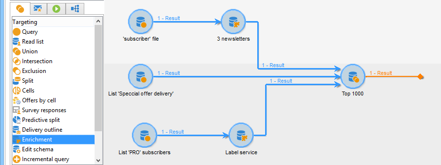

## Definitionen {#definitions}

Die Anreicherungsaktivität bietet verschiedene Optionen zur Hinzufügung von Daten:

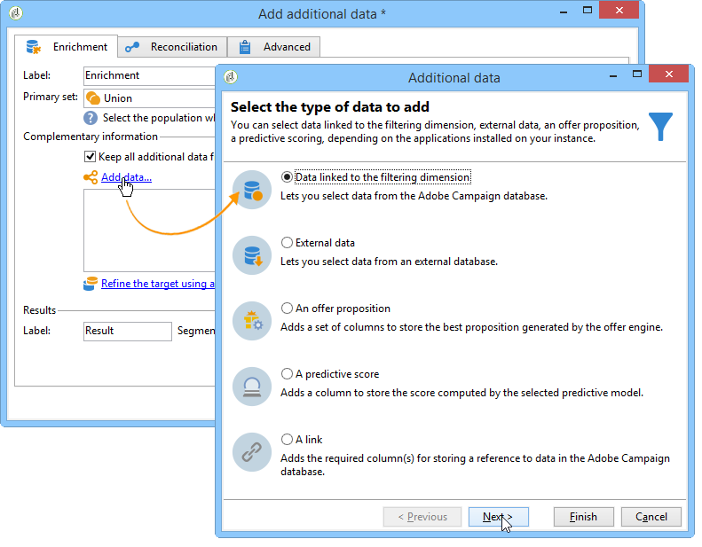

Die Option **[!UICONTROL Daten in Relation mit der Filterdimension]** bietet Zugriff auf:

* Daten der Filterdimension: entspricht den Daten der Arbeitstabelle;
* Daten in Relation mit der Filterdimension: entspricht den Daten in Relation mit der Arbeitstabelle.

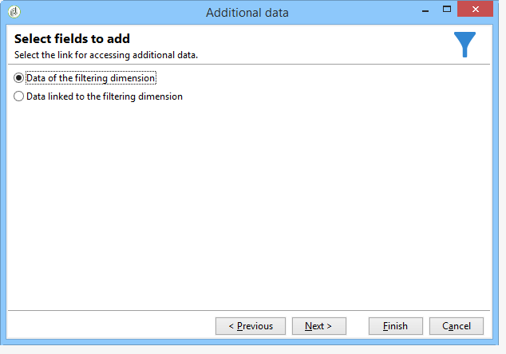

Die Option **[!UICONTROL Relation]** ermöglicht die Erstellung eines Joins mit jeder der in der Datenbank enthaltenen Tabellen.

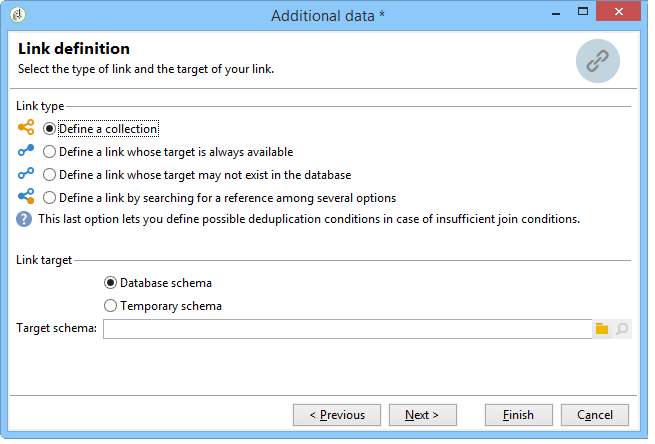

Vier Relationstypen stehen zur Auswahl:

* **[!UICONTROL Sammlung definieren]**: erstellt eine 1:n-Relation zwischen zwei Tabellen.
* **[!UICONTROL Relation definieren, deren Ziel noch verfügbar ist]**: ermöglicht die Definition einer Relation mit einer 1-1-Kardinalität zwischen Tabellen. Die Join-Bedingungen müssen durch einen einzelnen Datensatz in der Zieltabelle definiert werden.
* **[!UICONTROL Relation definieren, deren Ziel nicht unbedingt in der Basis vorhanden ist]**: ermöglicht die Definition einer Relation mit einer Kardinalität von 0-1 zwischen Tabellen. Die Join-Bedingung muss durch 0 oder 1 (max.) definiert sein. Datensatz in der Zieltabelle.

  Diese Option wird im Tab **[!UICONTROL Einfacher Join]** konfiguriert, auf den Sie über den Link **[!UICONTROL Zusätzliche Daten bearbeiten...]** in der Aktivität **[!UICONTROL Anreicherung]** zugreifen können.

* **[!UICONTROL Relation durch Suche nach einem Verweis aus mehreren Optionen definieren]**: Dieser Link-Typ definiert eine Abstimmung auf einen eindeutigen Datensatz hin. Adobe Campaign erstellt eine Relation zu einer Zieltabelle, indem in der Zieltabelle ein Fremdschlüssel zum Speichern eines Verweises auf den eindeutigen Datensatz hinzugefügt wird.

  Diese Option wird im Tab **[!UICONTROL Abstimmung &amp; Deduplizierung]** konfiguriert, auf den Sie über den Link **[!UICONTROL Zusätzliche Daten bearbeiten...]** in der Aktivität **[!UICONTROL Anreicherung]** zugreifen können.

Anwendungsbeispiele, mit denen die Funktionsweise der Aktivitäten des Typs „Anreicherung“ im Kontext ausführlich beschrieben wird, sind in folgenden Abschnitten verfügbar:

* [E-Mail-Anreicherung mit benutzerdefinierten Datumsfeldern](email-enrichment-with-custom-date-fields.md).
* [Anreicherung von Daten](enrich-data.md)
* [Erstellung einer zusammenfassenden Liste](create-a-summary-list.md)

## Informationen hinzufügen {#adding-information}

Verwenden Sie die **[!UICONTROL Anreicherung]**, um die Workflow-Arbeitstabelle um zusätzliche Daten zu ergänzen. Dies bietet sich insbesondere als Komplement zu einer Abfrage an.

Die Konfiguration der zusätzlichen Spalten wird im Abschnitt [Daten hinzufügen](query.md#adding-data) beschrieben.

Wählen Sie im Feld **[!UICONTROL Hauptmenge]** die eingehende Transition aus, deren Arbeitstabelle angereichert werden soll.

Klicken Sie auf **[!UICONTROL Link]** hinzufügen und wählen Sie den hinzuzufügenden Datentyp aus. Die Liste der angebotenen Datentypen hängt von den auf Ihrer Plattform installierten Modulen und Optionen ab. In einer minimalen Konfiguration können Sie immer Daten hinzufügen, die mit der Filterdimension und einem Link verknüpft sind.


Im folgenden Beispiel wird die Arbeitstabelle mit Informationen zum Alter der Zielpopulation angereichert.

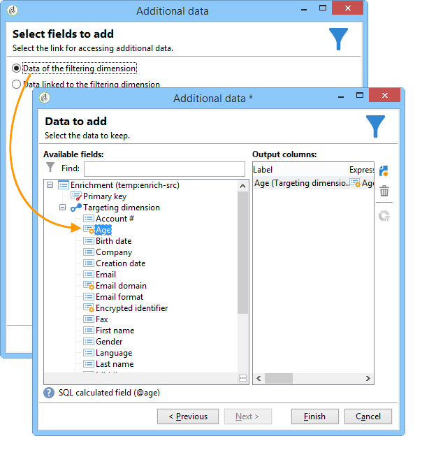

Klicken Sie mit der rechten Maustaste auf die eingehende Transition der Anreicherungsaktivität, um die Daten vor der Anreicherung anzusehen.

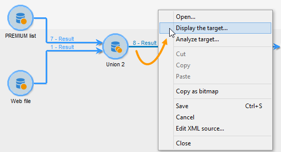

Die Arbeitstabelle enthält das zugeordnete Schema und folgende Daten:

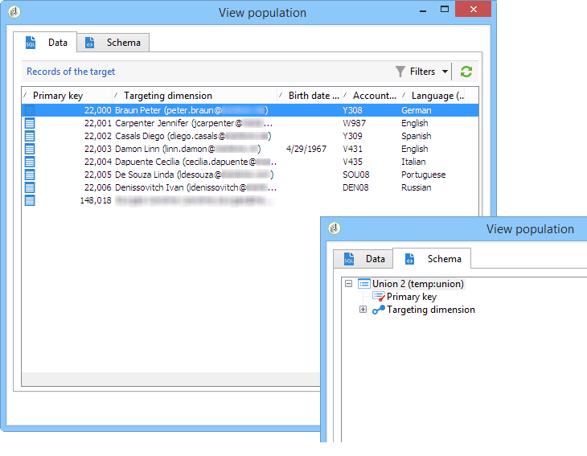

Sehen Sie sich nun die Daten nach der Anreicherung an, indem Sie mit der rechten Maustaste auf die ausgehende Transition klicken.

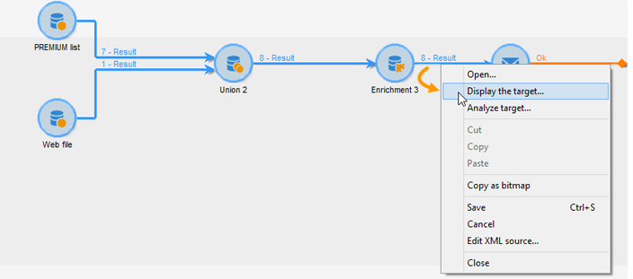

Sie stellen fest, dass das Alter hinzugefügt wurde:

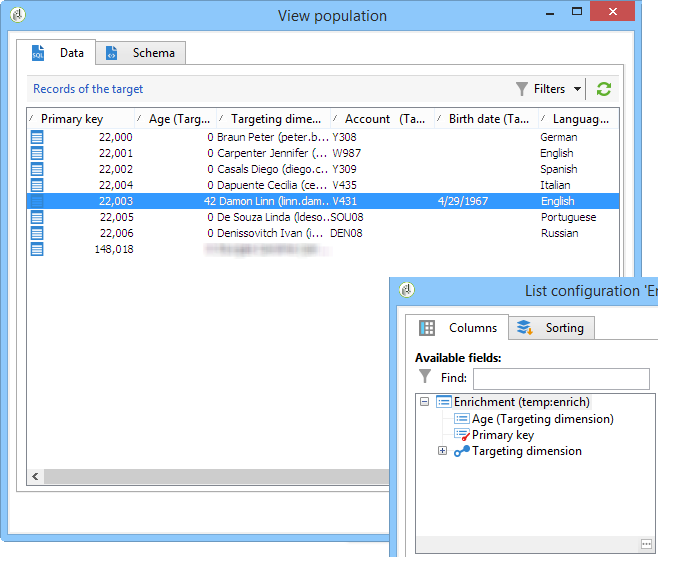

Auch das Schema wurde entsprechend angereichert.

## Umgang mit Zusatzdaten {#managing-additional-data}

Deaktivieren Sie die Option **[!UICONTROL Alle zusätzlichen Daten aus der Hauptmenge beibehalten]**, wenn Sie die zuvor definierten zusätzlichen Daten nicht beibehalten möchten. In diesem Fall werden nur die zusätzlichen Spalten, die in der Aktivität Anreicherung ausgewählt wurden, zur ausgehenden Arbeitstabelle hinzugefügt. Die zusätzlichen Informationen, die den vorgelagerten Aktivitäten hinzugefügt werden, werden nicht gespeichert.

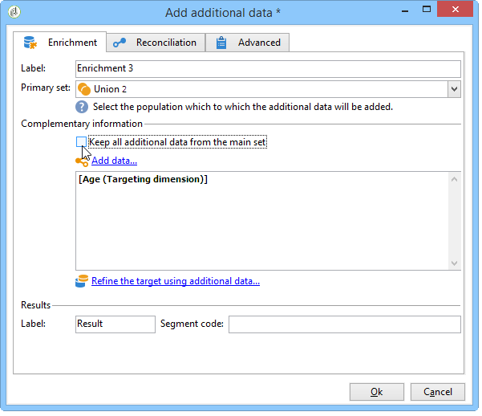

Die Daten und das Schema der ausgehenden Arbeitstabelle nach Durchführung der Anreicherung stellen sich dann wie folgt dar:

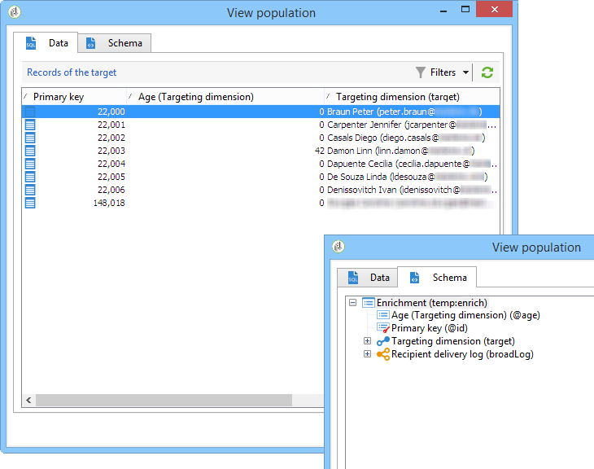

## Relation erzeugen {#creating-a-link}

Es besteht die Möglichkeit, mithilfe der Anreicherungsaktivität eine Relation zwischen den Daten der Arbeitstabelle und denen der Datenbank herzustellen. Es handelt sich in diesem Fall um eine auf den Workflow begrenzte Relation zwischen den eingehenden Daten.

Wenn Sie beispielsweise Daten aus einer Datei laden, die die Kundennummer, das Land und die E-Mail-Adresse der Empfänger enthält, ist die Erzeugung einer Relation zur Ländertabelle erforderlich, um die entsprechende Information im Empfängerprofil zu aktualisieren.

Gehen Sie hierzu wie folgt vor:

1. Laden Sie eine dem folgenden Muster entsprechende Datei:

   ```
   Account number;Country;Email
   18D65;FRANCE;agnes@gmail.com
   243PP;RUSSIA;paul@gmail.com
   55H87;CROATIA;dave@gmail.com
   56U81;USA;susan@gmail.com
   853PI;ITALY;anna@gmail.com
   890LP;FRANCE;robert@gmail.com
   83TY2;SWITZERLAND;mike@gmail.com
   ```

1. Öffnen Sie die Anreicherungsaktivität und klicken Sie auf den Link **Daten hinzufügen...**, um eine Relation zur Ländertabelle herzustellen.

   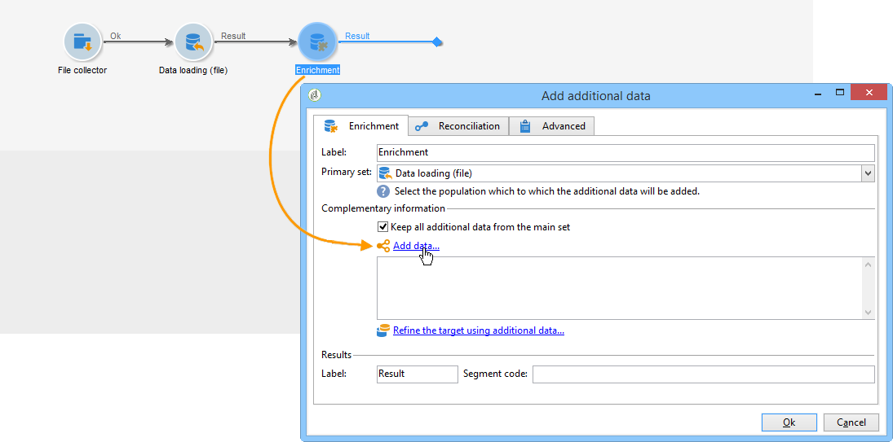

1. Wählen Sie die Option **[!UICONTROL Relationsdefinition]** und klicken Sie auf die Schaltfläche **[!UICONTROL Weiter]**. Geben Sie den Typ der zu erstellenden Relation an. In diesem Beispiel möchten wir das Land des Dateiempfängers mit einem Land in der Liste der verfügbaren Länder in der entsprechenden Tabelle der Datenbank abstimmen. Wählen Sie daher die Option **[!UICONTROL Relation durch Suche nach einer Referenz aus mehreren möglichen definieren]**. Wählen Sie im Feld **[!UICONTROL Zielschema]** die Ländertabelle an.

   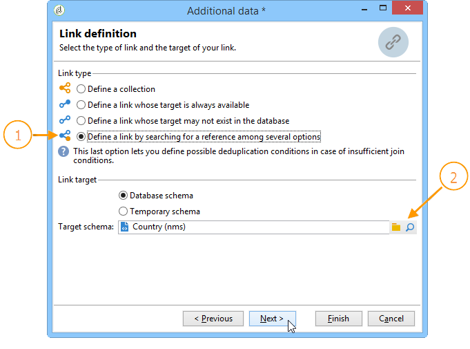

1. Definieren Sie schließlich das oder die Felder, die die Zuordnung der Werte der Quelldatei zu denen der Datenbank ermöglichen.

   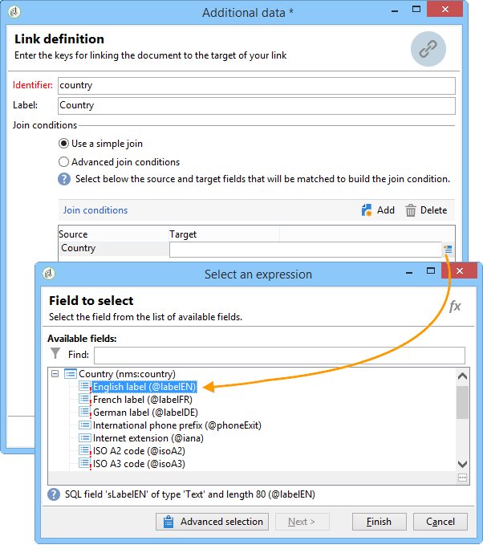

Nach Ausführung der Anreicherungsaktivität enthält das temporäre Schema wie zuvor konfiguriert die Relation zur Ländertabelle:

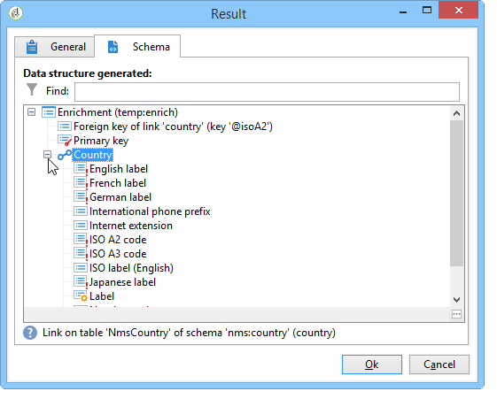

## Datenabstimmung {#data-reconciliation}

Die Anreicherungsaktivität kann zur Abstimmung von Daten genutzt werden, beispielsweise wenn externe Daten in die Datenbank geladen werden. In diesem Fall kann im Tab **[!UICONTROL Abstimmung]** die Relation zwischen den existierenden Daten und denen der Arbeitstabelle definiert werden.

Kreuzen Sie die Option **[!UICONTROL Dokument zur Zielgruppenbestimmung aufgrund der Arbeitsdaten identifizieren]** an und geben Sie das Schema an, zu dem die Relation hergestellt werden soll. Geben Sie dann die abzustimmenden Felder an: im Feld **[!UICONTROL Quellausdruck]** die der Arbeitsdaten und im Feld **[!UICONTROL Zielausdruck]** die der Zielgruppendimension.

Es können mehrere Abstimmkriterien definiert werden.

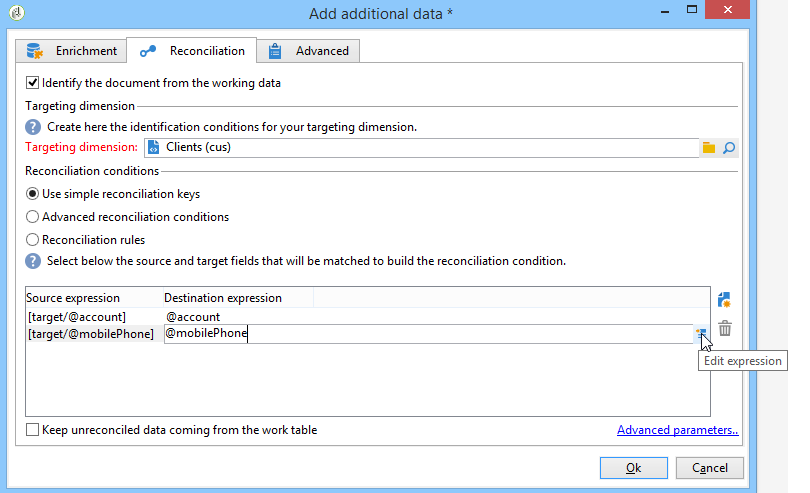

Bei mehreren Abstimmkriterien müssen ALLE erfüllt sein, damit die Relation hergestellt werden kann.

## Hinzufügung von Angebotsvorschlägen {#inserting-an-offer-proposition}

Die Anreicherungsaktivität ermöglicht das Hinzufügen von Angeboten oder von Relationen zu Angeboten für Versandempfänger.

Nähere Informationen zur Anreicherungsaktivität erhalten Sie in [diesem Abschnitt](enrichment.md).

Sie können beispielsweise aus einer Abfrage stammende Empfängerdaten vor Durchführung eines Versands anreichern.

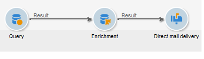

Erstellen Sie zunächst Ihre Zielbestimmungsabfrage (siehe diesen [Abschnitt](query.md)). Gehen Sie dann wie folgt vor:

1. Platzieren Sie im Anschluss an die Abfrage eine Anreicherungsaktivität und öffnen Sie sie zur weiteren Bearbeitung.
1. Wählen Sie **[!UICONTROL Daten hinzufügen]** im Tab **[!UICONTROL Anreicherung]**.
1. Wählen Sie **[!UICONTROL Angebotsvorschlag]** als hinzuzufügenden Datentyp aus.

   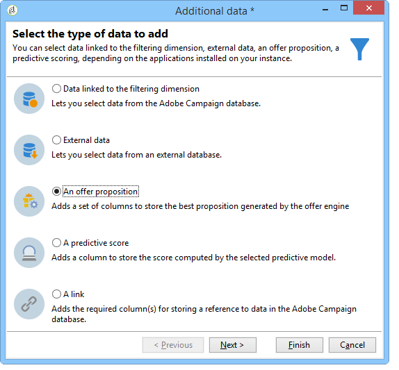

1. Geben Sie eine Kennung und einen Titel für den hinzuzufügenden Vorschlag an.
1. Geben Sie die Angebotsauswahl an. Hierfür gibt es zwei mögliche Optionen:

   * **[!UICONTROL Suche nach dem besten Angebot in einer Kategorie]**: Wenn Sie diese Option aktivieren, geben Sie die Aufrufparameter des Angebotsmoduls an (Platzierung, Kategorie oder Themen, Kontaktdatum, Anzahl beizubehaltender Angebote). Das Modul berechnet automatisch die hinzuzufügenden Angebote, die den Parametern entsprechen. Wir empfehlen, entweder das Feld **[!UICONTROL Kategorie]** oder das Feld **[!UICONTROL Thema]** vollständig auszufüllen, und nicht beide gleichzeitig.

     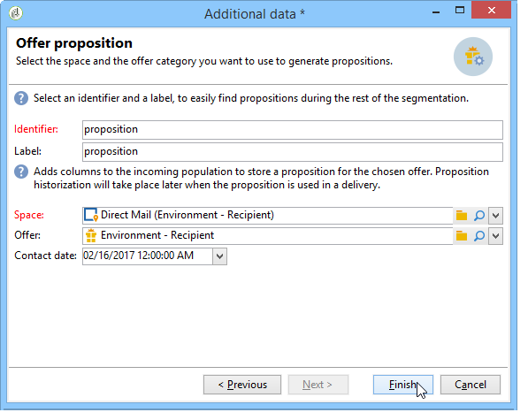

   * **[!UICONTROL Vordefiniertes Angebot]**: Bei Ankreuzen dieser Option können Sie ohne Abfrage des Angebotsmoduls direkt das einzufügende Angebot konfigurieren (Platzierung, Kontaktdatum).

     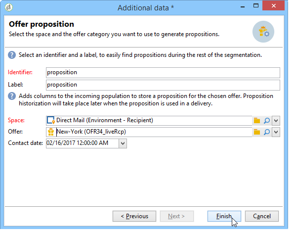

1. Konfigurieren Sie dann eine Versandaktivität, die dem von Ihnen gewählten Kanal entspricht. Siehe [Kanalübergreifender Versand](cross-channel-deliveries.md).

   Die Anzahl an für die Vorschau verfügbaren Vorschlägen hängt von der Konfiguration der Anreicherung und nicht von im Versand konfigurierten Parametern ab.

Um Angebotsvorschläge anzugeben, können Sie auch auf einen Link zu einem Angebot verweisen. Weitere Informationen hierzu finden Sie im Abschnitt [Referenzierung einer Relation zu einem Angebot](#referencing-a-link-to-an-offer).

## Referenzierung einer Relation zu einem Angebot {#referencing-a-link-to-an-offer}

In einer Anreicherungsaktivität besteht darüber hinaus die Möglichkeit, eine Relation zu einem Angebot zu referenzieren.

Gehen Sie dazu wie folgt vor:

1. Klicken Sie im Tab **[!UICONTROL Anreicherung]** der Aktivität auf den Link **[!UICONTROL Daten hinzufügen...]**.
1. Wählen Sie im folgenden Fenster den Datentyp **[!UICONTROL Relation]** aus.
1. Wählen Sie die Art des Links, den Sie erstellen möchten, sowie seine Zielgruppe aus. In diesem Fall ist das Angebotsschema die Zielgruppe.

   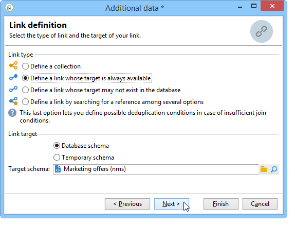

1. Relation zwischen den Daten der Eingangstabelle der Aktivität Anreicherung (hier die Empfängertabelle) und der Angebotstabelle Sie können beispielsweise einen Angebots-Code mit einem Empfänger verknüpfen.

   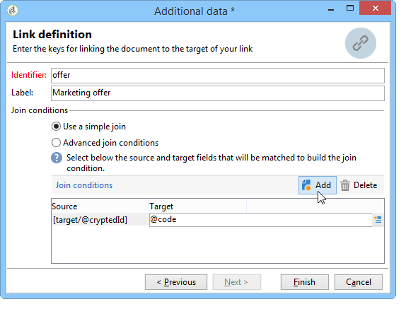

1. Konfigurieren Sie dann eine Versandaktivität, die dem von Ihnen gewählten Kanal entspricht. Siehe [Kanalübergreifender Versand](cross-channel-deliveries.md).

   >[!NOTE]
   >
   >Die Anzahl an für die Vorschau verfügbaren Vorschlägen hängt von den im Versand konfigurierten Parametern ab.

## Ranking und Gewichtung von Angeboten speichern {#storing-offer-rankings-and-weights}

Standardmäßig werden Ranking und Gewichtung bei Verwendung der Aktivität **Anreicherung** nicht in der Vorschlagstabelle gespeichert.

Die Aktivität **[!UICONTROL Angebotsmodul]** speichert diese Informationen standardmäßig.

Gehen Sie wie folgt vor, wenn Sie diese Informationen dennoch speichern möchten:

1. Erstellen Sie eine Angebotsmodul-Abfrage in einer Anreicherungsaktivität, die nach einer Abfrage und vor einer Versandaktivität platziert wird.
1. Klicken Sie im Anreicherung-Tab der gleichnamigen Aktivität auf den Link **[!UICONTROL Zusätzliche Daten bearbeiten...]**.

   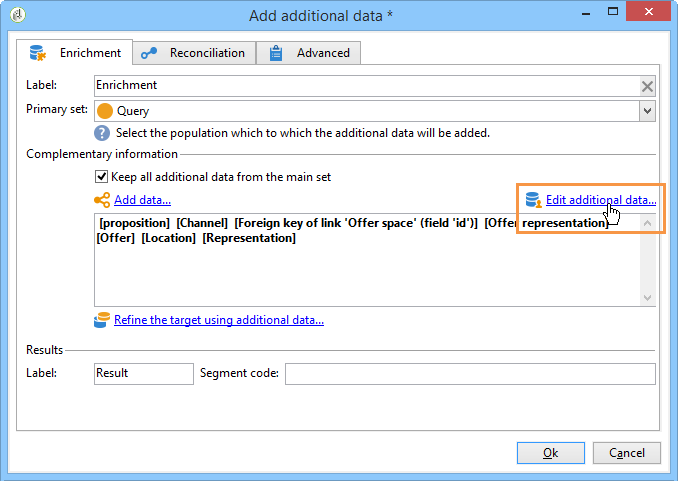

1. Fügen Sie für das Ranking die Spalte **[!UICONTROL @rank]** und für die Gewichtung die Spalte **[!UICONTROL @weight]** hinzu.

   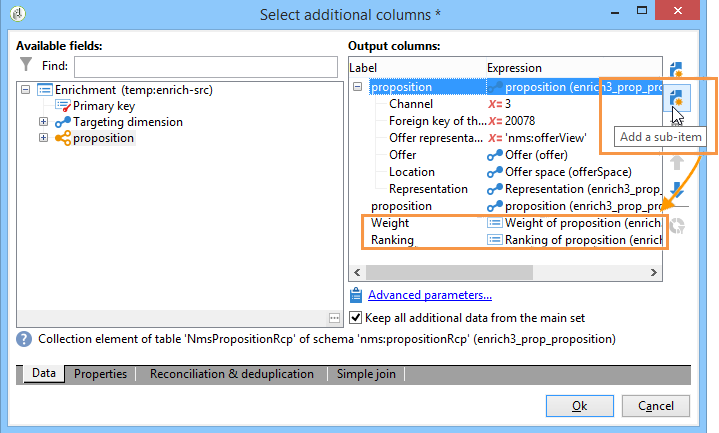

1. Bestätigen Sie Ihre Wahl und speichern Sie den Workflow.

Der Versand speichert automatisch die Rangfolge und Gewichtung der Angebote. Diese Informationen werden in der Registerkarte **[!UICONTROL Angebote]** des Versands angezeigt.
