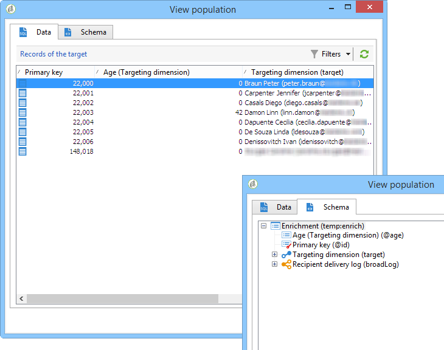

# Anreicherung{#enrichment}


Eine **[!UICONTROL Anreicherung]** ermöglicht die Ergänzung einer Profilliste durch Zusatzdaten und das Hinzufügen von Relationen zu existierenden Tabellen. Dabei können Abstimmkriterien in Bezug auf die bereits in der Datenbank enthaltenen Profile definiert werden.


## Definitionen {#definitions}

Die Anreicherungsaktivität bietet verschiedene Optionen zur Hinzufügung von Daten:


Die Option **[!UICONTROL Daten in Relation mit der Filterdimension]** bietet Zugriff auf:

* Daten der Filterdimension: entspricht den Daten der Arbeitstabelle;
* Daten in Relation mit der Filterdimension: entspricht den Daten in Relation mit der Arbeitstabelle.


Die Option **[!UICONTROL Relation]** ermöglicht die Erstellung eines Joins mit jeder der in der Datenbank enthaltenen Tabellen.


Vier Relationstypen stehen zur Auswahl:

* **[!UICONTROL Kollektion definieren]**: erstellt eine 1:n-Relation zwischen zwei Tabellen.
* **[!UICONTROL Relation definieren, Ziel muss zwingend existieren]**: erstellt eine 1:1-Relation zwischen zwei Tabellen. Die Join-Bedingung darf nur durch einen einzigen Datensatz der Zieltabelle definiert sein.
* **[!UICONTROL Relation definieren, Ziel muss nicht zwingend existieren]**: erstellt eine 0:1-Relation zwischen zwei Tabellen. Die Join-Bedingung darf nur durch null oder einen einzigen Datensatz der Zieltabelle definiert sein.

   Diese Option wird im Tab **[!UICONTROL Einfacher Join]** konfiguriert, auf den Sie über den Link **[!UICONTROL Zusätzliche Daten bearbeiten...]** in der Aktivität **[!UICONTROL Anreicherung]** zugreifen können.

* **[!UICONTROL Relation durch Suche nach einer Referenz aus mehreren möglichen definieren]**: definiert eine Abstimmung zu einem eindeutigen Datensatz. Adobe Campaign erstellt eine Relation zu einer Zieltabelle, indem ein Fremdschlüssel in die Zieltabelle eingefügt wird, der eine Referenz zum eindeutigen Datensatz enthält.

   Diese Option wird im Tab **[!UICONTROL Abstimmung &amp; Deduplizierung]** konfiguriert, auf den Sie über den Link **[!UICONTROL Zusätzliche Daten bearbeiten...]** in der Aktivität **[!UICONTROL Anreicherung]** zugreifen können.

Anwendungsbeispiele, mit denen die Funktionsweise der Anreicherungsaktivitäten im Kontext ausführlich beschrieben wird, sind in folgenden Abschnitten verfügbar:

* [E-Mail-Anreicherung mit benutzerdefinierten Datumsfeldern](email-enrichment-with-custom-date-fields.md).
* [Anreicherung von Daten](enrich-data.md)
* [Erstellung einer zusammenfassenden Liste](create-a-summary-list.md)

## Informationen hinzufügen {#adding-information}

Verwenden Sie die **[!UICONTROL Anreicherung]**, um die Workflow-Arbeitstabelle um zusätzliche Daten zu ergänzen. Dies bietet sich insbesondere im Anschluss an eine Abfrage an.

Die Konfiguration der zusätzlichen Spalten wird im Abschnitt [Daten hinzufügen](query.md#adding-data) beschrieben.

Wählen Sie im Feld **[!UICONTROL Hauptmenge]** die eingehende Transition aus, deren Arbeitstabelle angereichert werden soll.

Klicken Sie auf den Link **[!UICONTROL Daten hinzufügen...]** und geben Sie den gewünschten Datentyp an. Die verfügbaren Typen hängen von den auf Ihrer Plattform installierten Modulen ab. In der Minimalkonfiguration können Sie Daten in Relation mit der Filterdimension oder eine Relation hinzufügen.


Im folgenden Beispiel wird die Arbeitstabelle mit Informationen zum Alter der Zielpopulation angereichert.


Klicken Sie mit der rechten Maustaste auf die eingehende Transition der Anreicherungsaktivität, um die Daten vor der Anreicherung anzusehen.


Die Arbeitstabelle enthält das zugeordnete Schema und folgende Daten:


Sehen Sie sich nun die Daten nach der Anreicherung an, indem Sie mit der rechten Maustaste auf die ausgehende Transition klicken.


Sie stellen fest, dass das Alter hinzugefügt wurde:


Auch das Schema wurde entsprechend angereichert.

## Umgang mit Zusatzdaten {#managing-additional-data}

Deaktivieren Sie die Option **[!UICONTROL Alle Zusatzdaten der Hauptmenge beibehalten]**, wenn Sie nur die in der Anreicherungsaktivität erzeugten Spalten zur ausgehenden Arbeitstabelle hinzufügen möchten. Die eventuell in den vorangehenden Aktivitäten hinzugefügten Zusatzdaten werden nicht beibehalten.


Die Daten und das Schema der ausgehenden Arbeitstabelle nach Durchführung der Anreicherung stellen sich dann wie folgt dar:



## Relation erzeugen {#creating-a-link}

Es besteht die Möglichkeit, mithilfe der Anreicherungsaktivität eine Relation zwischen den Daten der Arbeitstabelle und denen der Datenbank herzustellen. Es handelt sich in diesem Fall um eine auf den Workflow begrenzte Relation zwischen den eingehenden Daten.

Wenn Sie beispielsweise Daten aus einer Datei laden, die die Kundennummer, das Land und die E-Mail-Adresse der Empfänger enthält, ist die Erzeugung einer Relation zur Ländertabelle erforderlich, um die entsprechende Information im Empfängerprofil zu aktualisieren.

Gehen Sie hierzu wie folgt vor:

1. Laden Sie eine dem folgenden Muster entsprechende Datei:

   ```
   Account number;Country;Email
   18D65;FRANCE;agnes@gmail.com
   243PP;RUSSIA;paul@gmail.com
   55H87;CROATIA;dave@gmail.com
   56U81;USA;susan@gmail.com
   853PI;ITALY;anna@gmail.com
   890LP;FRANCE;robert@gmail.com
   83TY2;SWITZERLAND;mike@gmail.com
   ```

1. Öffnen Sie die Anreicherungsaktivität und klicken Sie auf den Link **Daten hinzufügen...**, um eine Relation zur Ländertabelle herzustellen.

   

1. Kreuzen Sie die Option **[!UICONTROL Relation]** an und klicken Sie auf die Schaltfläche **[!UICONTROL Weiter]**. Geben Sie die Art der zu erstellenden Relation an. Im vorliegenden Beispiel soll das Land des Empfängers der eingehenden Datei mit einem Land aus der entsprechenden Datenbanktabelle abgestimmt werden. Wählen Sie daher die Option **[!UICONTROL Relation durch Suche nach einer Referenz aus mehreren möglichen definieren]** und geben Sie im Feld **[!UICONTROL Zielschema]** die Ländertabelle an.

   

1. Definieren Sie schließlich das oder die Felder, die die Zuordnung der Werte der Quelldatei zu denen der Datenbank ermöglichen.

   

Nach Ausführung der Anreicherungsaktivität enthält das temporäre Schema wie zuvor konfiguriert die Relation zur Ländertabelle:


## Datenabstimmung {#data-reconciliation}

Die Anreicherungsaktivität kann zur Abstimmung von Daten genutzt werden, beispielsweise wenn externe Daten in die Datenbank geladen werden. In diesem Fall kann im Tab **[!UICONTROL Abstimmung]** die Relation zwischen den existierenden Daten und denen der Arbeitstabelle definiert werden.

Kreuzen Sie die Option **[!UICONTROL Dokument zur Zielgruppenbestimmung aufgrund der Arbeitsdaten identifizieren]** an und geben Sie das Schema an, zu dem die Relation hergestellt werden soll. Geben Sie dann die abzustimmenden Felder an: im Feld **[!UICONTROL Quellausdruck]** die der Arbeitsdaten und im Feld **[!UICONTROL Zielausdruck]** die der Zielgruppendimension.

Es können mehrere Abstimmkriterien definiert werden.


Bei mehreren Abstimmkriterien müssen ALLE erfüllt sein, damit die Relation hergestellt werden kann.

## Hinzufügung von Angebotsvorschlägen {#inserting-an-offer-proposition}

Die Anreicherungsaktivität ermöglicht das Hinzufügen von Angeboten oder von Relationen zu Angeboten für Versandempfänger.

Nähere Informationen zur Anreicherungsaktivität erhalten Sie in [diesem Abschnitt](enrichment.md).

Sie können beispielsweise aus einer Abfrage stammende Empfängerdaten vor Durchführung eines Versands anreichern.


Erstellen Sie zunächst Ihre Zielbestimmungsabfrage (siehe diesen [Abschnitt](query.md)). Gehen Sie dann wie folgt vor:

1. Platzieren Sie im Anschluss an die Abfrage eine Anreicherungsaktivität und öffnen Sie sie zur weiteren Bearbeitung.
1. Wählen Sie **[!UICONTROL Daten hinzufügen]** im Tab **[!UICONTROL Anreicherung]**.
1. Wählen Sie **[!UICONTROL Angebotsvorschlag]** als hinzuzufügenden Datentyp aus.

   

1. Geben Sie eine Kennung und einen Titel für den hinzuzufügenden Vorschlag an.
1. Konfigurieren Sie die Angebotsauswahl. Zwei Optionen stehen zur Auswahl:

   * **[!UICONTROL Suche nach dem besten Angebot in einer Kategorie]**: Wenn Sie diese Option ankreuzen, berechnet das Angebotsmodul automatisch das oder die einzufügenden Angebote, die den angegebenen Parametern (Platzierung, Kategorie oder Themen, Kontaktdatum, Anzahl beizubehaltender Angebote) entsprechen. Es wird empfohlen, entweder eine **[!UICONTROL Kategorie]** oder **[!UICONTROL Themen]** anzugeben.

      

   * **[!UICONTROL Vordefiniertes Angebot]**: Bei Ankreuzen dieser Option können Sie ohne Abfrage des Angebotsmoduls direkt das einzufügende Angebot konfigurieren (Platzierung, Kontaktdatum).

      

1. Konfigurieren Sie dann eine Versandaktivität, die dem von Ihnen gewählten Kanal entspricht. Siehe [Kanalübergreifender Versand](cross-channel-deliveries.md).

   Die Anzahl an für die Vorschau verfügbaren Vorschlägen hängt von der Konfiguration der Anreicherung und nicht von im Versand konfigurierten Parametern ab.

Um Angebotsvorschläge anzugeben, können Sie auch auf einen Link zu einem Angebot verweisen. Weitere Informationen hierzu finden Sie im Abschnitt [Referenzierung einer Relation zu einem Angebot](#referencing-a-link-to-an-offer).

## Referenzierung einer Relation zu einem Angebot {#referencing-a-link-to-an-offer}

In einer Anreicherungsaktivität besteht darüber hinaus die Möglichkeit, eine Relation zu einem Angebot zu referenzieren.

Gehen Sie dazu wie folgt vor:

1. Klicken Sie im Tab **[!UICONTROL Anreicherung]** der Aktivität auf den Link **[!UICONTROL Daten hinzufügen...]**.
1. Wählen Sie im folgenden Fenster den Datentyp **[!UICONTROL Relation]** aus.
1. Definieren Sie nun den Relationstyp und das Ziel der Relation. Im vorliegenden Beispiel handelt es sich beim Ziel um das Angebotsschema.

   

1. Definieren Sie die Art der Relation zwischen den Daten der Eingangstabelle der Aktivität &quot;Anreicherung&quot; (hier die Empfängertabelle) und der Angebotstabelle. Sie können beispielsweise einem Empfänger einen Angebots-Code zuordnen.

   

1. Konfigurieren Sie dann eine Versandaktivität, die dem von Ihnen gewählten Kanal entspricht. Siehe [Kanalübergreifender Versand](cross-channel-deliveries.md).

   >[!NOTE]
   >
   >Die Anzahl an für die Vorschau verfügbaren Vorschlägen hängt von den im Versand konfigurierten Parametern ab.

## Ranking und Gewichtung von Angeboten speichern {#storing-offer-rankings-and-weights}

Standardmäßig werden Ranking und Gewichtung bei Verwendung der Aktivität **Anreicherung** nicht in der Vorschlagstabelle gespeichert.


Die Aktivität **[!UICONTROL Angebotsmodul]** speichert diese Informationen standardmäßig.

Gehen Sie wie folgt vor, wenn Sie diese Informationen dennoch speichern möchten:

1. Erstellen Sie eine Angebotsmodul-Abfrage in einer Anreicherungsaktivität, die nach einer Abfrage und vor einer Versandaktivität platziert wird.
1. Klicken Sie auf der Registerkarte &quot;Anreicherung&quot; der gleichnamigen Aktivität auf den Link **[!UICONTROL Zusätzliche Daten bearbeiten...]**.

   

1. Fügen Sie für das Ranking die Spalte **[!UICONTROL @rank]** und für die Gewichtung die Spalte **[!UICONTROL @weight]** hinzu.


   

1. Bestätigen Sie Ihre Wahl und speichern Sie den Workflow.

Der Versand speichert nun automatisch Ranking und Gewichtung der Angebote. Die Informationen können im Tab **[!UICONTROL Angebote]** des Versands eingesehen werden.

