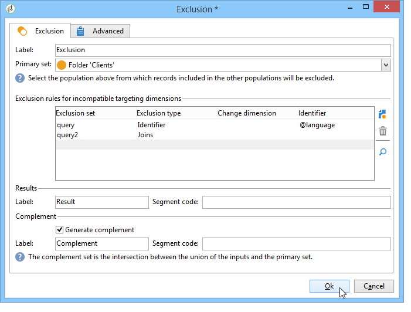
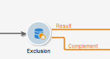
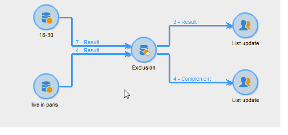

# Ausschluss{#exclusion}

Über eine Aktivität vom Typ **Ausschluss** lassen sich Populationen aus der Hauptzielgruppe extrahieren.

Um diese Aktivität zu konfigurieren, geben Sie ihren Titel ein und wählen Sie die Hauptempfängergruppe aus: Mit der Population aus der Hauptgruppe können Sie das Ergebnis konstruieren. Profile, die von der Hauptgruppe und mindestens einer der Eintrittstätigkeiten freigegeben werden, werden ausgeschlossen.

>[!NOTE]
>
>Weitere Informationen zum Konfigurieren und Verwenden der Ausschlussaktivität finden Sie unter [Populationen ausschließen (Ausschluss)](targeting-workflows.md#excluding-a-population--exclusion-).

Aktivieren Sie die **[!UICONTROL Komplement erzeugen]**, wenn Sie die verbleibende Population nutzen möchten. Das Komplement besteht aus der Haupteinreisepopulation abzüglich der ausreisenden Population. Eine zusätzliche ausgehende Transition wird wie folgt zur Aktivität hinzugefügt:

## Anwendungsbeispiele für Ausschlüsse {#exclusion-examples}

Gesucht werden Empfänger zwischen 18 und 30 Jahre, die nicht in Berlin leben. Gehen Sie wie folgt vor:

1. Fügen Sie eine Aktivität vom Typ **[!UICONTROL Ausschluss]** nach zwei Abfragen ein und öffnen Sie sie. Die erste Abfrage richtet sich an Empfängerinnen und Empfänger, die in Paris leben. Die zweite Abfrage bezieht sich auf Personen im Alter von 18 bis 30 Jahren.
1. Geben Sie die Hauptmenge ein. Hier ist die Hauptmenge die Abfrage **18-30 Jahre**. Alle Empfangenden, die in der Ergebnismenge der zweiten Abfrage enthalten sind, werden auf diese Weise vom Endergebnis ausgeschlossen.
1. Aktivieren Sie die Option **[!UICONTROL Komplement erzeugen]**, wenn Sie die Daten nutzen möchten, die nach dem Ausschluss verbleiben. In diesem Fall besteht das Komplement aus Empfängern im Alter von 18 bis 30 Jahren, die in Paris leben.
1. Bestätigen Sie die Ausschlusskonfiguration und fügen Sie dann eine Aktivität Liste aktualisieren in das Ergebnis ein. Sie können bei Bedarf auch eine zusätzliche Listenaktualisierung zum Komplement einfügen.
1. Führt den Workflow aus. In diesem Beispiel besteht das Ergebnis aus Empfängerinnen und Empfängern im Alter von 18 bis 30 Jahren, aber diejenigen, die in Paris leben, werden ausgeschlossen und an das Komplement gesendet.

   

## Eingabeparameter {#input-parameters}

* tableName
* schema

Jedes eingehende Ereignis muss eine durch diese Parameter definierte Zielgruppe angeben.

## Ausgabeparameter {#output-parameters}

* tableName
* schema
* recCount

Anhand der drei Werte lässt sich die durch den Ausschluss ermittelte Zielgruppe identifizieren. **[!UICONTROL tableName]** ist der Name der Tabelle, die die Zielgruppen-IDs enthält, **[!UICONTROL schema]** ist das Schema der Population, (i. d. R. nms:recipient) und **[!UICONTROL recCount]** ist die Anzahl der Elemente in der Tabelle.

Die Transition des Komplements weist die gleichen Parameter auf.
