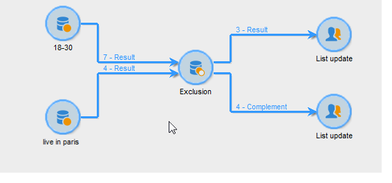

# Ausschluss{#exclusion}

Über eine Aktivität vom Typ **Ausschluss** lassen sich Populationen aus der Hauptzielgruppe extrahieren.

Konfigurieren Sie die Aktivität, indem Sie sie benennen und eine Hauptmenge auswählen. Die Population der Hauptmenge bildet die Grundlage zur Ergebnisfindung. Ausgeschlossen werden die Profile, die sowohl in der Hauptmenge als auch in mindestens einer der eingehenden Aktivitäten enthalten sind.

>[!NOTE]
>
>Weitere Informationen zum Konfigurieren und Verwenden der Ausschlussaktivität finden Sie unter [Populationen ausschließen (Ausschluss)](targeting-workflows.md#excluding-a-population--exclusion-).

Kreuzen Sie die Option **[!UICONTROL Komplement erzeugen]** an, wenn Sie auch die restliche Population verwenden möchten. Das Komplement enthält in diesem Fall die Hauptmenge abzüglich der Ergebnismenge. Die Ausschlussaktivität weist somit, wie unten abgebildet, zwei ausgehende Transitionen auf:

## Anwendungsbeispiele für Ausschlüsse {#exclusion-examples}

Gesucht werden Empfänger zwischen 18 und 30 Jahre, die nicht in Berlin leben. Gehen Sie wie folgt vor:

1. Schließen Sie einen **[!UICONTROL Ausschluss]** an zwei Abfragen an. Die erste Abfrage ruft alle Empfänger ab, die in Berlin leben, die zweite alle Empfänger zwischen 18 und 30 Jahre.
1. Geben Sie die Hauptmenge an, in diesem Fall die Abfrage **18-30 Jahre**. Alle Empfänger, die in der Ergebnismenge der zweiten Abfrage enthalten sind, werden auf diese Weise vom Endergebnis ausgeschlossen.
1. Kreuzen Sie die Option **[!UICONTROL Komplement erzeugen]** an, wenn Sie die ausgeschlossenen Elemente weiterverwenden möchten. In diesem Fall enthält das Komplement die Empfänger zwischen 18 und 30 Jahre, die in Berlin leben.
1. Bestätigen Sie die Konfiguration der Ausschlussaktivität und fügen Sie ein Listen-Update an. Schließen Sie, wenn Sie das Komplement verwenden, auch hier ein Listen-Update an.
1. Starten Sie den Workflow. Im vorliegenden Beispiel enthält die Ergebnisliste alle Empfänger im Alter von 18 bis 30 Jahre, außer denen, die in Berlin leben. Diese werden in der Komplementliste gespeichert.

   

## Eingabeparameter {#input-parameters}

* tableName
* schema

Jedes eingehende Ereignis muss eine durch diese Parameter definierte Zielgruppe angeben.

## Ausgabeparameter {#output-parameters}

* tableName
* schema
* recCount

Anhand der drei Werte lässt sich die durch den Ausschluss ermittelte Zielgruppe identifizieren. **[!UICONTROL tableName]** ist der Name der Tabelle, welche die Kennungen der Zielgruppenempfänger enthält, **[!UICONTROL schema]** ist das Schema der Population, (i. d. R. nms:recipient) und **[!UICONTROL recCount]** ist die Anzahl an Elementen in der Tabelle.

Die Transition des Komplements weist die gleichen Parameter auf.
