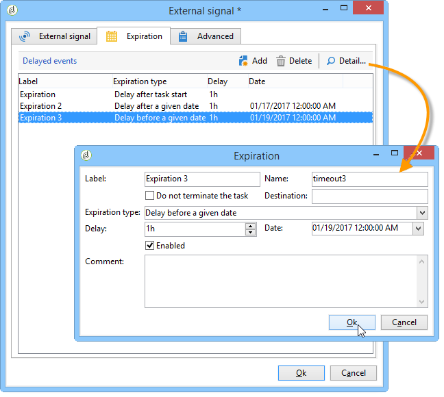
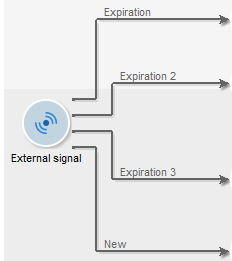

# Externes Signal{#external-signal}

Ein **Externes Signal** löst die Ausführung einer Reihe von Aufgaben innerhalb eines Workflows aus.

Wenn eine Aufgabe „Externes Signal“ aktiviert wird, wird sie unbegrenzt oder bis zum Ende des angegebenen Zeitraums ausgesetzt. Die Transition wird durch den SOAP-Aufruf aktiviert **PostEvent(sessionToken, workflowId, activity, transition, parameters, complete).** Der **[!UICONTROL complete]**-Parameter ermöglicht die Fertigstellung der Aufgabe und reagiert daher nicht auf nachfolgende Aufrufe.

Weiterführende Hinweise zu SOAP-Aufrufen und der PostEvent-Funktion finden Sie in der einschlägigen Online-Literatur.

Sie können diese Aktivität so konfigurieren, dass Ereignisse definiert werden, wenn kein Signal empfangen wird. Bearbeiten Sie hierzu die Aktivität und klicken Sie auf die Registerkarte **[!UICONTROL Gültigkeit]**. Klicken Sie auf die Schaltfläche **[!UICONTROL Einfügen]**, um ein Ereignis zu erstellen und zu konfigurieren.

Die Ablauf-Konfiguration wird im Abschnitt [Timeouts](define-approvals.md) beschrieben.

In der Spalte **Timeout** kann die Zeitspanne vor Ablauf in den Einheiten Ihrer Wahl definiert werden. Siehe [Warten](wait.md).

Jede Zeile stellt einen Ablauftypen dar und entspricht einer Transition.

