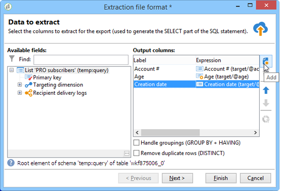

# Extraktion (Datei){#extraction-file}

Mithilfe der Aktivität **[!UICONTROL Extraktion (Datei)]** werden Daten einer Workflow-Tabelle in eine externe Datei extrahiert.

>[!CAUTION]
>
>Diese Aktivität erfordert eine eingehende Transition mit den zu extrahierenden Daten.

Gehen Sie wie folgt vor, um eine Extraktion zu konfigurieren:

1. Benennen Sie die zu extrahierende Datei. Der Name kann Variablen enthalten, die über die Personalisierungsschaltfläche rechts des entsprechenden Felds eingefügt werden können.
1. Klicken Sie auf den Link **[!UICONTROL Dateiformat bearbeiten...]**, um die zu extrahierenden Daten auszuwählen.

   

   Die Option **[!UICONTROL Gruppierungen verwalten (GROUP BY + HAVING)]** fügt eine weitere Etappe hinzu, die die Filterung des Aggregats ermöglicht (z. B. nach einer bestimmten Art von Bestellung, nach Kunden mit mehr als zehn Bestellungen etc.).

1. Bei Bedarf können Sie der Ausgabedatei zusätzliche Spalten hinzufügen, zum Beispiel die Ergebnisse von Auswertungen oder Verarbeitungen. Wählen Sie hierzu das Symbol **[!UICONTROL Hinzufügen]**.

   

   Klicken Sie dann auf das Symbol **[!UICONTROL Ausdruck bearbeiten]**, um den Inhalt der neuen Spalte zu definieren.

   

   Sie greifen dann auf das Auswahlfenster zu. Klicken Sie auf **[!UICONTROL Erweiterte Auswahl]**, um den auf die Daten anzuwendenden Prozess auszuwählen.

   

   Kreuzen Sie die gewünschte Formel an.

   

Sie können eine Nachbearbeitung definieren, die während der Datenextraktion ausgeführt werden soll, damit die Dateien komprimiert oder verschlüsselt werden. Dazu muss der gewünschte Befehl auf dem Tab **[!UICONTROL Script]** der Aktivität hinzugefügt werden.

## Aggregat-Funktionen {#list-of-aggregate-functions}

Folgende Aggregatfunktionen stehen zur Verfügung:

* **[!UICONTROL Zählung]**: zählt die Werte ungleich null des zu aggregierenden Felds einschließlich der doppelten Werte (des aggregierten Felds).

  **[!UICONTROL Zählung - Unterschiedlich]**: zählt die unterschiedlichen Werte ungleich null des zu aggregierenden Felds. Doppelte Werte werden vor der Berechnung ausgeschlossen.

* **[!UICONTROL Summe]**: gibt die Summe der Werte eines numerischen Felds aus.
* **[!UICONTROL Minimaler Wert]**: gibt den Mindestwert eines beliebigen Felds aus.
* **[!UICONTROL Maximaler Wert]**: gibt den Höchstwert eines beliebigen Felds aus.
* **[!UICONTROL Durchschnitt]**: gibt den Durchschnittswert eines numerischen Felds aus.
