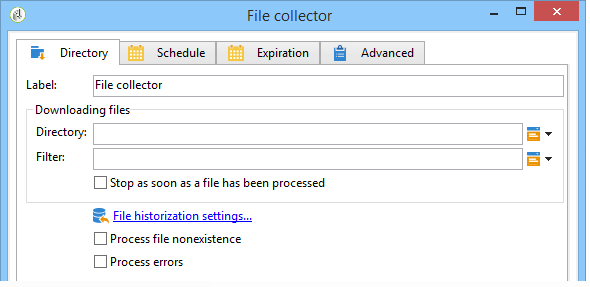
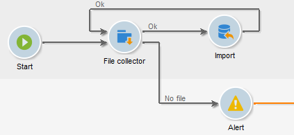

# Datei-Wächter{#file-collector}

Der **Datei-Wächter** überwacht das Eintreffen einer oder mehrerer Dateien in einem Verzeichnis und aktiviert für jede empfangene Datei deren Transition. Für jedes Ereignis enthält **[!UICONTROL Variable &quot;]**&quot; den vollständigen Namen der empfangenen Datei. Die gesammelten Dateien werden zu Archivierungszwecken in ein anderes Verzeichnis verschoben, um sicherzustellen, dass sie nur einmal gezählt werden.

Standardmäßig ist der Datei-Wächter eine persistente Aufgabe, die zu den in der Planung definierten Zeitpunkten das Verzeichnis auf das Vorhandensein von Dateien prüft.

Die Dateien müssen sich auf dem Server befinden, auf dem das für diesen Workflow verantwortliche wfserver-Modul ausgeführt wird. Wenn mehrere wfserver-Module auf einer einzigen Instanz bereitgestellt werden, muss entweder die Affinität der Aktivitäten, die diese Dateien verwenden, oder die Gesamtaffinität des Workflows angegeben werden.

## Eigenschaften {#properties}

Auf dem ersten Tab der Aktivität **[!UICONTROL Datei-Wächter]** können Sie den Quellordner auswählen und die erfassten Dateien bei Bedarf filtern. Die anderen Tabs werden unter [E-Mail-Empfang](inbound-emails.md) (auf den Tabs **[!UICONTROL Planung]** und **[!UICONTROL Ablauf]**) ausführlich beschrieben.

1. **Abruf der Dateien**

   * **[!UICONTROL Verzeichnis]**

     Ordner, der die herunterzuladenden Dateien enthält. Dieses Verzeichnis muss zuvor auf dem Server erstellt werden: Wenn es nicht existiert, wird ein Fehler ausgelöst.

   * **[!UICONTROL Filter]**

     Nur Dateien, die diesem Filter entsprechen, werden berücksichtigt. Die anderen Dateien im Verzeichnis werden ignoriert. Wenn der Filter leer ist, werden alle Dateien im Verzeichnis berücksichtigt. Filterbeispiele: **&#42;.zip**, **import-&#42;.txt**.

   * **[!UICONTROL Stoppen, sobald eine Datei bearbeitet wurde]**

     Wenn diese Option aktiviert ist, endet die Aufgabe nach Erhalt der ersten Datei. Wenn mehrere dem Filter entsprechende Dateien im Verzeichnis vorhanden sind, wird nur eine berücksichtigt. Diese Option garantiert, dass nur ein Ereignis gesendet wird. Die berücksichtigte Datei ist die erste in der Liste in alphabetischer Reihenfolge.

     Im Falle einer Aktivität, für die keine Planung definiert wurde, wird ein Fehler erzeugt, wenn keine Datei den Filterkriterien entspricht und die Option **[!UICONTROL Fehlen von Dateien bearbeiten]** nicht aktiviert wurde.

   * **[!UICONTROL Planung]**

     Definiert mithilfe der im Tab **[!UICONTROL Planung]** angegebenen Parameter die Häufigkeit, mit der das Verzeichnis auf die Existenz von Dateien überprüft wird.

1. **Umgang mit Fehlern**

   Zwei Optionen stehen zur Verfügung:

   * **[!UICONTROL Fehlen von Dateien bearbeiten]**

     Bei Ankreuzen dieser Option erscheint eine spezifische Transition, die immer dann aktiviert wird, wenn keine dem Filter entsprechende Datei im angegebenen Verzeichnis vorhanden ist.

     Wenn für die Aufgabe keine Planung definiert wurde, wird diese Transition nur einmal aktiviert.

   * **[!UICONTROL Fehler verarbeiten]**

     Mit dieser Option wird ein spezieller Übergang angezeigt, der aktiviert wird, wenn ein Fehler erzeugt wird. In diesem Fall ändert sich der Workflow nicht in den Fehlerstatus und wird weiter ausgeführt

     Dies gilt für Fehler des Dateisystems (Datei kann nicht verschoben werden, Zugriff auf das Verzeichnis nicht möglich usw.).

     Fehler, die aus der Konfiguration der Aktivität resultieren, beispielsweise durch Angabe von ungültigen Werten (z. B. inexistentes Verzeichnis), werden nicht verarbeitet.

1. **Verlauf**

   Informationen zum Schritt **[!UICONTROL Verlaufserstellung]** finden Sie unter [HTTP-Übertragung](web-download.md).

Die Reihenfolge der Dateiverarbeitung kann nicht beeinflusst werden. Um eine Reihe von Dateien schrittweise zu verarbeiten, kann die Option **[!UICONTROL Stoppen, sobald eine Datei bearbeitet wurde]** in Verbindung mit einer Schlaufe verwendet werden. In diesem Fall werden die Dateien in alphabetischer Reihenfolge verarbeitet. Die Option **[!UICONTROL Fehlen von Dateien bearbeiten]** beendet die Schlaufe.

## Ausgabeparameter {#output-parameters}

* filename: vollständiger Dateiname. Dies ist der Dateiname, nachdem er in das Historisierungsverzeichnis verschoben wurde. Der Pfad ist daher anders; der Name unterscheidet sich jedoch ebenfalls, wenn in dem Verzeichnis bereits eine andere Datei mit demselben Namen vorhanden ist. Die Erweiterung bleibt erhalten.
