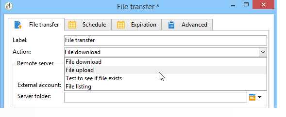
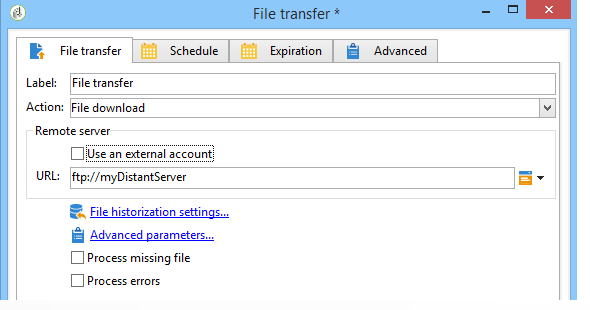
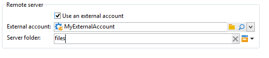
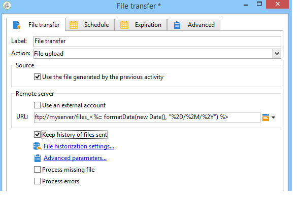
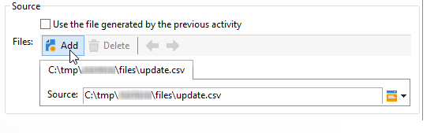
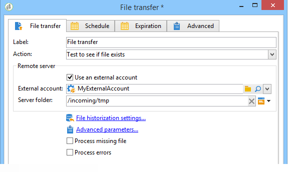
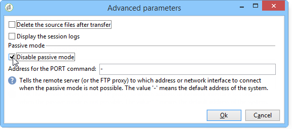

# Dateiübertragung{#file-transfer}

Mit der Aktivität **Dateiübertragung** können Sie Dateien senden und empfangen, das Vorhandensein von Dateien prüfen oder Dateien auf einem Server auflisten. Hierfür können die Protokolle Azure Blob Storage, Amazon Simple Storage Service (S3), FTP oder SFTP verwendet werden.
Bei Verwendung einer S3-, Azure Blob Storage- oder SFTP-Verbindung ist es außerdem möglich, Segmentdaten über die Echtzeit-Kundendatenplattform von Adobe in Adobe Campaign zu importieren. Weitere Informationen hierzu finden Sie in [dieser Dokumentation](https://experienceleague.adobe.com/docs/experience-platform/destinations/catalog/email-marketing/adobe-campaign.html?lang=de){target="_blank"}.

## Eigenschaften {#properties}

Wählen Sie im Feld **[!UICONTROL Aktion]** die auszuführende Aktivität aus.

Die weitere Konfiguration hängt von der gewählten Aktion ab.

1. **Dateiempfang**

   Um auf einem Remote-Server gespeicherte Dateien zu empfangen, wählen Sie **[!UICONTROL Datei herunterladen]** im Feld **[!UICONTROL Aktion]** aus. Die URL muss im entsprechenden Feld angegeben werden.

   

   Aktivieren Sie das Kontrollkästchen **[!UICONTROL Externes Konto verwenden]**, um ein Konto aus den Azure Blob Storage-, S3-, FTP- oder SFTP-Konten auszuwählen, die im Knoten **[!UICONTROL Administration > Plattform > Externe Konten]** des Navigationsbaums konfiguriert sind. Geben Sie danach an, welches Verzeichnis auf dem Server die Dateien enthält, die heruntergeladen werden sollen.

   

1. **Dateiübertragung**

   Um eine Datei an einen Server zu senden, wählen Sie **[!UICONTROL Datei-Upload]** im Feld **[!UICONTROL Aktion]**. Sie müssen den Ziel-Server im Abschnitt **[!UICONTROL Remote-Server]** des Editors angeben. Die Parameter sind mit denen für eingehende Dateien identisch. Siehe oben.

   Die Quelldatei kann aus der vorherigen Aktivität stammen. In diesem Fall muss die Option **[!UICONTROL Durch vorhergehende Aktivität erzeugte Datei verwenden]** ausgewählt sein.

   

   Dies kann sich auch auf eine oder mehrere andere Dateien beziehen. Um sie auszuwählen, deaktivieren Sie die Option und klicken Sie auf **[!UICONTROL Einfügen]**. Geben Sie den Zugriffspfad der zu sendenden Datei an. Um eine weitere Datei hinzuzufügen, klicken Sie erneut auf **[!UICONTROL Einfügen]**. Die Dateien haben nun alle ihre eigenen Registerkarten.

   

   Mit den Pfeilen können Sie die Reihenfolge der Registerkarten ändern. Dies bezieht sich auf die Reihenfolge, in der Dateien an den Server gesendet werden.

   Mit **[!UICONTROL Option „Verlauf der gesendeten Dateien]**&quot; können Sie die gesendeten Dateien verfolgen. Auf diesen Verlauf kann über das Verzeichnis zugegriffen werden.

1. **Existenztest einer Datei**

   Um das Vorhandensein einer Datei zu testen, wählen Sie die Option **[!UICONTROL Testen, um zu sehen, ob]** Datei vorhanden ist **[!UICONTROL im Feld Aktion]** aus. Die Konfiguration des Remote-Servers entspricht der Konfiguration für den Datei-Download. Weiterführende Informationen hierzu finden Sie in diesem [Abschnitt](#properties).

   

1. **Dateiauflistung**

   Um die Dateien aufzulisten, wählen Sie die Option **[!UICONTROL Dateiauflistung]** aus dem Feld **[!UICONTROL Aktion]** aus. Die Konfiguration des Remote-Servers entspricht der für den Empfang von Dateien. Weiterführende Informationen hierzu finden Sie in diesem [Abschnitt](#properties).

   Die Option **[!UICONTROL Alle Dateien auflisten]**, die bei Auswahl der Aktion **[!UICONTROL Dateiauflistung]** erscheint, ermöglicht es, alle auf dem Server befindlichen Dateien in der Ereignisvariable **vars.filenames** zu erfassen. Die Dateinamen werden durch `\n`-Zeichen getrennt angegeben.

Zwei weitere Optionen stehen generell für die Dateiübertragung zur Verfügung:

* Die Option **[!UICONTROL Fehlen von Dateien bearbeiten]** erzeugt eine Transition, die aktiviert wird, wenn im angegebenen Verzeichnis keine Datei vorhanden ist.
* Die Option **[!UICONTROL Fehler verarbeiten]** wird im Abschnitt [Verarbeitungsfehler](monitor-workflow-execution.md#processing-errors) erläutert.

Der Link **[!UICONTROL Erweiterte Parameter...]** bietet Zugriff auf folgende Optionen:

* **[!UICONTROL Quelldateien nach der Übertragung löschen]**

  Löscht die Dateien auf dem Remote-Server. Wenn Sie diese Option deaktiviert lassen, müssen Sie die Größe des archivierten Inhalts im SFTP-Verzeichnis manuell überwachen.

* **[!UICONTROL SSL verwenden]**

  Verwendet eine gesicherte Verbindung bei der Dateiübertragung (SSL-Protokoll).

* **[!UICONTROL Sitzungsprotokolle anzeigen]**

  Ruft die Logs zur Azure Blob Storage-, S3-, FTP- bzw. SFTP-Übertragung ab und fügt sie in die Workflow-Logs ein.

* **[!UICONTROL Passiven Modus deaktivieren]**

  Ermöglicht es, den für die Übertragung zu verwendenden Verbindungsport anzugeben.

Über den Link **[!UICONTROL Verlaufsparameter der Dateien...]** besteht Zugriff auf Optionen, die im Abschnitt [HTTP-Übertragung](web-download.md) (im Schritt **[!UICONTROL Verlaufserstellung]**) beschrieben werden.

## Eingabeparameter {#input-parameters}

* filename

  Vollständiger Name der übertragenen Datei.

## Ausgabeparameter {#output-parameters}

* filename

  Vollständiger Name der empfangenen Datei, wenn die Option **[!UICONTROL Durch vorhergehende Aktivität erzeugte Datei verwenden]** angekreuzt wurde.
