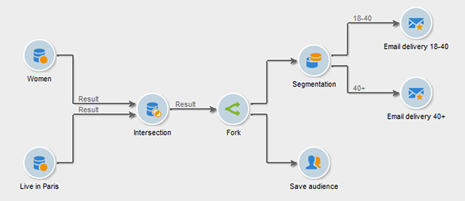

# Verzweigung{#fork}

Sie können die Aktivität **[!UICONTROL Verzweigung]** verwenden, um mehrere ausgehende Transitionen zu erstellen und innerhalb desselben Workflows mehrere Aktivitäten unabhängig voneinander auszuführen.

>[!IMPORTANT]
>
>Die ausgehenden Transitionen, die Sie nach einer Aktivität **[!UICONTROL Verzweigung]** hinzufügen, werden nicht gleichzeitig ausgeführt. Dieses Verhalten kann sich auf die Workflow-Leistung auswirken. Verwenden Sie die Aktivität **[!UICONTROL Verzweigung]**, wenn Sie mehrere Aktivitäten unabhängig voneinander ausführen müssen. Optional können Sie die ausgehenden Aktivitäten vor dem folgenden Teil des Workflows verbinden.

Gehen Sie wie folgt vor, um eine Aktivität **[!UICONTROL Verzweigung]** und die zugehörigen Aktivitäten zu konfigurieren:

1. Öffnen Sie die Aktivität **[!UICONTROL Verzweigung]** und definieren Sie den Namen und den Titel der ausgehenden Transitionen.

   

1. Öffnen Sie jede ausgehende Transition und konfigurieren Sie sie.
1. Um ausgehende Transitionen miteinander zu verbinden, fügen Sie optional eine UND-Verknüpfung hinzu. [Weitere Informationen](and-join.md).

   Der nachfolgende Teil des Workflows wird erst nach Abschluss der verbundenen ausgehenden Transitionen ausgeführt.

## Beispiel: Segmentierung

In diesem Beispiel werden verschiedene E-Mails an verschiedene Populationen gesendet. Eine Aktivität **[!UICONTROL Verzweigung]** wird nach einer Abfrage verwendet, um zwei parallele Aktionen durchzuführen:

* Speichern des Abfrageergebnisses
* Segmentieren des Ergebnisses zum Senden mehrerer Sendungen

   

Der Workflow umfasst die folgenden Aktivitäten:

1. Aktivität **[!UICONTROL Abfrage]**

   Zwei Populationsgruppen werden ausgewählt: Frauen und Pariser. 

1. Aktivität **[!UICONTROL Schnittmenge]**

   Die Schnittmenge der Abfrageergebnisse, also Pariser Frauen, wird ausgewählt.

1. Aktivität **[!UICONTROL Verzweigung]**

   Die berechnete Population wird gespeichert und parallel dazu in zwei Gruppen unterteilt:

   1. Pariser Frauen im Alter zwischen 18 und 40 Jahren
   1. Pariser Frauen über 40

1. Aktivität **[!UICONTROL Versand]**

   Jede Populationsgruppe erhält eine andere E-Mail.

## Anwendungsfall: Geburtstags-E-Mail senden

Eine wiederkehrende E-Mail wird zum Geburtstag an eine Empfängerliste gesendet. Die Aktivität **[!UICONTROL Verzweigung]** wird verwendet, um Empfänger einzuschließen, die am 29. Februar in einem Schaltjahr Geburtstag haben. [Weitere Informationen](send-a-birthday-email.md) zu diesem Anwendungsbeispiel.

## Anwendungsfall: Automatisieren von Inhalten mit einem Workflow

Anschließend können Sie die einzelnen ausgehenden Transitionen konfigurieren und dann gegebenenfalls mithilfe der Aktivität [Und-Verknüpfung](and-join.md) verknüpfen. Auf diese Weise wird der Rest des Workflows erst ausgeführt, nachdem die ausgehenden Transitionen der **[!UICONTROL Verzweigungsaktivität]** abgeschlossen sind.

## Verwandte Themen

* [Aktivität &quot;UND-Verknüpfung&quot;](and-join.md)
* [Anwendungsfall: Geburtstags-E-Mail](send-a-birthday-email.md)