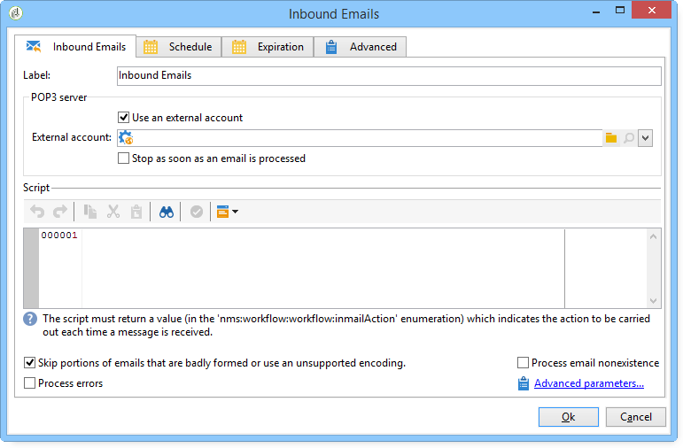
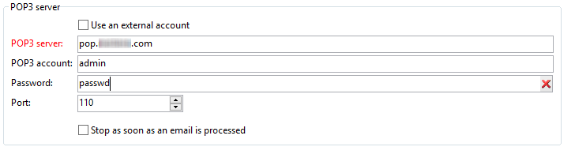
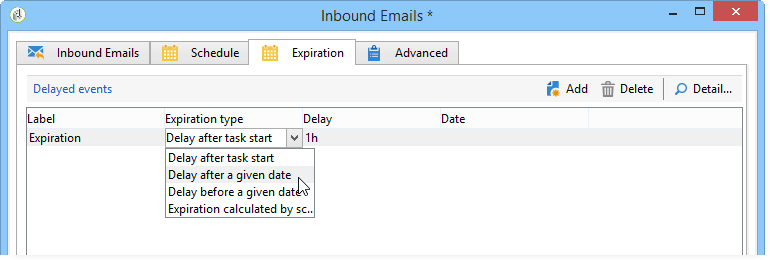

# E-Mail-Empfang{#inbound-emails}

Die Aktivität **E-Mail-Empfang** ermöglicht den Abruf und die Verarbeitung von E-Mails aus Mailboxen, die über POP3 abgefragt werden können.

Auf der ersten Registerkarte der Aktivität **Eingehende E-Mails** können Sie die Parameter des POP3-Servers eingeben und das Skript eingeben, das bei Erhalt jeder Nachricht ausgeführt werden soll. Auf der zweiten Registerkarte können Sie der Aktivität einen Zeitplan zuweisen. Auf der dritten Registerkarte werden die Ablaufbedingungen für die Aktivität definiert.

1. **[!UICONTROL E-Mail-Empfang]**

   * **[!UICONTROL Externes Konto verwenden]**

     Wenn diese Option aktiviert wird, können Sie direkt ein externes POP3-Konto auswählen, anstatt die Verbindungsparameter anzugeben. Im Feld **[!UICONTROL Externes Konto]** wird das zu verwendende POP3-Konto angegeben, das für die Verbindung zum E-Mail-Dienst genutzt werden soll. Dieses Feld ist nur sichtbar, wenn die Option „Externes Konto verwenden&quot;aktiviert ist.

     Wenn die zuvor beschriebene Option nicht aktiviert wurde, sind folgende Parameter anzugeben:

     

      * **[!UICONTROL POP3-Server]**

        Name des POP3-Servers.

      * **[!UICONTROL POP3-Konto]**

        Name des Benutzers.

      * **[!UICONTROL Passwort]**

        Passwort des Benutzerkontos.

      * **[!UICONTROL Port]**

        Port-Nummer der POP3-Verbindung. Der Standard-Port ist 110.

   * **[!UICONTROL Stoppen, sobald eine E-Mail verarbeitet wurde]**

     Mit dieser Option können Sie E-Mails einzeln verarbeiten. Die Aktivität aktiviert ihre Transition nur einmal und beendet dann die Verarbeitung, sodass nicht verarbeitete Nachrichten auf dem Server bleiben.

1. **[!UICONTROL Script]**

   Mit dem Skript können Sie die Nachricht verarbeiten und verschiedene Vorgänge ausführen, die vom Inhalt der Nachricht abhängen. Das Script wird für jede Nachricht ausgeführt und kann den für die Nachricht auszuführenden Vorgang (Nachricht hinterlassen oder löschen) und die Aktivierung der ausgehenden Transition festlegen.

   Der Rückgabe-Code muss einem der folgenden Werte entsprechen:

   * 1 - Löscht die Nachricht auf dem Server und aktiviert die ausgehende Transition.
   * 2 - Lässt die Nachricht auf dem Server und aktiviert die ausgehende Transition.
   * 3 - Löscht die Nachricht auf dem Server.
   * 4 - Lässt die Nachricht auf dem Server.

   Auf den Inhalt der Nachricht kann über die allgemeine Variable **[!UICONTROL mailMessage]** zugegriffen werden.

1. **[!UICONTROL Planung]**

   Gehen Sie in den **[!UICONTROL Planung]**-Tab und kreuzen Sie die Option **[!UICONTROL Ausführung planen an]**. Klicken Sie anschließend auf die Schaltfläche **[!UICONTROL Ändern]**, um den Ausführungsrhythmus der Aktivität zu konfigurieren.

   Die Konfiguration erfolgt analog zum Planungsassistenten. Siehe [Planung](scheduler.md).

1. **[!UICONTROL Ablauf]**

   Im **[!UICONTROL Ablauf]**-Tab können Ablauffristen für die Aktivität definiert werden.

   

   Die Konfiguration erfolgt analog zum Planungsassistenten. Siehe [Timeouts](define-approvals.md).
