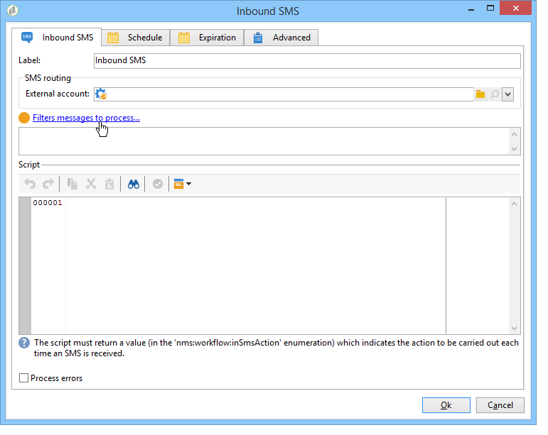
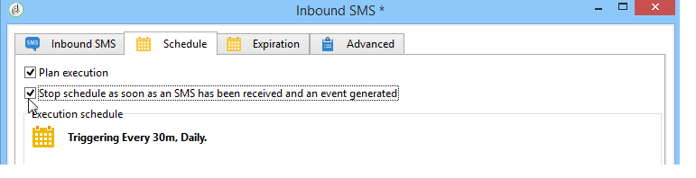

# SMS-Empfang{#inbound-sms}

Die Aktivität **SMS-Empfang** ermöglicht den Abruf und die Verarbeitung von SMS über ein externes Konto.

## Eigenschaften {#properties}

Auf der ersten Registerkarte der Aktivität **Eingehende SMS** können Sie die Routing-Parameter für SMS-Nachrichten eingeben und das Skript eingeben, das beim Empfang jeder Nachricht ausgeführt werden soll. Auf der zweiten Registerkarte können Sie der Aktivität einen Zeitplan zuweisen. Die dritte Registerkarte definiert die Ablaufbedingungen der Aktivität.

1. **[!UICONTROL SMS-Routing]**: Wählen Sie das für den SMS-Empfang zu verwendende externe Konto aus. Externe Konten werden im Knoten **[!UICONTROL Administration > Platform >Externe Konten]** der Baumstruktur konfiguriert. [Weitere Informationen](../../v8/config/external-accounts.md)
1. **[!UICONTROL Script]**
1. **[!UICONTROL Planung]**

   

1. **[!UICONTROL Ablauf]**

Die Tabs **[!UICONTROL Script]**, **[!UICONTROL Planung]** und **[!UICONTROL Ablauf]** werden im Abschnitt [Eingehende E-Mails](inbound-emails.md) erläutert.
