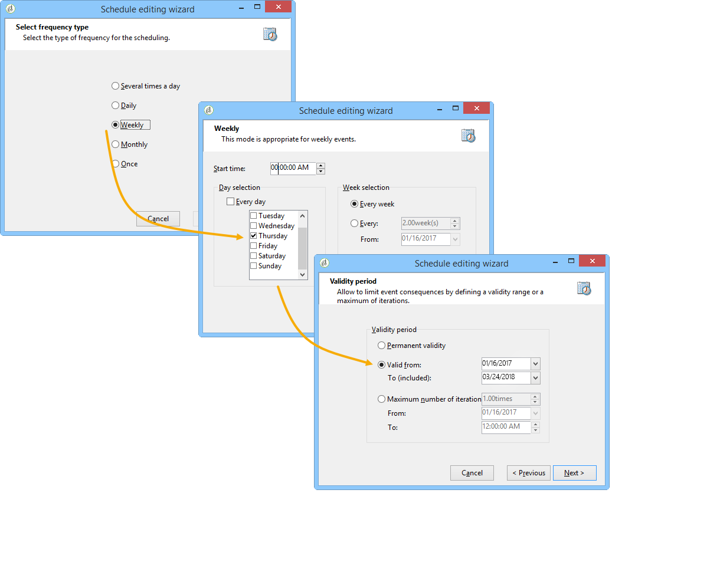
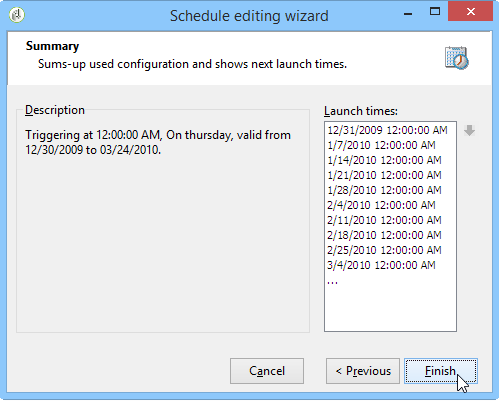
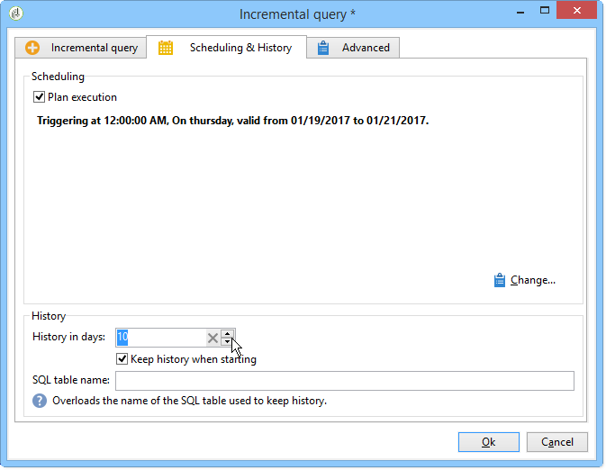

# Inkrementelle Abfrage{#incremental-query}

Inkrementelle Abfragen ermöglichen die regelmäßig wiederkehrende Auswahl einer Zielgruppe nach bestimmten Kriterien unter Ausschluss der Population, die in früheren Durchgängen bereits aufgrund dieser Kriterien ausgewählt wurde.

Die bereits ausgewählte Population wird sowohl nach Workflow-Instanz als auch nach Aktivität im Speicher gespeichert. Das bedeutet, dass zwei Workflows, die aus derselben Vorlage gestartet wurden, nicht dasselbe Protokoll verwenden. Zwei Aufgaben, die auf derselben inkrementellen Abfrage für dieselbe Workflow-Instanz basieren, verwenden hingegen dasselbe Protokoll.

Die Konfiguration der Abfrage entspricht der von Standardabfragen, aber die Ausführung wird geplant.

**Verwandte Themen:**

* [Anwendungsfall: Vierteljährliches Listen-Update mithilfe einer inkrementellen Abfrage](quarterly-list-update.md)
* [Abfragen erstellen](query.md#creating-a-query)

>[!CAUTION]
>
>Wenn das Ergebnis einer inkrementellen Abfrage während einer ihrer Ausführungen **0** beträgt, wird der Workflow bis zur nächsten programmierten Ausführung der Abfrage angehalten. Die Übergänge und Aktivitäten, die der inkrementellen Abfrage folgen, werden daher nicht vor der folgenden Ausführung verarbeitet.

Gehen Sie dazu wie folgt vor:

1. Wählen Sie auf **[!UICONTROL Registerkarte]** Planung und Verlauf **[!UICONTROL die Option Ausführung]**. Die Aufgabe bleibt nach ihrer Erstellung aktiv und wird nur zu den Zeiten ausgelöst, die im Zeitplan für die Ausführung der Abfrage festgelegt sind. Wenn die Option deaktiviert wurde, wird die Abfrage **einmalig und sofort** ausgeführt.
1. Klicken Sie auf die Schaltfläche **[!UICONTROL Ändern...]**.

   Im sich öffnenden **[!UICONTROL Planungsassistent]**-Fenster können Sie den Ausführungsrhythmus und den Gültigkeitszeitraum definieren.

   

1. Klicken Sie zur Bestätigung Ihrer Eingaben auf **[!UICONTROL Beenden]**.

   

1. Im unteren Bereich des Tabs **[!UICONTROL Planung &amp; Verlauf]** können Sie nähere Angaben zum Verlauf machen.

   

   * **[!UICONTROL Verlaufsumfang (Tage)]**

     Bereits ausgewählte Empfänger können eine maximale Anzahl von Tagen ab dem Tag protokolliert werden, an dem sie angesprochen wurden. Wenn dieser Wert null ist, werden die Empfangenden nie aus dem Protokoll gelöscht.

   * **[!UICONTROL Verlauf beim Start beibehalten]**

     Bei Auswahl dieser Option wird der Verlauf bei der Aktivierung der Aktivität nicht gelöscht.

   * **[!UICONTROL Name der SQL-Tabelle]**

     Mithilfe dieses Felds kann die Standard-SQL-Tabelle, die den Verlauf enthält, überschrieben werden.

## Ausgabeparameter {#output-parameters}

* tableName
* schema
* recCount

Anhand der drei Werte lässt sich die durch die Abfrage ermittelte Population identifizieren. **[!UICONTROL tableName]** ist der Name der Tabelle, die die Zielgruppen-IDs enthält, **[!UICONTROL schema]** ist das Schema der Population, (i. d. R. nms:recipient) und **[!UICONTROL recCount]** ist die Anzahl der Elemente in der Tabelle.
