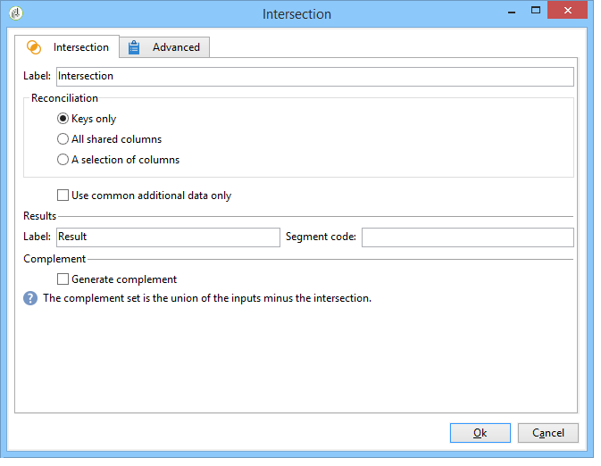
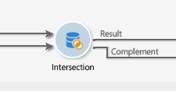
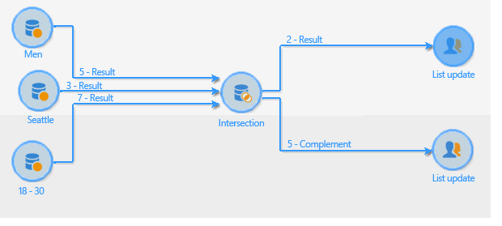

# Schnittmenge{#intersection}

Die Aktivität **Schnittmenge** erzeugt ausgehend von den eingehenden Aktivitäten eine neue Population.

Über eine Schnittmenge lassen sich nur die Populationen extrahieren, die in allen eingehenden Aktivitätsergebnissen enthalten sind. Die Zielgruppe wird mit allen erhaltenen Ergebnissen erstellt: Alle vorherigen Aktivitäten müssen daher abgeschlossen sein, bevor die Schnittmenge ausgeführt werden kann. Um diese Aktivität zu konfigurieren, müssen Sie einen Titel für sie sowie die Optionen für das Ergebnis eingeben.

Weitere Informationen zur Konfiguration und Verwendung der Schnittmengenaktivität finden Sie unter [Gemeinsame Daten aus Populationen extrahieren (Schnittmenge)](targeting-workflows.md#extracting-joint-data--intersection-).

Aktivieren Sie die Option **[!UICONTROL Komplement erzeugen]**, wenn Sie auch die nicht in der Schnittmenge enthaltene Population verwenden möchten. Das Komplement enthält die Vereinigung der Ergebnisse aller eingehenden Aktivitäten abzüglich der Schnittmenge. Die Aktivität weist somit, wie unten abgebildet, eine zusätzliche ausgehende Transition auf:

## Anwendungsbeispiel für eine Schnittmenge {#intersection-example}

Im vorliegenden Beispiel werden drei Abfragen erstellt. Gesucht werden die in jeder der drei Populationen enthaltenen Empfänger. Diese sollen in einer Liste gespeichert werden. Gehen Sie wie folgt vor:

1. Schließen Sie eine **[!UICONTROL Schnittmenge]** an drei Abfrageaktivitäten an.

   Im vorliegenden Beispiel ruft die erste Abfrage alle männlichen Empfänger ab, die zweite alle Empfänger, die in Berlin leben, die dritte alle Empfänger zwischen 18 und 30 Jahre.

1. Konfigurieren Sie die Schnittmenge. Wählen Sie als Abstimmoption **[!UICONTROL Nur die Schlüssel]**, da im vorliegenden Beispiel die aus den Abfragen stammenden Populationen homogen sind.
1. Falls Sie in den Abfragen Zusatzdaten verwenden, können Sie sich dafür entscheiden, nur gemeinsame Daten beizubehalten, indem Sie die entsprechende Option ankreuzen.
1. Kreuzen Sie die Option **[!UICONTROL Komplement erzeugen]** an, wenn Sie die Ergebnisse der Abfragen (abzüglich der Schnittmenge) im weiteren Verlauf des Workflows verwenden möchten.
1. Fügen Sie nach dem Ergebnis der Schnittmenge die Aktivität Listen-Update hinzu. Sie können dem Komplement auch eine Liste hinzufügen, die aktualisiert wird, wenn Sie dieses Tool verwenden möchten.
1. Führt den Workflow aus. Hier wenden zwei Empfänger gleichzeitig auf alle drei eingegebenen Abfragen an. Das Komplement besteht aus fünf Empfängern, die sich nur auf eine oder zwei der drei Abfragen beziehen.

   Das Ergebnis der Schnittmenge wird an die erste Listenaktualisierung gesendet. Wenn Sie sich für die Verwendung des Komplements entschieden haben, wird es auch an die zweite Listenaktualisierung gesendet.

   

## Eingabeparameter {#input-parameters}

* tableName
* schema

Jedes eingehende Ereignis muss eine durch diese Parameter definierte Zielgruppe angeben.

## Ausgabeparameter {#output-parameters}

* tableName
* schema
* recCount

Anhand der drei Werte lässt sich die durch die Schnittmenge ermittelte Zielgruppe identifizieren. **[!UICONTROL tableName]** ist der Name der Tabelle, die die Zielgruppenidentifizierungen enthält, **[!UICONTROL schema]** ist das Schema der Population, (i. d. R. **[!UICONTROL nms:recipient]**) und **[!UICONTROL recCount]** ist die Anzahl an Elementen in der Tabelle.
