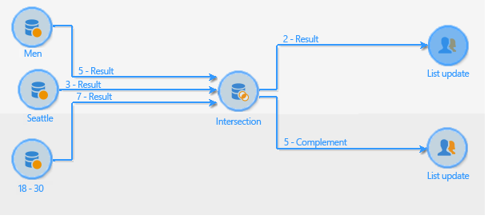

# Schnittmenge{#intersection}

Die Aktivität **Schnittmenge** erzeugt ausgehend von den eingehenden Aktivitäten eine neue Population.

Dabei werden nur die in jeder der eingehenden Aktivitäten enthaltenen Populationen extrahiert. Die Zielgruppe wird aus allen eingehenden Ergebnissen erstellt, dies bedeutet, dass die vorgeschalteten Aktivitäten beendet sein müssen, bevor die Schnittmenge ausgeführt werden kann. Konfigurieren Sie die Aktivität, indem Sie einen Titel vergeben und die Optionen bezüglich des Ergebnisses auswählen.

Weitere Informationen zur Konfiguration und Verwendung der Schnittmengenaktivität finden Sie unter [Gemeinsame Daten aus Populationen extrahieren (Schnittmenge)](targeting-workflows.md#extracting-joint-data--intersection-).

Aktivieren Sie die Option **[!UICONTROL Komplement erzeugen]**, wenn Sie auch die nicht in der Schnittmenge enthaltene Population verwenden möchten. Das Komplement enthält in diesem Fall die Vereinigung aller eingehenden Aktivitäten abzüglich der Schnittmenge. Die Schnittmengenaktivität weist somit, wie unten abgebildet, zwei ausgehende Transitionen auf:

## Anwendungsbeispiel für eine Schnittmenge {#intersection-example}

Im vorliegenden Beispiel werden drei Abfragen erstellt. Gesucht werden die in jeder der drei Populationen enthaltenen Empfänger. Diese sollen in einer Liste gespeichert werden. Gehen Sie wie folgt vor:

1. Schließen Sie eine **[!UICONTROL Schnittmenge]** an drei Abfrageaktivitäten an.

   Im vorliegenden Beispiel ruft die erste Abfrage alle männlichen Empfänger ab, die zweite alle Empfänger, die in Berlin leben, die dritte alle Empfänger zwischen 18 und 30 Jahre.

1. Konfigurieren Sie die Schnittmenge. Wählen Sie als Abstimmoption **[!UICONTROL Nur die Schlüssel]**, da im vorliegenden Beispiel die aus den Abfragen stammenden Populationen homogen sind.
1. Falls Sie in den Abfragen Zusatzdaten verwenden, können Sie sich dafür entscheiden, nur gemeinsame Daten beizubehalten, indem Sie die entsprechende Option ankreuzen.
1. Kreuzen Sie die Option **[!UICONTROL Komplement erzeugen]** an, wenn Sie die Ergebnisse der Abfragen (abzüglich der Schnittmenge) im weiteren Verlauf des Workflows verwenden möchten.
1. Schließen Sie an die Schnittmengenaktivität und gegebenenfalls auch an das Komplement jeweils ein Listen-Update an.
1. Starten Sie den Workflow. Im vorliegenden Beispiel sind zwei Empfänger in allen drei eingehenden Abfragen enthalten. Das Komplement enthält die fünf Empfänger, die nur in einer oder zwei der drei Abfragen vorkommen.

   Das Ergebnis der Schnittmenge wird an die erste Listen-Update-Aktivität übermittelt. Das Ergebnis des Komplements wird an die zweite Listen-Update-Aktivität gesandt.

   

## Eingabeparameter {#input-parameters}

* tableName
* schema

Jedes eingehende Ereignis muss eine durch diese Parameter definierte Zielgruppe angeben.

## Ausgabeparameter {#output-parameters}

* tableName
* schema
* recCount

Anhand der drei Werte lässt sich die durch die Schnittmenge ermittelte Zielgruppe identifizieren. **[!UICONTROL tableName]** ist der Name der Tabelle, welche die Kennungen der Zielgruppenempfänger enthält, **[!UICONTROL schema]** ist das Schema der Population, (i. d. R. **[!UICONTROL nms:recipient]**) und **[!UICONTROL recCount]** ist die Anzahl an Elementen in der Tabelle.
