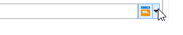
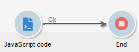
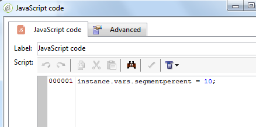
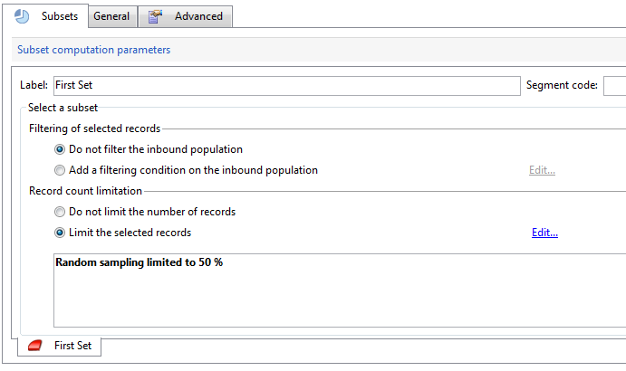
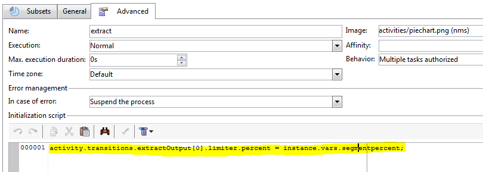
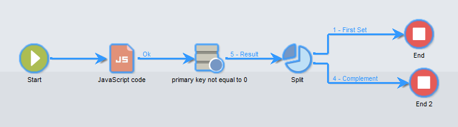
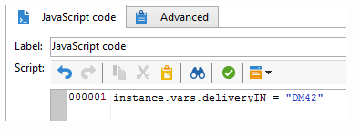
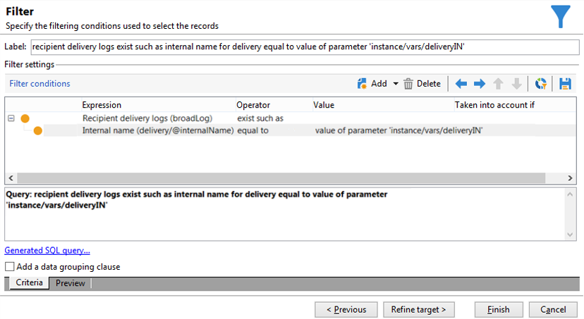

# Scripts/JavaScript-Templates{#javascript-scripts-and-templates}


Scripts dienen zur Berechnung von Werten, dem Austausch von Daten zwischen verschiedenen Aufgaben des Prozesses und der Ausführung von spezifischen Aktionen mithilfe von SOAP-Calls.

In einem Workflow-Diagramm sind Scripts allgegenwärtig:

* Alle Aktivitäten verfügen über Initialisierungsskripte. Ein Initialisierungsskript wird ausgeführt, wenn die Aktivität aktiviert ist, und kann verwendet werden, um Variablen zu initialisieren und die Eigenschaften zu ändern.
* Die &#39;JavaScript-Code&#39;-Aktivität dient einzig der Ausführung eines Scripts.
* Die &#39;Test&#39;-Aktivität wertet JavaScript-Ausdrücke aus, um die richtige Transition zu aktivieren.
* Die meisten Textfelder sind JavaScript-Vorlagen: JavaScript-Ausdrücke können zwischen &lt;%= und %> eingefügt werden. Diese Felder enthalten eine Schaltfläche, über die eine Dropdown-Liste geöffnet werden kann, in die Sie Ausdrücke eingeben können.

  

## Script-Objekte {#objects-exposed}

Jedes im Rahmen des Workflows ausgeführte JavaScript greift auf eine Reihe von globalen Objekten zu.

* **instance**: Stellt den Workflow dar, der ausgeführt wird. Das Schema dieses Objekts lautet **xtk:workflow**.
* **task**: Stellt die ausgeführten Aufgaben dar. Das Schema dieses Objekts lautet **xtk:workflowTask**.
* **event**: Stellt die Ereignisse dar, die die ausgeführte Aufgabe aktiviert haben. Das Schema dieses Objekts lautet **xtk:workflowEvent**. Dieses Objekt wird nicht für Aktivitäten vom Typ **Und-Verknüpfung** initialisiert, die von mehreren Transitionen aktiviert wurden.
* **events**: Stellt die Liste der Ereignisse dar, die die aktuelle Aufgabe aktiviert haben. Das Schema dieses Objekts lautet **xtk:workflowEvent**. Diese Tabelle enthält in der Regel ein Element, kann jedoch mehrere Aktivitäten vom Typ **Und-Verknüpfung** enthalten, die anhand mehrerer Transitionen aktiviert wurden.
* **activity**: Stellt das Modell der ausgeführten Aufgabe dar. Das Schema dieses Objekts hängt vom Aktivitätstyp ab. Das Objekt kann vom Initialisierungs-Script geändert werden; in anderen Scripten werden Änderungen unbestimmbare Folgen haben.

Die verfügbaren Eigenschaften dieser Objekte sind über die Dropdown-Liste rechts in der Symbolleiste des Scripts abrufbar.

>[!CAUTION]
>
>Die Objekteigenschaften sind schreibgeschützt mit Ausnahme der Unter-Eigenschaften der vars-Eigenschaft.
>  
>Die meisten dieser Eigenschaften werden erst aktualisiert, nachdem eine elementare Aufgabe ausgeführt oder die Instanz passiviert wurde. Die gelesenen Werte stimmen nicht unbedingt mit dem aktuellen Status überein, sondern mit dem vorherigen Status.

**Beispiel**

Für das vorliegende Beispiel und die folgenden wird wie unten dargestellt ein Workflow mit einer **JavaScript-Code**-Aktivität und einem **Ende** benötigt.



Öffnen Sie die **JavaScript-Code**-Aktivität und fügen Sie das folgende Script ein:

```
logInfo("Label: " + instance.label)
logInfo("Start date: " + task.creationDate)
```

Die Funktion **[!UICONTROL logInfo(message)]** erstellt einen Eintrag im Protokoll.

Klicken Sie **[!UICONTROL OK]**, um den Erstellungsassistenten zu schließen, und starten Sie dann den Workflow mithilfe der Aktionsschaltflächen oben rechts in der Liste der Workflows. Rufen Sie am Ende der Ausführung das Protokoll auf. Bei korrekter Ausführung werden zwei dem Script entsprechende Nachrichten angezeigt: Ein Eintrag zeigt den Workflow-Titel, der zweite das Datum der Script-Aktivierung.

## Variablen {#variables}

Variablen sind freie Eigenschaften der Objekte **[!UICONTROL instance]**, **[!UICONTROL task]** und **[!UICONTROL event]**. Die für diese Variablen zulässigen JavaScript-Typen sind **[!UICONTROL string]**,**[!UICONTROL number]** und **[!UICONTROL Date]**.

### Instanzvariablen {#instance-variables}

Die Instanzvariablen (**[!UICONTROL instance.vars.xxx]**) sind mit globalen Variablen vergleichbar. Sie werden von allen Aktivitäten geteilt.

### Aufgabenvariablen {#task-variables}

Die Aufgabenvariablen (**[!UICONTROL task.vars.xxx]**) sind mit lokalen Variablen vergleichbar. Sie werden nur von der aktuellen Aufgabe verwendet. Diese Variablen werden von persistenten Aktivitäten verwendet, um Daten beizubehalten, und manchmal zum Austausch von Daten zwischen den verschiedenen Skripten einer Aktivität.

### Ereignisvariablen {#event-variables}

Die Ereignisvariablen (**[!UICONTROL vars.xxx]**) ermöglichen den Datenaustausch zwischen den elementaren Aufgaben eines Workflow-Prozesses. Diese Variablen werden von der Aufgabe übergeben, die die in Bearbeitung befindliche Aufgabe aktiviert hat. Es ist möglich, sie zu ändern und neue zu definieren. Sie werden dann an die folgenden Aktivitäten weitergeleitet.

>[!CAUTION]
>
>Bei Verwendung einer [UND-Verknüpfung](and-join.md) werden die Variablen zusammengeführt. Wenn eine Variable mehrmals definiert wurde entsteht ein Konflikt und es wird ein unbestimmter Wert ausgegeben.

Ereignisvariablen sind die am häufigsten verwendeten Variablen und sind Instanzvariablen vorzuziehen.

Bestimmte Ereignisvariablen werden durch die verschiedenen Aktivitäten geändert oder gelesen. Dies sind alles Variablen vom Typ Zeichenfolge. Beispiel: Ein Export definiert die Variable **[!UICONTROL vars.filename]** mit dem vollständigen Namen der Datei, die gerade exportiert wurde. Alle diese gelesenen oder geänderten Variablen werden in [Über Aktivitäten](activities.md) in den Abschnitten **Eingabeparameter** und **Ausgabeparameter** der Aktivitäten beschrieben.

### Anwendungsfälle {#example}

>[!NOTE]
>
>Weitere Anwendungsbeispiele für Workflows sind in [diesem Abschnitt](workflow-use-cases.md) verfügbar.

**Beispiel 1**

In diesem Beispiel wird eine Instanzvariable verwendet, um den auf eine Population anzuwendenden Aufspaltungsprozentsatz dynamisch zu berechnen.

1. Erstellen Sie einen Workflow und fügen Sie eine Startaktivität hinzu.

1. Fügen Sie eine JavaScript-Code-Aktivität hinzu und konfigurieren Sie sie, um eine Instanzvariable zu erstellen.

   Beispiel: `instance.vars.segmentpercent = 10;`

   

1. Fügen Sie eine Abfrageaktivität hinzu und wählen Sie entsprechend Ihren Anforderungen Empfänger für die Zielgruppe aus.

1. Fügen Sie eine Aufspaltungsaktivität hinzu und konfigurieren Sie sie so, dass eine Stichprobe für die eingehende Population vorgenommen wird. Der Stichprobenprozentsatz kann beliebig sein. In diesem Beispiel ist er auf 50 % festgelegt.

   Dieser Prozentsatz wird dank der zuvor definierten Instanzvariablen dynamisch aktualisiert.

   

1. Definieren Sie im Abschnitt „Initialisierungs-Script“ auf dem Tab „Erweitert“ der Aufspaltungsaktivität eine JS-Bedingung. Die JS-Bedingung wählt den zufälligen Stichprobenprozentsatz der ersten Transition aus der Aufspaltungsaktivität aus und aktualisiert ihn auf einen Wert, der von der zuvor erstellten Instanzvariablen festgelegt wurde.

   ```
   activity.transitions.extractOutput[0].limiter.percent = instance.vars.segmentpercent;
   ```

   

1. Stellen Sie sicher, dass das Komplement in einer separaten Transition der Aufspaltungsaktivität generiert wird, und fügen Sie nach jeder der ausgehenden Transitionen Endaktivitäten hinzu.

1. Speichern und starten Sie den Workflow. Das dynamische Sampling wird entsprechend der Instanzvariablen angewendet.

   

**Beispiel 2**

1. Ausgehend vom Workflow des vorangehenden Beispiels wird das Script der **JavaScript-Code**-Aktivität durch folgendes Script ersetzt:

   ```
   instance.vars.foo = "bar1"
   vars.foo = "bar2"
   task.vars.foo = "bar3"
   ```

1. Ergänzen Sie dann das Initialisierungsscript der **Ende**-Aktivität um folgendes Script:

   ```
   logInfo("instance.vars.foo = " + instance.vars.foo)
   logInfo("vars.foo = " + vars.foo)
   logInfo("task.vars.foo = " + task.vars.foo)
   ```

1. Starten Sie den Workflow und rufen Sie das Protokoll auf:

   ```
   Workflow finished
   task.vars.foo = undefined
   vars.foo = bar2
   instance.vars.foo = bar1
   Starting workflow (operator 'admin')
   ```

Das Beispiel zeigt, dass die Aktivität **JavaScript-Code** auf die Instanz- und Ereignisvariablen zugreift, während die Aufgabenvariablen ausserhalb der Aufgaben nicht verfügbar sind (&#39;undefined&#39;).

### Aufrufen von Instanzvariablen in Abfragen {#calling-an-instance-variable-in-a-query}

In Aktivitäten definierte Instanzvariablen können in Workflow-Abfragen wiederverwendet werden.

Geben Sie beispielsweise zum Abruf der Variablen **instance.vars.xxx = &quot;yyy&quot;** folgende Filterbedingung ein: **$(instance/vars/@xxx)**.

Beispiel:

1. Erstellen Sie eine Instanzvariable, die über die **[!UICONTROL JavaScript-Code]**-Aktivität den internen Namen eines Versands definiert: **instance.vars.deliveryIN = &quot;DM42&quot;**

   

1. Erstellen Sie eine Abfrage , deren Zielgruppen- und Filterdimensionen die Empfänger sind. Geben Sie in den Bedingungen an, dass Sie alle Empfänger finden möchten, die an den von der Variablen angegebenen Versand gesendet wurden.

   Hinweis: Diese Informationen werden in den Versandlogs gespeichert.

   Geben Sie in der Spalte **[!UICONTROL Wert]** **$(instance/vars/@deliveryIN)** an, um sich auf die Instanzvariable zu beziehen.

   Der Workflow gibt die Empfänger aus, die den Versand DM42 erhalten haben.

   

## Erweiterte Funktionen {#advanced-functions}

Neben den Standard-JavaScript-Funkionen stehen spezifische Funktionen zur Verfügung, um Dateien zu bearbeiten, Daten der Datenbank zu lesen oder zu ändern oder Nachrichten in das Protokoll einzutragen.

### Protokoll {#journal}

**[!UICONTROL logInfo(message)]** wurde in den obigen Beispielen beschrieben. Diese Funktion fügt dem Protokoll eine Informationsmeldung hinzu.

**[!UICONTROL logError(message)]** fügt dem Protokoll eine Fehlermeldung hinzu. Das Skript unterbricht seine Ausführung, und der Workflow wechselt in den Fehlerstatus (standardmäßig wird die Instanz angehalten).

## Initialisierungsskript {#initialization-script}

Eine Aktivitätseigenschaft kann unter bestimmten Bedingungen zum Zeitpunkt der Ausführung geändert werden.

Die Mehrzahl der Aktivitätseigenschaften kann dynamisch berechnet werden, entweder unter Verwendung eines JavaScript-Templates oder weil die Workflow-Eigenschaften die Berechnung des Werts durch ein Script explizit erlauben.

Für andere Eigenschaften müssen Sie jedoch das Initialisierungsskript verwenden. Dieses Skript wird vor Ausführung der Aufgabe ausgewertet. Die Variable **[!UICONTROL activity]** verweist auf die der Aufgabe entsprechende Aktivität. Die Eigenschaften dieses Objekts können geändert werden und betreffen nur diese Aufgabe.

**Verwandte Themen**
[Beispiele für JavaScript-Code in Workflows](javascript-in-workflows.md)
