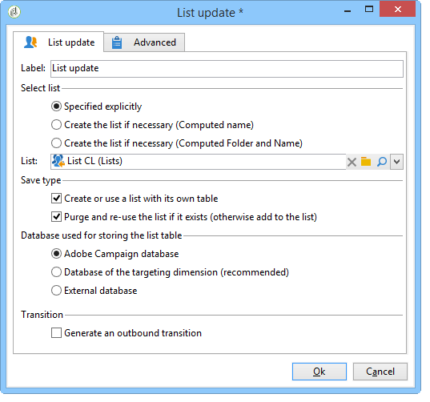
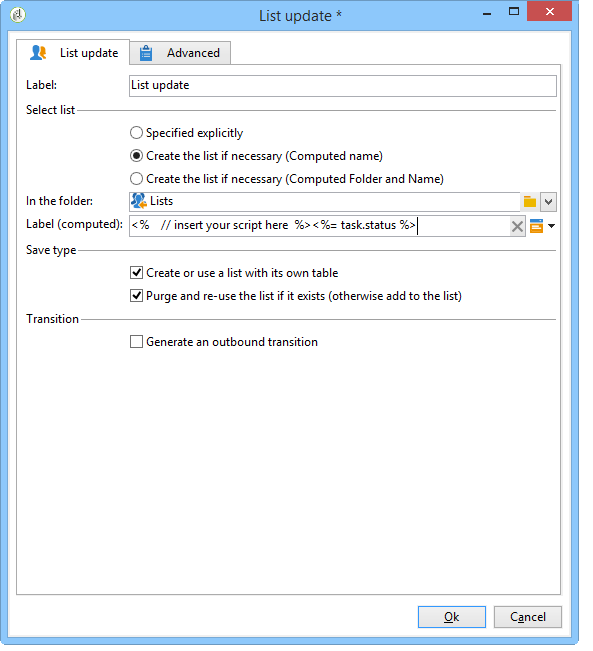
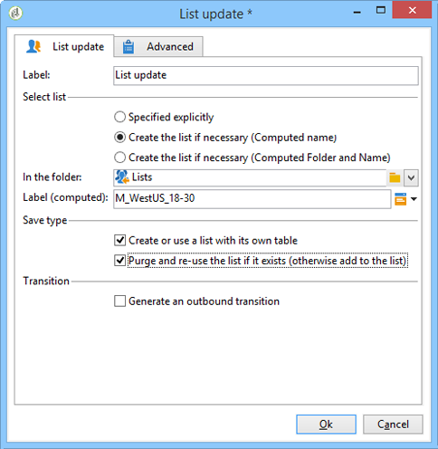

# Listen-Update{#list-update}

Das **Listen-Update** speichert die Ergebnisse der eingehenden Aktivitäten in einer Liste.

Die Liste kann bereits existieren.

Sie kann auch mithilfe der Optionen **[!UICONTROL Liste bei Bedarf erstellen (berechneter Name)]** und **[!UICONTROL Liste bei Bedarf erstellen (berechneter Ordner und Name)]** erstellt werden. Mit diesen Optionen können Sie den Titel Ihrer Wahl auswählen, um eine Liste zu erstellen, und später den Ordner, in dem sie gespeichert werden soll. Der Titel kann auch automatisch durch Einfügen dynamischer Felder oder eines Skripts generiert werden. Die verschiedenen dynamischen Felder sind im Popup-Menü rechts neben der Beschriftung verfügbar.

Wenn die Liste bereits vorhanden ist, werden die Empfänger bzw. Empfängerinnen zum vorhandenen Inhalt hinzugefügt, es sei denn, Sie aktivieren die Option **[!UICONTROL Wenn sie vorhanden ist, Liste löschen (andernfalls zur Liste hinzufügen]**. In diesem Fall wird der Inhalt der Liste vor der Aktualisierung gelöscht.

Kreuzen Sie die Option **[!UICONTROL Liste mit eigener Tabelle erstellen oder verwenden]** an, wenn die erstellte oder aktualisierte Liste nicht die Empfängertabelle verwenden soll.

In diesem Fall müssen die entsprechenden Tabellen zuvor in der Adobe Campaign-Instanz konfiguriert werden.

Im Allgemeinen stellt die Speicherung einer Zielgruppe in einer Liste das Ende eines Workflows dar. Standardmäßig bietet die **[!UICONTROL Listen-Update]**-Aktivität daher keine ausgehende Transition. Dies kann durch Ankreuzen der Option **[!UICONTROL Ausgehende Transition erzeugen]** umgangen werden.

 [Erfahren Sie im Video, wie Sie vom Explorer aus eine Liste von Empfängern erstellen](#video)

## Anwendungsbeispiel Listen-Update {#example--list-update}

Im folgenden Beispiel folgt die Aktivität Listen-Update einer Abfrage, die sich an Männer über 30 richtet, die in Frankreich leben. Die Liste wird zunächst aus den Ergebnissen der Abfrage erstellt. Er wird dann jedes Mal aktualisiert, wenn er vom Workflow gestartet wird. Sie kann beispielsweise regelmäßig für zielgerichtete Werbeangebote für Kampagnen genutzt werden.

1. Schließen Sie an eine Abfrage ein **[!UICONTROL Listen-Update]** an und öffnen Sie die Aktivität.

   Weitere Informationen zum Erstellen von Abfragen in Workflows finden unter [Abfrage](query.md).

1. Benennen Sie die Aktivität.
1. Kreuzen Sie die Option **[!UICONTROL Wenn nötig Liste erstellen (Titel berechnet)]** an, damit die Liste bei Ausführung des ersten Workflows erstellt und später jeweils aktualisiert wird.
1. Wählen Sie den Ordner aus, in dem die Liste gespeichert werden soll.
1. Geben Sie einen Titel für die Liste ein. Sie können dynamische Felder einfügen, um den Namen automatisch aus der Liste zu generieren. In diesem Beispiel hat die Liste denselben Namen wie die Abfrage, um ihren Inhalt leicht identifizieren zu können.
1. Lassen Sie die Option **[!UICONTROL Wenn sie existiert, Liste leeren und erneut verwenden (nicht vervollständigen)]** aktiv, damit die Empfänger, die nicht mehr den Targeting-Kriterien entsprechen, gelöscht und die neuen Empfänger eingfügt werden.
1. Lassen Sie die Option **[!UICONTROL Liste mit eigener Tabelle erstellen oder verwenden]** ebenfalls aktiv.
1. Lassen Sie die Option **[!UICONTROL Ausgehende Transition erzeugen]** deaktiviert.
1. Klicken Sie auf **[!UICONTROL OK]** und starten Sie den Workflow.

   

   Die Empfängerliste wird erstellt und bei erneuter Ausführung des Workflows aktualisiert.

## Eingabeparameter {#input-parameters}

* tableName
* schema

Identifiziert die in der Gruppe zu speichernde Population.

## Ausgabeparameter {#output-parameters}

* groupId: Gruppenkennung.

## Anleitungsvideo {#video}

In diesem Video wird gezeigt, wie man vom Explorer aus eine Liste von Empfängern erstellt.

>[!VIDEO](https://video.tv.adobe.com/v/25602/quality=12)

Weitere Anleitungsvideos zu Campaign finden Sie [hier](https://experienceleague.adobe.com/docs/campaign-learn/tutorials/getting-started/introduction-to-adobe-campaign.html?lang=de){target="_blank"}.