# Verwenden der lokalen Validierungsaktivität{#using-the-local-approval-activity}

Im Rahmen eines Zielgruppen-Workflows ermöglicht die Aktivität **[!UICONTROL Lokale Validierung]** die Formalisierung eines Validierungsprozesses, der die Überprüfung der ausgewählten Empfänger vor Absendung der Kampagne sicherstellt.

>[!CAUTION]
>
>Um diese Funktion nutzen zu können, müssen Sie das Modul Dezentrales Marketing erwerben, bei dem es sich um eine Campaign-Option handelt. Prüfen Sie diesbezüglich Ihren Lizenzvertrag.

Der Workflow für dieses Anwendungsbeispiel stellt sich wie folgt dar:

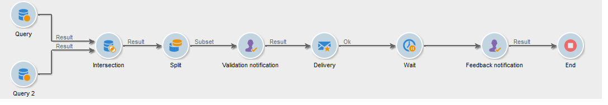

Der lokale Validierungsprozess gliedert sich in folgende Schritte:

1. Die aus der Zielgruppenbestimmung resultierende Population wird mithilfe einer **[!UICONTROL Aufspaltung]** mit einer Datenverteilungsvorlage begrenzt.

   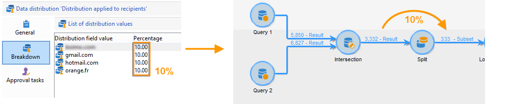

1. Die Aktivität **[!UICONTROL Lokale Validierung]** übernimmt dann und sendet eine Benachrichtigungs-E-Mail an jeden lokalen Verantwortlichen. Die Aktivität wird ausgesetzt, bis jeder lokale Verantwortliche die ihm zugewiesenen Empfänger genehmigt hat.

1. Mit Ablauf der Validierungsfrist nimmt der Workflow die Ausführung wieder auf. Im vorliegenden Beispiel wird die **[!UICONTROL Versandaktivität]** aktiviert und der Versand an die validierten Empfänger gestartet.

   >[!NOTE]
   >
   >Die bis zum Ablauf der Validierungsfrist nicht validierten Empfänger werden in der Zielgruppenbestimmung nicht berücksichtigt.

   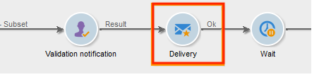

1. Einige Tage später sendet die zweite **[!UICONTROL Lokale Validierung]** allen lokalen Verantwortlichen eine E-Mail-Benachrichtigung, die sie über die Empfängerreaktionen (Klicks, Öffnungen usw.) informiert.

## &#x200B;1. Schritt: Erstellen der Datenverteilungsvorlage {#step-1--creating-the-data-distribution-template-}

Die Verteilungsvorlage ermöglicht es, die aus der Zielgruppenbestimmung resultierende Population mithilfe einer Datengruppierung zu begrenzen, wobei jeder Wert einem lokalen Verantwortlichen zugewiesen werden kann. In diesem Beispiel haben wir die Variable **[!UICONTROL Domain der E-Mail-Adresse]** als Verteilungsfeld ein und jedem lokalen Verantwortlichen eine Domain zugewiesen.

Weitere Informationen zum Erstellen einer Datenverteilungsvorlage finden Sie unter [Anzahl an Datensätzen in Teilmengen durch Datenverteilung begrenzen](split.md#limiting-the-number-of-subset-records-per-data-distribution).

1. Gehen Sie in den Knoten **[!UICONTROL Ressourcen > Kampagnenverwaltung > Datenverteilung]** und klicken Sie auf die Schaltfläche **[!UICONTROL Neu]**.

   

1. Gehen Sie in den **[!UICONTROL Allgemein]**-Tab.

   

1. Vergeben Sie einen **[!UICONTROL Titel]** und füllen Sie die Felder zum **[!UICONTROL Verteilungskontext]** aus. Im vorliegenden Beispiel wurden die **[!UICONTROL Empfänger]** als Targeting-Schema und das Feld **[!UICONTROL E-Mail-Domain]** als Verteilungsfeld gewählt. Die Empfängerliste wird somit nach Domain verteilt.
1. Wählen Sie im Feld **[!UICONTROL Verteilungstyp]** die Art aus, in der die Zielgruppenbegrenzung im Tab **[!UICONTROL Verteilung]** ausgedrückt werden soll. Im vorliegenden Beispiel wurde **[!UICONTROL Prozent]** ausgewählt.
1. Geben Sie im Feld **[!UICONTROL Validierungsspeicherung]** das dem verwendeten Zielgruppenbestimmungsschema entsprechende Speicherschema an. Im Folgenden wird das standardmäßige Speicherschema verwendet: **[!UICONTROL Lokale Validierung der Empfangenden]**.
1. Klicken Sie dann auf den Link **[!UICONTROL Erweiterte Parameter...]**

   

1. Damit alle Empfänger in der Liste der zu validierenden Empfänger erscheinen, lassen Sie die Option **[!UICONTROL Nachrichten validieren]** angekreuzt.
1. Im Feld **[!UICONTROL Versandbezeichnung]** haben wir den Standardausdruck (Compute string des Versands) beibehalten. Die Standardbezeichnung des Versands wird in der Feedback-Benachrichtigung verwendet.
1. Geben Sie im **[!UICONTROL Gruppierungsfeld]** das **[!UICONTROL Geschlecht]** als Kriterium für die Gruppierung der Empfänger in den Benachrichtigungen an.
1. Im Abschnitt **[!UICONTROL Bearbeiten zielgerichteter Nachrichten]** haben wir die Webanwendung **[!UICONTROL Empfänger bearbeiten]** und den Parameter **[!UICONTROL recipientId]** ausgewählt. In den Validierungs- und Feedback-Benachrichtigungen sind die Empfänger anklickbar und verweisen auf die URL der Web-Anwendung. Der zusätzliche Parameter der URL ist **[!UICONTROL recipientId]**.
1. Klicken Sie dann auf **[!UICONTROL Registerkarte]** Verteilung“. Geben Sie für jede Domain die folgenden Felder ein:

   

   * **[!UICONTROL Wert]**: Geben Sie den Domainnamen ein.
   * **[!UICONTROL Prozentsatz/Behoben]**: Geben Sie für jede Domain den Maximalwert ein. Anzahl der Empfänger, an die der Versand gesendet werden soll. In diesem Beispiel möchten wir den Versand auf 10 % pro Domain beschränken.
   * **[!UICONTROL Titel]**: Vergeben Sie für jede Domain einen Titel, der in den Validierungs- und Feedback-Benachrichtigungen angezeigt wird.
   * **[!UICONTROL Gruppe oder Benutzer]**: Geben Sie den Benutzer oder die Benutzergruppe an, dem die Domain zugewiesen wurde.

     >[!CAUTION]
     >
     >Stellen Sie sicher, dass die Benutzer über die nötigen Berechtigungen verfügen.

## &#x200B;2. Schritt: Erstellen des Zielgruppen-Workflows {#step-2--creating-the-targeting-workflow}

Der Workflow für dieses Anwendungsbeispiel stellt sich wie folgt dar:

Folgende Aktivitäten wurden verwendet:

* **[!UICONTROL Abfragen]**,
* **[!UICONTROL Schnittmenge]**,
* **[!UICONTROL Aufspaltung]**,
* **[!UICONTROL Lokale Validierung]**,
* **[!UICONTROL Versand]**,
* **[!UICONTROL Warten]**,
* **[!UICONTROL Lokale Validierung]**,
* **[!UICONTROL Ende]**.

### Abfragen, Schnittmenge und Teilung {#queries--intersection-and-split}

Die Zielgruppenbestimmung geschieht mithilfe zweier Abfragen und einer Schnittmenge. Die **[!UICONTROL Aufspaltung]** schränkt die resultierende Population über eine Datenverteilungsvorlage ein.

Weitere Informationen zum Konfigurieren einer Aufspaltungsaktivität finden Sie unter [Aufspaltung](split.md). Die Erstellung einer Datenverteilungsvorlage wird unter [Anzahl an Datensätzen in Teilmengen durch Datenverteilung begrenzen](split.md#limiting-the-number-of-subset-records-per-data-distribution) ausführlich beschrieben.

Wenn Sie die aus der Abfrage resultierende Population nicht einschränken möchten, ist die Verwendung der **[!UICONTROL Abfragen]**, **[!UICONTROL Schnittmenge]** und **[!UICONTROL Aufspaltung]** nicht erforderlich. Konfigurieren Sie in diesem Fall die Verteilungsvorlage in der ersten Aktivität vom Typ **[!UICONTROL Lokale Validierung]**.

1. Öffnen Sie die Aufspaltung und kreuzen Sie im Bereich **[!UICONTROL Begrenzung der Anzahl von Datensätzen]** die Option **[!UICONTROL Anzahl von Datensätzen begrenzen]** an. Klicken Sie anschließend auf den Link **[!UICONTROL Bearbeiten...]**.

   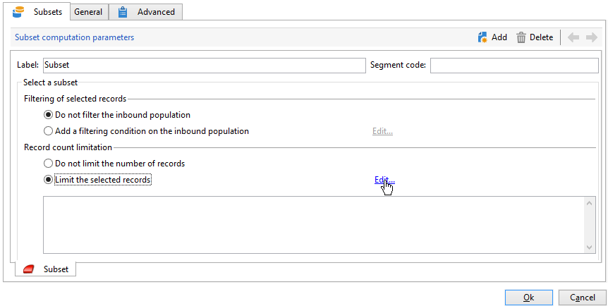

1. Aktivieren Sie die Option **[!UICONTROL Die ersten, aus einer Sortierung hervorgehenden Elemente beibehalten]** und klicken Sie auf **[!UICONTROL Weiter]**.

   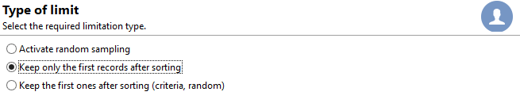

1. Fügen Sie im Bereich **[!UICONTROL Sortierungsspalten]** das Feld hinzu, nach dem die Liste sortiert werden soll. Im vorliegenden Beispiel ist dies **[!UICONTROL E-Mail]**. Klicken Sie auf **[!UICONTROL Weiter]**.

   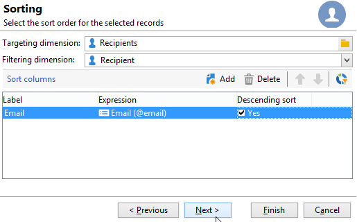

1. Wählen Sie die Option **[!UICONTROL Durch Datenverteilung]**, wählen Sie die zuvor erstellte Verteilungsvorlage aus (siehe [Schritt 1: Erstellung der Datenverteilungsvorlage](#step-1--creating-the-data-distribution-template-)) und klicken Sie auf **[!UICONTROL Beenden]**.

   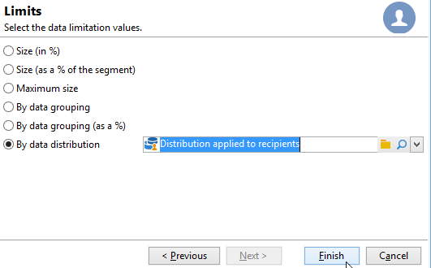

In der Verteilungsvorlage wurde die Population auf 10 % je Gruppierungswert begrenzt. Dies spiegelt sich im Workflow wieder (340 Empfänger in der eingehenden Transition, 34 in der ausgehenden).

### Validierungsbenachrichtigung {#approval-notification}

Die **[!UICONTROL Lokale Validierung]** erlaubt den Versand einer Benachrichtigung an jeden lokalen Verantwortlichen.

Weiterführende Informationen zur Konfiguration der **[!UICONTROL lokalen Validierung]** finden Sie im Abschnitt [Lokale Validierung](local-approval.md).

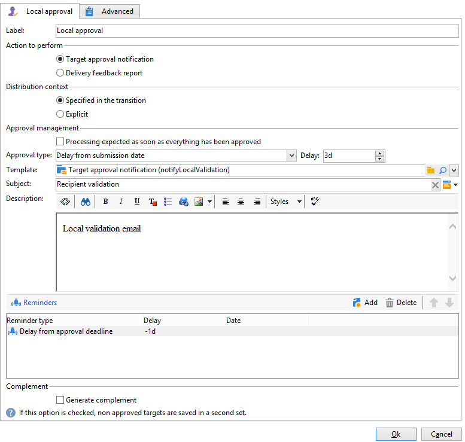

Folgende Angaben sind erforderlich:

1. Im Bereich **[!UICONTROL Auszuführende Aktion]**: Wählen Sie die Option **[!UICONTROL Benachrichtigung zur Zielgruppenvalidierung]** aus.
1. Im Bereich **[!UICONTROL Verteilungskontext]**: Wählen Sie die Option **[!UICONTROL Wird durch die Transition angegeben]** aus.

   Wenn die resultierende Population nicht begrenzt werden soll, ist die Option **[!UICONTROL Explizit]** anzukreuzen und im Feld **[!UICONTROL Datenverteilung]** die zuvor erstellte Verteilungsvorlage anzugeben.

1. Wählen Sie im Bereich **[!UICONTROL Validierungsverwaltung]** die Versandvorlage aus und geben Sie den Betreff für die Benachrichtigungs-E-Mail an. Hier haben wir die Standardvorlage ausgewählt: **[!UICONTROL Benachrichtigung bezüglich lokaler Validierungen]**.
1. Im Abschnitt **[!UICONTROL Validierungsplan]** haben wir die standardmäßige Validierungsfrist (3 Tage) beibehalten und eine Erinnerung hinzugefügt. Der Versand wird 3 Tage nach Beginn der Validierung beendet. Wenn die Validierungsfrist abgelaufen ist, werden nicht validierte Empfänger und Empfängerinnen nicht in der Zielgruppenbestimmung berücksichtigt.

Durch die Aktivität **[!UICONTROL Lokale Validierung]** wird eine Benachrichtigungs-E-Mail an lokale Verantwortliche gesendet.

### Warten {#wait}

Die Warteaktivität verzögert den Start der zweiten Validierungsaktivität, welche die Versandreaktionen-Benachrichtigungen versendet. Im Feld **[!UICONTROL Wartezeit]** wurde hier **[!UICONTROL 5T]**, also 5 Tage, angegeben. Auf diese Weise werden die Empfängerreaktionen der nächsten fünf Tage in der Versandreaktionen-Benachrichtigung berücksichtigt.

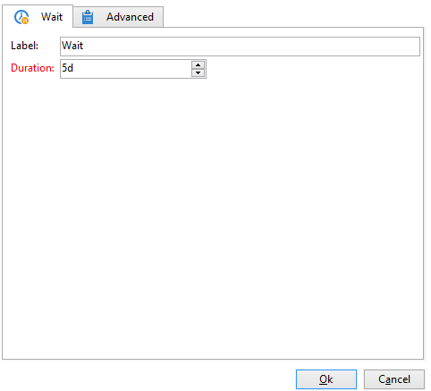

### Feedback-Benachrichtigung {#feedback-notification}

Die zweite Aktivität vom Typ **[!UICONTROL Lokale Validierung]** sendet an jeden lokalen Verantwortlichen einen Feedback-Bericht.

Folgende Angaben sind erforderlich:

1. Im Bereich **[!UICONTROL Auszuführende Aktion]**: Wählen Sie die Option **[!UICONTROL Feedback-Bericht]** aus.
1. Im Bereich **[!UICONTROL Versand]**: Wählen Sie die Option **[!UICONTROL Wird durch die Transition angegeben]** aus.
1. Im Bereich **[!UICONTROL Validierungsverwaltung]**: Wählen Sie die Versandvorlage aus und geben Sie den Betreff für die Benachrichtigungs-E-Mail an.

Nach Ablauf der in der Warteaktivität definierten Wartezeit sendet die zweite **[!UICONTROL Lokale Validierung]** an jeden lokalen Verantwortlichen folgende Benachrichtigung:

### Validierungs-Tracking durch den Administrator {#approval-tracking-by-the-administrator}

Bei jedem Start der lokalen Validierungsaktivität wird eine Validierungsaufgabe erstellt. Der Administrator kann jede dieser Genehmigungsaufgaben steuern.

Klicken Sie im Zielgruppen-Workflow Ihrer Kampagne auf den Tab **[!UICONTROL Lokale Validierungsaufgaben]**.

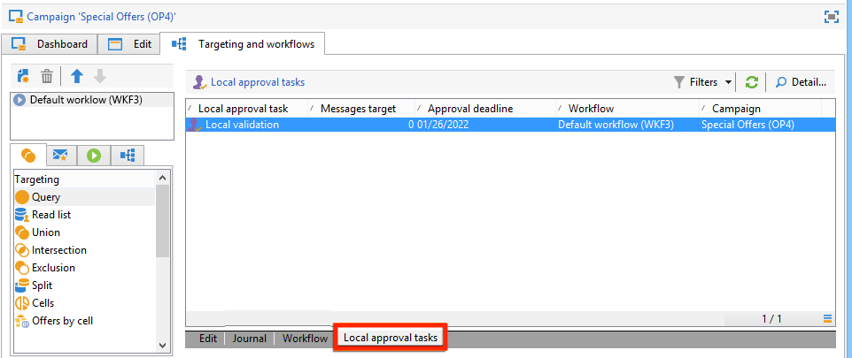

Eine weitere Zugriffsmöglichkeit besteht über den Tab **[!UICONTROL Validierungsaufgaben]** in der Datenverteilungsvorlage.

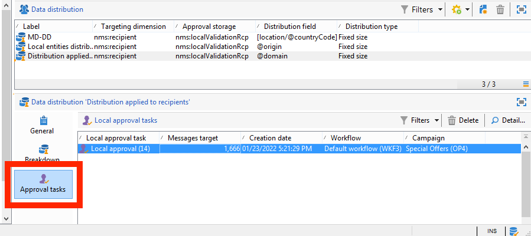

Markieren Sie die zu prüfende Aufgabe und klicken Sie auf die Schaltfläche **[!UICONTROL Detail]**. Im **[!UICONTROL Allgemein]**-Tab der Aufgabe werden die wichtigsten Informationen zur Aufgabe angezeigt. Es besteht des Weiteren die Möglichkeit, die Validierungs-Deadline und das Erinnerungsdatum zu ändern.

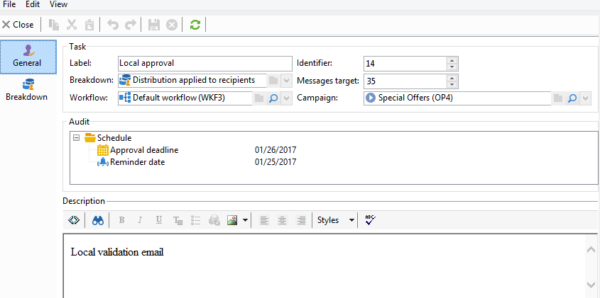

Folgende Informationen stehen zur Verfügung:

* Titel und Kennung der Aufgabe,
* verwendete Verteilung,
* Anzahl potenziell zu sendender Nachrichten,
* zugrundeliegender Workflow und Kampagne,
* Planung der Aufgabe.

Im Tab **[!UICONTROL Verteilung]** der Aufgabe werden die Validierungslogs und -status, die Anzahl potenziell zu sendender Nachrichten, das Validierungsdatum und die validierenden Benutzer angezeigt.

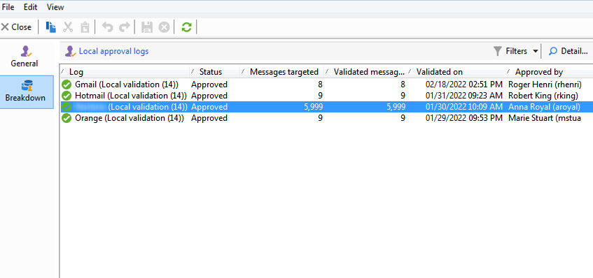

Markieren Sie ein Validierungslog und klicken Sie auf die Schaltfläche **[!UICONTROL Details...]** für genauere Informationen. Die Registerkarte **[!UICONTROL Allgemein]** des Validierungslogs zeigt allgemeine Log-Informationen an. Darüber hinaus kann der Validierungsstatus geändert werden.

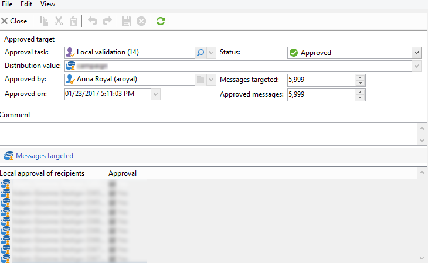

Folgende Informationen stehen zur Verfügung:

* Zugrunde liegende Validierungsaufgabe,
* Validierungsstatus (**[!UICONTROL Validiert]** oder **[!UICONTROL Ausstehend]**),
* verwendete Verteilung,
* lokaler Verantwortlicher, der validiert hat, und Validierungsdatum,
* Anzahl potenziell zu sendender Nachrichten und Anzahl validierter Nachrichten.

Auf **[!UICONTROL Registerkarte]** Zielgruppe“ des Validierungsprotokolls wird die Liste der Zielgruppenempfänger und deren Validierungsstatus angezeigt. Sie können diesen Status bei Bedarf ändern.

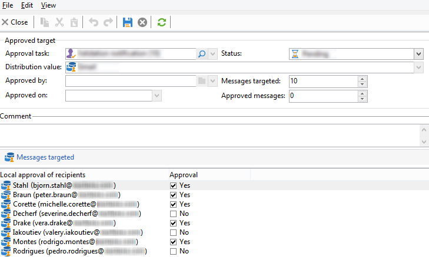
