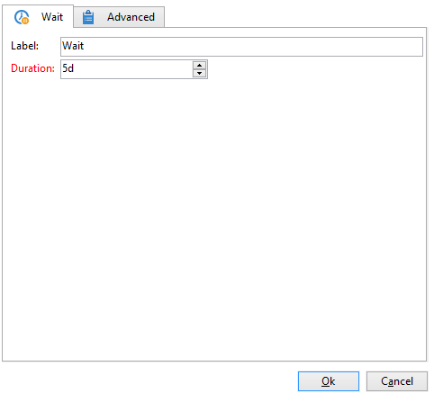

# Verwenden der lokalen Validierungsaktivität{#using-the-local-approval-activity}

Im Rahmen eines Zielgruppen-Workflows ermöglicht die Aktivität **[!UICONTROL Lokale Validierung]** die Formalisierung eines Validierungsprozesses, der die Überprüfung der ausgewählten Empfänger vor Absendung der Kampagne sicherstellt.

>[!CAUTION]
>
>Zur Verwendung dieser Funktion benötigen Sie das Modul Distributed Marketing (Campaign-Option). Bitte prüfen Sie Ihren Lizenzvertrag.

Der Workflow für dieses Anwendungsbeispiel stellt sich wie folgt dar:

Der lokale Validierungsprozess gliedert sich in folgende Schritte:

1. Die aus der Zielgruppenbestimmung resultierende Population wird mithilfe einer **[!UICONTROL Aufspaltung]** mit einer Datenverteilungsvorlage begrenzt.

   

1. Die **[!UICONTROL Lokale Validierung]** sendet im Anschluss daran eine E-Mail-Benachrichtigung an alle lokalen Validierungsverantwortlichen. Die Aktivität bleibt im Wartezustand, bis alle Verantwortlichen die ihnen zugewiesenen Empfänger validiert haben.

1. Sobald die Validierungs-Deadline erreicht ist, wird der Workflow erneut gestartet. In diesem Beispiel wird die **[!UICONTROL Versand]** Die Aktivität beginnt, und der Versand wird an die genehmigten Zielgruppen gesendet.

   >[!NOTE]
   >
   >Die bis zum Ablauf der Validierungsfrist nicht validierten Empfänger werden in der Versand-Zielgruppe nicht berücksichtigt.

   

1. Einige Tage später sendet die zweite **[!UICONTROL Lokale Validierung]** allen lokalen Verantwortlichen eine E-Mail-Benachrichtigung, die sie über die Empfängerreaktionen (Klicks, Öffnungen usw.) informiert.

## 1. Schritt: Erstellen der Datenverteilungsvorlage {#step-1--creating-the-data-distribution-template-}

Mit der Datenverteilungsvorlage können Sie die Population begrenzen, die sich aus der Zielgruppenbestimmung ergibt, und zwar auf der Grundlage von Datengruppierungen, während Sie gleichzeitig jeden Wert einem lokalen Verantwortlichen zuweisen können. In diesem Beispiel haben wir Folgendes definiert **[!UICONTROL Domain der E-Mail-Adresse]** Feld als Verteilungsfeld und jedem lokalen Verantwortlichen eine Domäne zugewiesen

Weitere Informationen zum Erstellen einer Datenverteilungsvorlage finden Sie unter [Anzahl an Datensätzen in Teilmengen durch Datenverteilung begrenzen](split.md#limiting-the-number-of-subset-records-per-data-distribution).

1. Gehen Sie in den Knoten **[!UICONTROL Ressourcen > Kampagnenverwaltung > Datenverteilung]** und klicken Sie auf die Schaltfläche **[!UICONTROL Neu]**.

   

1. Gehen Sie in den **[!UICONTROL Allgemein]**-Tab.

   

1. Geben Sie die **[!UICONTROL Bezeichnung]** und die **[!UICONTROL Verteilungskontext]**. In diesem Beispiel haben wir Folgendes ausgewählt **[!UICONTROL Empfängerin oder Empfänger]** Zielgruppenschema und **[!UICONTROL E-Mail-Domain]** Feld als Verteilungsfeld. Die Empfängerliste wird nach Domain aufgeschlüsselt.
1. In der **[!UICONTROL Verteilungstyp]** auswählen, wie der Zielbegrenzungswert in der **[!UICONTROL Verteilung]** Tabulator. Hier haben wir uns entschieden **[!UICONTROL Prozent]**.
1. In der **[!UICONTROL Validierungsspeicherung]** Geben Sie im Feld das Speicherschema der Validierungen ein, die dem verwendeten Zielgruppenschema entsprechen. Hier verwenden wir das standardmäßige Speicherschema: **[!UICONTROL Lokale Validierung von Empfängern]**.
1. Klicken Sie dann auf den Link **[!UICONTROL Erweiterte Parameter...]**

   

1. Damit alle Empfänger in der Liste der zu validierenden Empfänger erscheinen, lassen Sie die Option **[!UICONTROL Nachrichten validieren]** angekreuzt.
1. Behalten Sie im Feld **[!UICONTROL Versandtitel]** den Standardausdruck bei (Compute String des Versands). Auf diese Weise wird in der Versandreaktionen-Benachrichtigung der ursprüngliche Versandtitel verwendet.
1. Geben Sie im **[!UICONTROL Gruppierungsfeld]** das **[!UICONTROL Geschlecht]** als Kriterium für die Gruppierung der Empfänger in den Benachrichtigungen an.
1. In der **[!UICONTROL Zielgerichtete Nachrichten bearbeiten]** haben wir das **[!UICONTROL Empfänger bearbeiten]** Web-Anwendung und **[!UICONTROL recipientId]** Parameter. In den Validierungs- und Feedback-Benachrichtigungen können die Empfänger angeklickt werden und auf die URL der Web-Anwendung verweisen. Der zusätzliche URL-Parameter lautet **[!UICONTROL recipientId]**.
1. Schließen Sie die erweiterten Parameter und gehen Sie in den Tab **[!UICONTROL Verteilung]**. Füllen Sie für jede Domain die folgenden Felder aus:

   

   * **[!UICONTROL Wert]**: Geben Sie den Domainnamen ein.
   * **[!UICONTROL Prozent/Feste Größe]**: Geben Sie für jede Domain die Begrenzung ein. Im vorliegenden Beispiel wurde der Versand auf 10 % jeder Domain begrenzt.
   * **[!UICONTROL Titel]**: Vergeben Sie für jede Domain einen Titel, der in den Validierungs- und Versandreaktionen-Benachrichtigungen angezeigt wird.
   * **[!UICONTROL Gruppe oder Benutzer]**: Geben Sie den Benutzer oder die Benutzergruppe an, dem die Domain zugewiesen wurde.

     >[!CAUTION]
     >
     >Stellen Sie sicher, dass die Benutzer über die nötigen Berechtigungen verfügen.

## 2. Schritt: Erstellen des Zielgruppen-Workflows {#step-2--creating-the-targeting-workflow}

Der Workflow für dieses Anwendungsbeispiel stellt sich wie folgt dar:

Folgende Aktivitäten wurden verwendet:

* **[!UICONTROL Abfragen]**,
* **[!UICONTROL Schnittmenge]**,
* **[!UICONTROL Aufspaltung]**,
* **[!UICONTROL Lokale Validierung]**,
* **[!UICONTROL Versand]**,
* **[!UICONTROL Warten]**,
* **[!UICONTROL Lokale Validierung]**,
* **[!UICONTROL Ende]**.

### Abfragen, Schnittmenge und Teilung {#queries--intersection-and-split}

Upstream-Targeting besteht aus zwei Abfragen, einer Schnittmenge und einer Aufspaltung. Die Population, die aus der Zielgruppenbestimmung resultiert, kann mithilfe einer **[!UICONTROL Aufspaltung]** Aktivität unter Verwendung einer Datenverteilungsvorlage.

Weitere Informationen zum Konfigurieren einer Aufspaltungsaktivität finden Sie unter [Aufspaltung](split.md). Die Erstellung einer Datenverteilungsvorlage wird unter [Anzahl an Datensätzen in Teilmengen durch Datenverteilung begrenzen](split.md#limiting-the-number-of-subset-records-per-data-distribution) ausführlich beschrieben.

Wenn Sie die Population aus der Abfrage nicht beschränken möchten, müssen Sie den **[!UICONTROL Abfrage]**, **[!UICONTROL Schnittmenge]**, und **[!UICONTROL Aufspaltung]** Aktivitäten. Füllen Sie in diesem Fall die Datenverteilungsvorlage im ersten **[!UICONTROL Lokale Validierung]** Aktivität.

1. Öffnen Sie die Aufspaltung und kreuzen Sie im Bereich **[!UICONTROL Begrenzung der Anzahl von Datensätzen]** die Option **[!UICONTROL Anzahl von Datensätzen begrenzen]** an. Klicken Sie anschließend auf den Link **[!UICONTROL Bearbeiten...]**.

   

1. Aktivieren Sie die Option **[!UICONTROL Die ersten, aus einer Sortierung hervorgehenden Elemente beibehalten]** und klicken Sie auf **[!UICONTROL Weiter]**.

   

1. In der **[!UICONTROL Sortieren von Spalten]** fügen Sie das Feld hinzu, auf das die Sortierung angewendet wird. Hier haben wir die **[!UICONTROL E-Mail]** Feld. Klicken Sie auf **[!UICONTROL Weiter]**.

   

1. Wählen Sie die Option **[!UICONTROL Durch Datenverteilung]**, wählen Sie die zuvor erstellte Verteilungsvorlage aus (siehe [Schritt 1: Erstellung der Datenverteilungsvorlage](#step-1--creating-the-data-distribution-template-)) und klicken Sie auf **[!UICONTROL Beenden]**.

   

In der Verteilungsvorlage wurde die Population auf 10 % je Gruppierungswert begrenzt. Dies spiegelt sich im Workflow wieder (340 Empfänger in der eingehenden Transition, 34 in der ausgehenden).

### Validierungsbenachrichtigung {#approval-notification}

Die **[!UICONTROL Lokale Validierung]** erlaubt den Versand einer Benachrichtigung an jeden lokalen Verantwortlichen.

Weiterführende Informationen zur Konfiguration der **[!UICONTROL lokalen Validierung]** finden Sie im Abschnitt [Lokale Validierung](local-approval.md).

Folgende Angaben sind erforderlich:

1. Im Bereich **[!UICONTROL Auszuführende Aktion]**: Wählen Sie die Option **[!UICONTROL Benachrichtigung zur Zielgruppenvalidierung]** aus.
1. Im Bereich **[!UICONTROL Verteilungskontext]**: Wählen Sie die Option **[!UICONTROL Wird durch die Transition angegeben]** aus.

   Wenn die resultierende Population nicht begrenzt werden soll, ist die Option **[!UICONTROL Explizit]** anzukreuzen und im Feld **[!UICONTROL Datenverteilung]** die zuvor erstellte Verteilungsvorlage anzugeben.

1. In der **[!UICONTROL Benachrichtigung]** die Versandvorlage und den Betreff für die Benachrichtigungs-E-Mail auswählen. Hier haben wir die Standardvorlage ausgewählt: **[!UICONTROL Lokale Validierungsbenachrichtigung]**.
1. Definieren Sie außerdem den **[!UICONTROL Validierungstyp]**. Im vorliegenden Beispiel wurde die Standardoption beibehalten, d. h. die Validierung muss spätestens 3 Tage nach dem Unterbreitungsdatum erfolgen, andernfalls werden die nicht validierten Empfänger beim Versand nicht berücksichtigt.

Durch die Aktivität **[!UICONTROL Lokale Validierung]** wird eine Benachrichtigungs-E-Mail an lokale Verantwortliche gesendet.

### Warten {#wait}

Die Warteaktivität verzögert den Start der zweiten Validierungsaktivität, welche die Versandreaktionen-Benachrichtigungen versendet. In der **[!UICONTROL Dauer]** Feld, wir haben das **[!UICONTROL 5 T]** Wert (5 Tage). Die Aktionen, die Empfängerinnen und Empfänger fünf Tage lang nach dem Versand durchführen, werden in die Feedback-Benachrichtigung aufgenommen.

### Versandreaktionen-Benachrichtigung {#feedback-notification}

Die zweite Aktivität vom Typ **[!UICONTROL Lokale Validierung]** sendet an jeden lokalen Verantwortlichen einen Versandreaktionen-Bericht.

Folgende Angaben sind erforderlich:

1. Im Bereich **[!UICONTROL Auszuführende Aktion]**: Wählen Sie die Option **[!UICONTROL Versandreaktionen-Bericht]** aus.
1. Im Bereich **[!UICONTROL Versand]**: Wählen Sie die Option **[!UICONTROL Wird durch die Transition angegeben]** aus.
1. Im Bereich **[!UICONTROL Validierungsverwaltung]**: Wählen Sie die Versandvorlage aus und geben Sie den Betreff für die Benachrichtigungs-E-Mail an.

Nach Ablauf der in der Warteaktivität definierten Wartezeit sendet die zweite **[!UICONTROL Lokale Validierung]** an jeden lokalen Verantwortlichen folgende Benachrichtigung:

### Validierungs-Tracking durch den Administrator {#approval-tracking-by-the-administrator}

Bei jedem Start der lokalen Validierungsaktivität wird eine Validierungsaufgabe erstellt. Der Administrator hat die Möglichkeit, jede dieser Validierungsaufgaben zu prüfen.

Klicken Sie im Zielgruppen-Workflow Ihrer Kampagne auf den Tab **[!UICONTROL Lokale Validierungsaufgaben]**.

Eine weitere Zugriffsmöglichkeit besteht über den Tab **[!UICONTROL Validierungsaufgaben]** in der Datenverteilungsvorlage.

Wählen Sie die Aufgabe aus, die Sie überwachen möchten, und klicken Sie auf **[!UICONTROL Detail]** Schaltfläche. Die **[!UICONTROL Allgemein]** Auf der Registerkarte Lokale Validierung können Sie Informationen zu der Aufgabe anzeigen. Bei Bedarf können Sie die Validierungs- und Erinnerungsdaten ändern.

Folgende Informationen stehen zur Verfügung:

* Titel und Kennung der Aufgabe,
* verwendete Verteilung,
* Anzahl potenziell zu sendender Nachrichten,
* zugrundeliegender Workflow und Kampagne,
* Planung der Aufgabe.

Im Tab **[!UICONTROL Verteilung]** der Aufgabe werden die Validierungslogs und -status, die Anzahl potenziell zu sendender Nachrichten, das Validierungsdatum und die validierenden Benutzer angezeigt.

Wählen Sie ein Validierungsprotokoll aus und klicken Sie auf **[!UICONTROL Detail]** Schaltfläche zum Anzeigen weiterer Informationen. Die **[!UICONTROL Allgemein]** Auf der Registerkarte Lokales Validierungsprotokoll können Sie allgemeine Protokollinformationen anzeigen. Sie können auch den Genehmigungsstatus ändern.

Folgende Informationen stehen zur Verfügung:

* Zugrunde liegende Validierungsaufgabe,
* Validierungsstatus (**[!UICONTROL Validiert]** oder **[!UICONTROL Ausstehend]**),
* verwendete Verteilung,
* lokaler Verantwortlicher, der validiert hat, und Validierungsdatum,
* Anzahl potenziell zu sendender Nachrichten und Anzahl validierter Nachrichten.

Im Tab **[!UICONTROL Zielkontakte]** des Validierungslogs wird die Liste der potenziellen Empfänger und ihr Validierungsstatus angezeigt. Der Status kann an dieser Stelle geändert werden.

