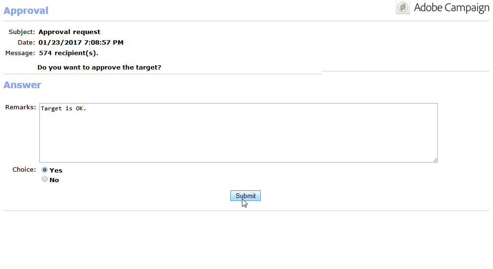

# Lokale Validierung{#local-approval}

Im Rahmen eines Zielgruppen-Workflows ermöglicht die Aktivität **[!UICONTROL Lokale Validierung]** die Formalisierung eines Validierungsprozesses, der die Überprüfung der ausgewählten Empfänger vor Absendung der Kampagne sicherstellt.

>[!CAUTION]
>
>Zur Verwendung dieser Funktion benötigen Sie das Modul Distributed Marketing (Campaign-Option). Bitte prüfen Sie Ihren Lizenzvertrag.

Ein Beispiel für die Aktivität **[!UICONTROL Lokale Validierung]** mit einer Verteilungsvorlage finden Sie unter [Lokale Validierung verwenden](local-approval-activity.md).

Benennen Sie zunächst die Aktivität und kreuzen Sie die **[!UICONTROL Auszuführende Aktion]** an:

* Wählen Sie die Option **[!UICONTROL Benachrichtigung zur Zielgruppenvalidierung]**, um die Verantwortlichen der Lokalstellen zur Validierung ihrer jeweiligen Empfängerliste aufzufordern.

* **Inkrementelle Abfrage**: erlaubt es, eine Abfrage auszuführen und deren Ausführung zu planen. Siehe Abschnitt [Inkrementelle Abfrage](incremental-query.md).

   

## Benachrichtigung zur Zielgruppenvalidierung {#target-approval-notification}

Bei Verwendung dieser Option ist die Aktivität **[!UICONTROL Lokale Validierung]** im Anschluss an die Zielgruppenbestimmung und vor der Versandaktivität zu platzieren:

In diesem Fall sind folgende Felder zu konfigurieren:

* **[!UICONTROL Verteilungskontext]**: Kreuzen sie **[!UICONTROL Wird von der Transition angegeben]** an, wenn Sie die Zielpopulation durch eine **[!UICONTROL Aufspaltung]** begrenzen. In diesem Fall wird die Verteilungsvorlage in der Aufspaltungsaktivität angegeben. Wenn die Population nicht begrenzt werden soll, ist die Option **[!UICONTROL Explizit]** anzukreuzen. Geben Sie dann im Feld **[!UICONTROL Datenverteilung]** die gewünschte Vorlage an.

   Weitere Informationen zum Erstellen einer Datenverteilungsvorlage finden Sie unter [Anzahl an Datensätzen in Teilmengen durch Datenverteilung begrenzen](split.md#limiting-the-number-of-subset-records-per-data-distribution).

* **[!UICONTROL Validierungsverwaltung:]**

   * Geben Sie die Versandvorlage und den Betreff der Benachrichtigungs-E-Mail an. Sie können die Standardvorlage **[!UICONTROL Benachrichtigung bezüglich der Zielgruppenvalidierung]** oder eine benutzerdefinierte Vorlage verwenden. Wenn Sie eine Beschreibung angeben, wird diese oberhalb der Empfängerlisten in den Benachrichtigungen oder im Versandreaktionen-Bericht angezeigt.
   * Geben Sie den **[!UICONTROL Validierungstyp]** an, d. h. die Validierungsdeadline (Datum oder Abstand vom Unterbreitungsdatum). Zum angegebenen Zeitpunkt wird die Ausführung des Workflows fortgesetzt. Nicht validierte Empfänger werden von der Zielgruppe ausgeschlossen. Nach Absendung der Benachrichtigungen wechselt die Aktivität in den Wartezustand bis die Lokalstellen-Verantwortlichen die Empfänger validiert haben oder der Validierungszeitraum abgelaufen ist.

      >[!NOTE]
      >
      >Wenn nicht anders angegeben, wartet die Aktivität drei Tage.

      Klicken Sie auf **[!UICONTROL Erinnerung hinzufügen]**, um die Validierungsverantwortlichen vor Ablauf der Frist zu erinnern.

* **[!UICONTROL Komplement]**: Kreuzen Sie die Option **[!UICONTROL Komplement erzeugen]** an, um eine zweite Ergebnismenge mit allen nicht validierten Empfängern zu erzeugen.

   >[!NOTE]
   >
   >Standardmäßig ist diese Option deaktiviert.

## Versandreaktionen-Bericht {#delivery-feedback-report}

In diesem Fall wird die **[!UICONTROL Lokale Validierung]** im Anschluss an die Versandaktion platziert:

Folgende Angaben sind erforderlich:

* Kreuzen Sie die Option **[!UICONTROL Wird durch die Transition angegeben]** an, wenn der Versand in einer vorangehenden Aktivität konfiguriert wurde. Kreuzen Sie andernfalls **[!UICONTROL Explizit]** an und konfigurieren Sie den Versand direkt in der Validierungsaktivität.
* Geben Sie die Versandvorlage und den Betreff der Benachrichtigungs-E-Mail-an. Sie können die Standardvorlage **[!UICONTROL Benachrichtigung bezüglich der Zielgruppenvalidierung]** oder eine benutzerdefinierte Vorlage verwenden.

## Beispiel: Workflow-Versand validieren {#example--approving-a-workflow-delivery}

Dieses Beispiel zeigt, wie Sie einen Validierungsprozess für einen Workflow-Versand einrichten. Weitere Informationen zum Erstellen von Versand-Workflows finden Sie im Abschnitt [Beispiel: Versand-Workflow](delivery.md#example--delivery-workflow).

Dem Benutzer bieten sich zwei verschiedene Möglichkeiten, um einen Versand zu validieren. Dies kann entweder per Webzugriff unter Verwendung des in der Benachrichtigung enthaltenen Links oder direkt in der Clientkonsole geschehen.

* Validierung über Webzugriff

   Die an die zuvor gewählte Benutzergruppe gesandte Benachrichtigung ermöglicht die Validierung der Versandzielgruppe. Die Benachrichtigung enthält den in der Vorlage definierten Text, wobei der JavaScript-Ausdruck durch den berechneten Wert (hier &#39;574&#39;) ersetzt wird.

   Klicken Sie zur Validierung auf den entsprechenden Link in der Benachrichtigung und verbinden Sie sich mit der Adobe-Campaign-Konsole.

   

   Kreuzen Sie die gewünschte Antwort an und klicken Sie auf **[!UICONTROL Unterbreiten]**.

   

* Validierung in der Clientkonsole

   Im Navigationsbaum enthält der Knoten **[!UICONTROL Administration > Betreibung > Automatisch erstellte Objekte > Ausstehende Validierungen]** die Liste der vom aktuellen Benutzer zu validierenden Aufgaben. Doppelklicken Sie auf die entsprechende Zeile, um die Validierung vorzunehmen.

**** Kreuzen Sie die gewünschte Antwort an und klicken Sie auf **[!UICONTROL Validieren]**. Ein Pop-up bestätigt Ihnen, dass die Antwort gespeichert wurde.

Wenn Sie nach einigen Sekunden zum Workflow-Diagramm zurückkehren, stellt es sich wie folgt dar:

Der Workflow hat die Aufgabe **[!UICONTROL Versand bearbeiten]** ausgeführt, d. h. der zuvor erstellte Versand wurde gestartet, und der Workflow wurde erfolgreich abgeschlossen.
