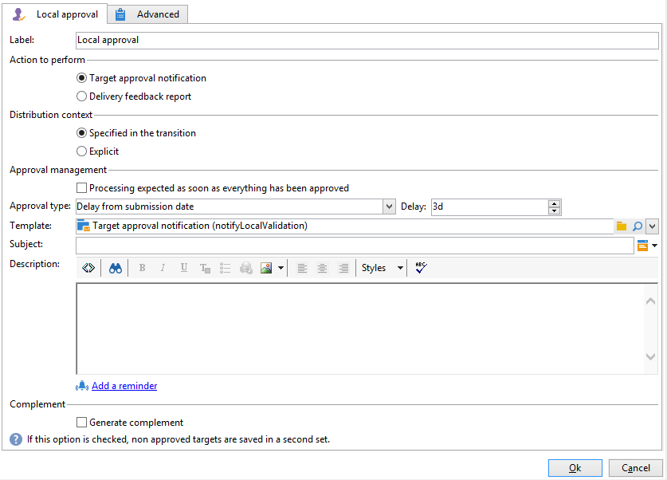
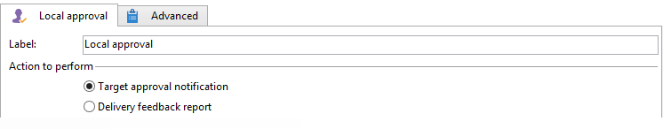
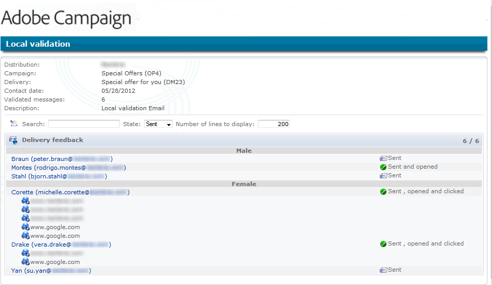
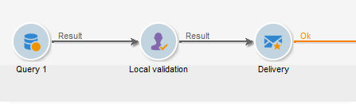
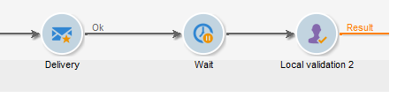
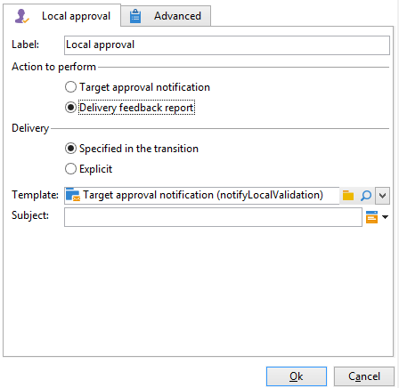
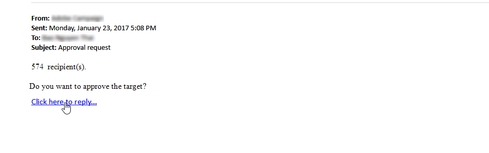
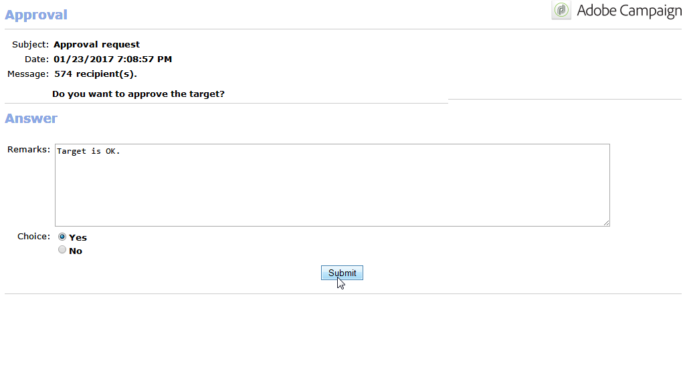
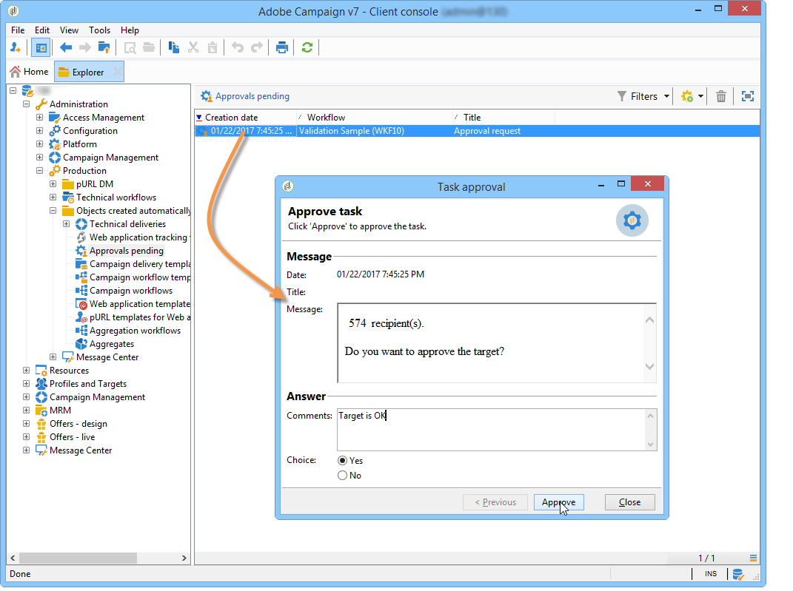
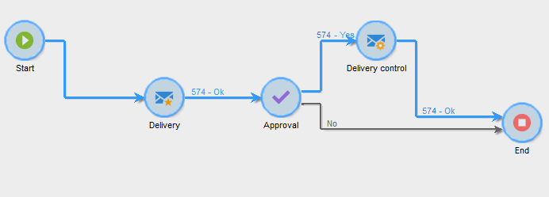

# Lokale Validierung{#local-approval}

Im Rahmen eines Zielgruppen-Workflows ermöglicht die Aktivität **[!UICONTROL Lokale Validierung]** die Formalisierung eines Validierungsprozesses, der die Überprüfung der ausgewählten Empfänger vor Absendung der Kampagne sicherstellt.

>[!CAUTION]
>
>Um diese Aktivität verwenden zu können, müssen Sie das Modul Dezentrales Marketing erworben haben, bei dem es sich um eine Campaign-Option handelt. Prüfen Sie diesbezüglich Ihren Lizenzvertrag.

Ein Beispiel für die Aktivität **[!UICONTROL Lokale Validierung]** mit einer Verteilungsvorlage finden Sie unter [Lokale Validierung verwenden](local-approval-activity.md).

Benennen Sie zunächst die Aktivität und kreuzen Sie die **[!UICONTROL Auszuführende Aktion]** an:

* Wählen Sie die Option **[!UICONTROL Benachrichtigung zur Zielgruppenvalidierung]**, um die Verantwortlichen der Lokalstellen zur Validierung ihrer jeweiligen Empfängerliste aufzufordern.

* **Inkrementelle Abfrage**: erlaubt es, eine Abfrage auszuführen und deren Ausführung zu planen. Siehe Abschnitt [Inkrementelle Abfrage](incremental-query.md).

  

## Benachrichtigung zur Zielgruppenvalidierung {#target-approval-notification}

Bei Verwendung dieser Option ist die Aktivität **[!UICONTROL Lokale Validierung]** im Anschluss an die Zielgruppenbestimmung und vor der Versandaktivität zu platzieren:

In diesem Fall sind folgende Felder zu konfigurieren:

* **[!UICONTROL Verteilungskontext]**: Wählen Sie die Option **[!UICONTROL In der Transition angegeben]**, wenn Sie eine **[!UICONTROL vom Typ]** verwenden, um die Zielpopulation zu begrenzen. In diesem Fall wird die Verteilungsvorlage in die Aufspaltungsaktivität eingegeben. Wenn Sie die Zielpopulation nicht begrenzt möchten, wählen Sie die Option **[!UICONTROL Explizit]** aus und geben Sie im Feld **[!UICONTROL Datenverteilung]** die Verteilungsvorlage an.

  Weitere Informationen zum Erstellen einer Datenverteilungsvorlage finden Sie unter [Anzahl an Datensätzen in Teilmengen durch Datenverteilung begrenzen](split.md#limiting-the-number-of-subset-records-per-data-distribution).

* **[!UICONTROL Validierungsverwaltung:]**

   * Wählen Sie die Versandvorlage und den Betreff für die E-Mail-Benachrichtigung aus. Eine Standardvorlage ist verfügbar: **[!UICONTROL Benachrichtigung bezüglich lokaler Validierungen]**. Sie können auch eine Beschreibung hinzufügen, die oberhalb der Empfängerlisten in den Validierungs- und Feedback-Benachrichtigungen erscheint.
   * Geben Sie den **[!UICONTROL Genehmigungstyp]** an, der der Genehmigungsfrist (Datum oder Frist ab Beginn der Genehmigung) entspricht. An diesem Datum wird der Workflow erneut gestartet und die nicht genehmigten Empfängerinnen und Empfänger werden bei der Zielgruppenbestimmung nicht berücksichtigt. Nachdem die Benachrichtigungen gesendet wurden, wird die Aktivität in die Warteschlange gestellt, damit die lokalen Supervisoren ihre Kontakte genehmigen können.

     >[!NOTE]
     >
     >Wenn nicht anders angegeben, wartet die Aktivität drei Tage.

     Sie können auch eine oder mehrere Erinnerungen hinzufügen, um die lokalen Validierungsverantwortlichen vor Ablauf der Frist zu erinnern. Klicken Sie dazu auf den Link **[!UICONTROL Erinnerung hinzufügen]**.

* **[!UICONTROL Komplement]**: Aktivieren Sie die Option **[!UICONTROL Komplement erzeugen]**, um eine zweite Ergebnismenge mit allen nicht validierten Empfängern zu erzeugen.

  >[!NOTE]
  >
  >Standardmäßig ist diese Option deaktiviert.

## Feedback-Bericht {#delivery-feedback-report}

In diesem Fall wird die **[!UICONTROL Lokale Validierung]** im Anschluss an die Versandaktion platziert:

Folgende Angaben sind erforderlich:

* Wählen Sie die Option **[!UICONTROL In der Transition angegeben]** aus, wenn der Versand in einer vorangehenden Aktivität eingegeben wurde. Wählen Sie **[!UICONTROL Explizit]** aus, um den Versand in der lokalen Validierungsaktivität anzugeben.
* Wählen Sie die Versandvorlage und den Betreff der Benachrichtigungs-E-Mail aus. Es gibt eine Standardvorlage: **[!UICONTROL Benachrichtigung bezüglich lokaler Validierungen]**.

## Beispiel: Workflow-Versand validieren {#example--approving-a-workflow-delivery}

Dieses Beispiel zeigt, wie Sie einen Validierungsprozess für einen Workflow-Versand einrichten. Weitere Informationen zum Erstellen von Versand-Workflows finden Sie im Abschnitt [Beispiel: Versand-Workflow](delivery.md#example--delivery-workflow).

Der Benutzerin bzw. dem Benutzer bieten sich zwei verschiedene Möglichkeiten, um einen Versand zu genehmigen: entweder über die in der E-Mail-Nachricht verlinkte Web-Seite oder über die Client-Konsole.

* Validierung über Webzugriff

  Die an Benutzer der Administratorgruppe gesendete E-Mail ermöglicht die Validierung der Versandzielgruppe. Die Nachricht verwendet den definierten Text, und der JavaScript-Ausdruck wird durch den berechneten Wert ersetzt (in diesem Fall „574„)

  Um den Versand zu genehmigen, klicken Sie auf den entsprechenden Link und melden sich bei der Adobe Campaign-Client-Konsole an.

  

  Kreuzen Sie die gewünschte Antwort an und klicken Sie auf **[!UICONTROL Unterbreiten]**.

  

* Genehmigung über die Client-Konsole

  In der Verzeichnisstruktur enthält der Knoten **[!UICONTROL Administration > Produktion > Automatisch erstellte Objekte > Ausstehende Genehmigungen]** die Liste der Aufgaben, die vom derzeit verbundenen Benutzer genehmigt werden müssen. Die Liste sollte eine Zeile anzeigen. Doppelklicken Sie auf diese Zeile, um zu antworten. Das folgende Fenster wird angezeigt:

Wählen Sie **Ja** und klicken Sie dann auf **[!UICONTROL Genehmigen]**. Eine Meldung informiert Sie darüber, dass die Antwort aufgezeichnet wurde.

Wenn Sie nach einigen Sekunden zum Workflow-Diagramm zurückkehren, stellt es sich wie folgt dar:

Der Workflow hat die Aufgabe **[!UICONTROL Versandkontrolle]** ausgeführt, was in diesem Fall den Start des zuvor erstellten Versands bedeutet. Der Workflow wurde fehlerfrei abgeschlossen.
