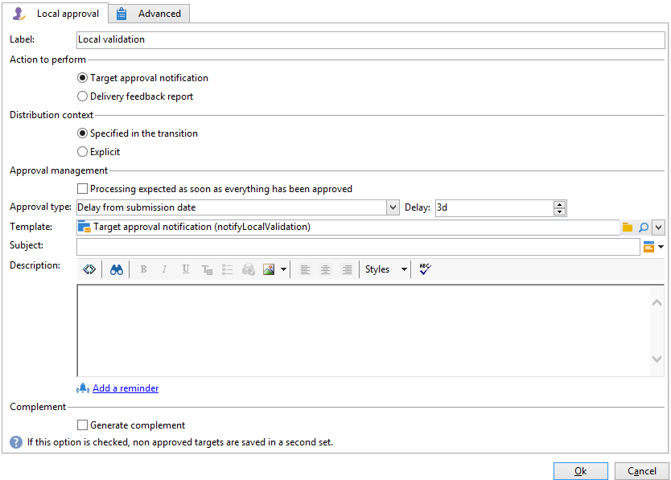

# Lokale Validierung{#local-approval}

Im Rahmen eines Zielgruppen-Workflows ermöglicht die Aktivität **[!UICONTROL Lokale Validierung]** die Formalisierung eines Validierungsprozesses, der die Überprüfung der ausgewählten Empfänger vor Absendung der Kampagne sicherstellt.

>[!CAUTION]
>
>Zur Verwendung dieser Funktion benötigen Sie das Modul Distributed Marketing (Campaign-Option). Bitte prüfen Sie Ihren Lizenzvertrag.

Ein Beispiel für die Aktivität **[!UICONTROL Lokale Validierung]** mit einer Verteilungsvorlage finden Sie unter [Lokale Validierung verwenden](local-approval-activity.md).

Benennen Sie zunächst die Aktivität und kreuzen Sie die **[!UICONTROL Auszuführende Aktion]** an:

* Wählen Sie die Option **[!UICONTROL Benachrichtigung zur Zielgruppenvalidierung]**, um die Verantwortlichen der Lokalstellen zur Validierung ihrer jeweiligen Empfängerliste aufzufordern.

* **Inkrementelle Abfrage**: erlaubt es, eine Abfrage auszuführen und deren Ausführung zu planen. Siehe Abschnitt [Inkrementelle Abfrage](incremental-query.md).

  

## Benachrichtigung zur Zielgruppenvalidierung {#target-approval-notification}

Bei Verwendung dieser Option ist die Aktivität **[!UICONTROL Lokale Validierung]** im Anschluss an die Zielgruppenbestimmung und vor der Versandaktivität zu platzieren:

In diesem Fall sind folgende Felder zu konfigurieren:

* **[!UICONTROL Verteilungskontext]**: Wählen Sie die **[!UICONTROL Wird durch die Transition angegeben]** -Option, wenn Sie eine **[!UICONTROL Aufspaltung]** Aktivität vom Typ zur Begrenzung der Zielpopulation. In diesem Fall wird die Verteilungsvorlage in die Aufspaltungsaktivität eingegeben. Wenn Sie die Zielpopulation nicht einschränken, wählen Sie die **[!UICONTROL Explizit]** und geben Sie die Verteilungsvorlage im **[!UICONTROL Datenverteilung]** -Feld.

  Weitere Informationen zum Erstellen einer Datenverteilungsvorlage finden Sie unter [Anzahl an Datensätzen in Teilmengen durch Datenverteilung begrenzen](split.md#limiting-the-number-of-subset-records-per-data-distribution).

* **[!UICONTROL Validierungsverwaltung:]**

   * Wählen Sie die Versandvorlage und den Betreff für die E-Mail-Benachrichtigung aus. Eine Standardvorlage ist verfügbar: **[!UICONTROL Benachrichtigung bezüglich lokaler Validierungen]**. Sie können auch eine Beschreibung hinzufügen, die oberhalb der Empfängerlisten in den Validierungs- und Feedback-Benachrichtigungen erscheint.
   * Geben Sie den **[!UICONTROL Validierungstyp]** an, d. h. die Validierungsdeadline (Datum oder Abstand vom Unterbreitungsdatum). Zum angegebenen Zeitpunkt wird die Ausführung des Workflows fortgesetzt. Nicht validierte Empfänger werden von der Zielgruppe ausgeschlossen. Nach Absendung der Benachrichtigungen wechselt die Aktivität in den Wartezustand bis die Lokalstellen-Verantwortlichen die Empfänger validiert haben oder der Validierungszeitraum abgelaufen ist.

     >[!NOTE]
     >
     >Wenn nicht anders angegeben, wartet die Aktivität drei Tage.

     Sie können auch eine oder mehrere Erinnerungen hinzufügen, um die lokalen Aufsichtsbehörden darüber zu informieren, dass der Termin näher rückt. Klicken Sie dazu auf die Schaltfläche **[!UICONTROL Erinnerung hinzufügen]** -Link.

* **[!UICONTROL Komplement]**: Kreuzen Sie die Option **[!UICONTROL Komplement erzeugen]** an, um eine zweite Ergebnismenge mit allen nicht validierten Empfängern zu erzeugen.

  >[!NOTE]
  >
  >Standardmäßig ist diese Option deaktiviert.

## Versandreaktionen-Bericht {#delivery-feedback-report}

In diesem Fall wird die **[!UICONTROL Lokale Validierung]** im Anschluss an die Versandaktion platziert:

Folgende Angaben sind erforderlich:

* Wählen Sie die **[!UICONTROL Wird durch die Transition angegeben]** Option, wenn der Versand in einer vorangehenden Aktivität eingegeben wurde. Auswählen **[!UICONTROL Explizit]** um den Versand in der lokalen Validierungsaktivität anzugeben.
* Wählen Sie die Versandvorlage und das Objekt der Benachrichtigungs-E-Mail aus. Es gibt eine Standardvorlage: **[!UICONTROL Benachrichtigung bezüglich lokaler Validierungen]**.

## Beispiel: Workflow-Versand validieren {#example--approving-a-workflow-delivery}

Dieses Beispiel zeigt, wie Sie einen Validierungsprozess für einen Workflow-Versand einrichten. Weitere Informationen zum Erstellen von Versand-Workflows finden Sie im Abschnitt [Beispiel: Versand-Workflow](delivery.md#example--delivery-workflow).

Der Benutzer kann einen Versand auf zwei Arten validieren: über die in der E-Mail-Nachricht enthaltene Webseite oder über die Clientkonsole.

* Validierung über Webzugriff

  Die an die zuvor gewählte Benutzergruppe gesandte Benachrichtigung ermöglicht die Validierung der Versandzielgruppe. Die Benachrichtigung enthält den in der Vorlage definierten Text, wobei der JavaScript-Ausdruck durch den berechneten Wert (hier &#39;574&#39;) ersetzt wird.

  Klicken Sie zur Validierung des Versands auf den entsprechenden Link und melden Sie sich bei der Adobe Campaign-Clientkonsole an.

  

  Kreuzen Sie die gewünschte Antwort an und klicken Sie auf **[!UICONTROL Absenden]**.

  

* Validierung über die Clientkonsole

  Im Navigationsbaum enthält der Knoten **[!UICONTROL Administration > Betreibung > Automatisch erstellte Objekte > Ausstehende Validierungen]** die Liste der vom aktuellen Benutzer zu validierenden Aufgaben. Doppelklicken Sie auf die entsprechende Zeile, um die Validierung vorzunehmen.

**** Kreuzen Sie die gewünschte Antwort an und klicken Sie auf **[!UICONTROL Validieren]**. Ein Pop-up bestätigt Ihnen, dass die Antwort gespeichert wurde.

Wenn Sie nach einigen Sekunden zum Workflow-Diagramm zurückkehren, stellt es sich wie folgt dar:

Der Workflow hat die Aufgabe **[!UICONTROL Versand bearbeiten]** ausgeführt, d. h. der zuvor erstellte Versand wurde gestartet, und der Workflow wurde erfolgreich abgeschlossen.
