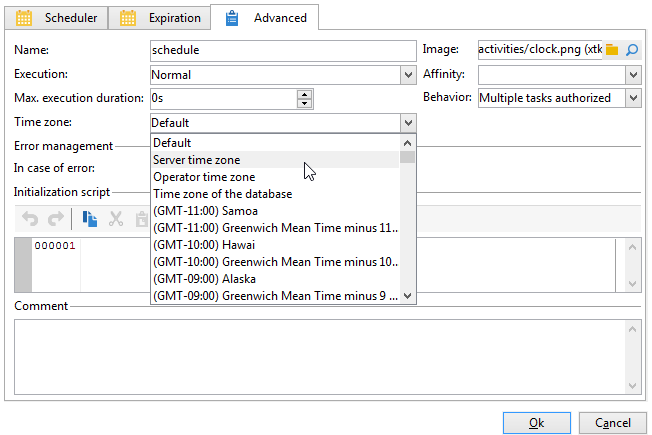

# Verwalten von Zeitzonen{#managing-time-zones}

Mit Adobe Campaign können Sie Zeitverzögerungen zwischen verschiedenen Ländern verwalten, die von derselben Instanz betroffen sind. Die angewendete Konfiguration wird während der Instanzerstellung konfiguriert.

In einem Workflow können Sie die Ausführungspläne der Aktivitäten anpassen und eine bestimmte Zeitzone mit einer Aktivität oder dem gesamten Workflow verknüpfen. Diese Konfiguration kann beim Importieren der Datei oder im Rahmen der Versandplanung nützlich sein.

## Ausführung planen {#execution-scheduling}

Sie können die Ausführung von Aufgaben mit der Planung planen (siehe [Planung](scheduler.md)). Alternativ können Sie die Planungsoptionen verwenden, die in den Aktivitäten verfügbar sind, die diese Funktion bieten. Diese Aktivitäten bieten einen Tab namens **[!UICONTROL Planung]**: **[!UICONTROL Datei-Wächter]**, **[!UICONTROL Dateiversand]**, **[!UICONTROL HTTP-Übertragung]**, **[!UICONTROL E-Mail-Empfang]** und **[!UICONTROL SMS]** usw.

Für alle geplanten Aufgaben, d. h. für alle Aktivitäten mit Planungsoptionen, können Sie die anzuwendende Zeitzone auswählen. Die Zeitzone wird über die Registerkarte **[!UICONTROL Erweitert]** der betreffenden Aktivität ausgewählt:

Mögliche Werte:

* Server-Zeitzone

  Verwendet die Zeitzone des Adobe Campaign-Anwendungs-Servers.

* Benutzer-Zeitzone

  Verwendet die Zeitzone des Adobe Campaign-Benutzers, der die Ausführung des Workflows startet.

* Zeitzone der Datenbank

  Verwendet die Zeitzone des Datenbankservers.

* Bestimmte Zeitzonen

  Verwendet die ausgewählte Zeitzone.

Bei Auswahl der Option **[!UICONTROL Standard]** wird die Zeitzone des Workflows oder, wenn nicht vorhanden, des Anwendungs-Servers verwendet.

## Aktivitäten eine Zeitzone zuweisen {#linking-a-time-zone-to-an-activity}

Auf **[!UICONTROL Registerkarte]** Erweitert“ der Workflow-Aktivitäten können Sie die Zeitzone auswählen. Obwohl die Zeitzone des Workflows meistens ausreicht, kann es erforderlich sein, sie gelegentlich für eine bestimmte Aktivität zu überschreiben, z. B. beim Datenimport, um Datumsangaben mit der richtigen Zeitzone zu verknüpfen.
