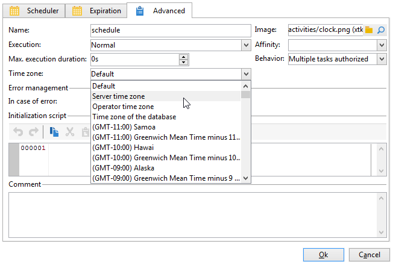

# Verwalten von Zeitzonen{#managing-time-zones}

Adobe Campaign ist in der Lage, verschiedene Zeitzonen innerhalb einer Instanz zu verwalten. Die verwendeten Zeitzonen werden bei der Instanzerstellung konfiguriert.

Weiterführende Informationen zur Zeitzonenkonfiguration in Adobe Campaign finden Sie hier:

In einem Workflow besteht nicht nur die Möglichkeit, die Ausführung einzelner Aktivitäten zu terminieren, sondern auch dem ganzen Workflow oder einzelnen Aktivitäten eine Zeitzone zuzuordnen. Dies kann insbesondere beim Dateiimport oder im Zuge der Versandauslösung von Nutzen sein.

## Ausführung planen {#execution-scheduling}

Sie können die Ausführung von Aufgaben mit der Planung planen (siehe [Planung](scheduler.md)). Alternativ können Sie die Planungsoptionen verwenden, die in den Aktivitäten verfügbar sind, die diese Funktion bieten. Diese Aktivitäten bieten einen Tab namens **[!UICONTROL Planung]**: **[!UICONTROL Datei-Wächter]**, **[!UICONTROL Dateiversand]**, **[!UICONTROL HTTP-Übertragung]**, **[!UICONTROL E-Mail-Empfang]** und **[!UICONTROL SMS]** usw.

Öffnen Sie zur Zeitzonenauswahl die gewünschte Aktivität und geben Sie im entsprechenden Feld des **[!UICONTROL Erweitert]**-Tabs die Zeitzone an:

Mögliche Werte:

* Server-Zeitzone

   Verwendet die Zeitzone des Adobe-Campaign-Anwendungsservers.

* Benutzer-Zeitzone

   Verwendet die Zeitzone des Adobe-Campaign-Benutzers, der die Ausführung des Workflows startet.

* Zeitzone der Datenbank

   Verwendet die Zeitzone des Datenbankservers.

* Bestimmte Zeitzonen

   Verwendet die ausgewählte Zeitzone.

Bei Auswahl der Option **[!UICONTROL Standard]** wird die Zeitzone des Workflows oder, wenn nicht vorhanden, des Anwendungsservers verwendet.

## Aktivitäten eine Zeitzone zuweisen {#linking-a-time-zone-to-an-activity}

Im Tab **[!UICONTROL Erweitert]** der Workflow-Aktivitäten besteht die Möglichkeit, die Zeitzone anzugeben. I. d. R. reicht es aus, dem gesamten Workflow eine Zeitzone zuzuweisen. Punktuell kann es jedoch interessant sein, sie für eine bestimmte Aktivität zu überschreiben, beispielsweise beim Datenimport, um den enthaltenen Datumsangaben die entsprechende Zeitzone zuzuordnen.
