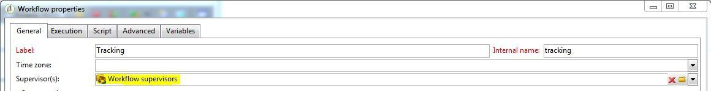

# Überwachen technischer Workflows {#monitoring-technical-workflows}

Technische Workflows müssen überwacht werden und bei einer Störung müssen Maßnahmen ergriffen werden.

## Instanz-Monitoring-Dashboard {#instance-monitoring-dashboard}

Auf das Instanz-Monitoring-Dashboard können Sie über den Tab **[!UICONTROL Monitoring]** zugreifen.

Prüfen Sie unter &quot;System Indicators&quot; und &quot;core files&quot;, ob Indikatoren rot hervorgehoben sind. Gehen Sie in diesem Fall folgendermaßen vor:

* Prüfen Sie, ob die erforderlichen Prozesse immer aktiv sind.
* Vergewissern Sie sich, dass keiner der Prozesse veraltet ist.
* Vergewissern Sie sich, dass die Protokolldateien der Prozesse keine Alarm auslösenden und wiederkehrenden Fehler aufweisen.

## Technische Workflows {#technical-workflows}

Technische Workflows finden Sie unter **[!UICONTROL Administration]** > **[!UICONTROL Betreibung]** > **[!UICONTROL Technische Workflows]**.

Folgen Sie je nach technischem Workflow den unten beschriebenen Schritten, um ein reibungsloses Funktionieren zu gewährleisten.

In diesem [Abschnitt](technical-workflows.md) erfahren Sie, was jeder technische Workflow bewirkt.

Für **[!UICONTROL Datenbankbereinigungs-Workflow (&#39;cleanup&#39;)]**:

Vergewissern Sie sich im Protokoll, dass die verstrichene Zeit auch langfristig ungefähr konstant bleibt und andere Workflows nicht stört.

Für **[!UICONTROL Tracking-Workflow (&#39;tracking&#39;)]**:

Vergewissern Sie sich, dass der Tracking-Workflow plangemäß ausgeführt wird (standardmäßig jede Stunde) und im Protokoll keine wiederkehrenden Fehler aufgezeigt werden. Weiterführende Informationen hierzu finden Sie in diesem [Abschnitt](delivery.md).

Für **[!UICONTROL Aktualisierung der Zustellbarkeit (&#39;deliverabilityUpdate&#39;)]**:

1. Vergewissern Sie sich, dass der Workflow **[!UICONTROL Zustellbarkeitsaktualisierung]** täglich ausgeführt und erfolgreich abgeschlossen wird.
1. Prüfen Sie im Protokoll, ob die Regeln regelmäßig aktualisiert werden.

**[!UICONTROL Kampagnenprozesse (&#39;operationMgt&#39;, &#39;deliveryMgt‘ etc.)]**:

1. Sehen Sie sich die Workflows im Ordner **[!UICONTROL Kampagnenprozesse]** an. Weiterführende Informationen hierzu finden Sie auf dieser [Seite](technical-workflows.md).
1. Vergewissern Sie sich, dass die Workflows plangemäß ausgeführt werden und im Protokoll keine wiederkehrenden Fehler aufgezeigt werden.

## Workflow-Supervision {#workflow-supervision}

In der Gruppe **[!UICONTROL Workflow-Supervisoren]** sollten Benutzer enthalten sein, die von Fehlschlägen informiert werden müssen und umgehend Abhilfemaßnahmen setzen können.

Wenn ein Problem auftritt, sollte eine Warnung erzeugt und an die entsprechende Benutzergruppe gesendet werden.

Vergewissern Sie sich, dass für jeden Benutzer eine gültige E-Mail-Adresse angegeben ist.

Jeder Workflow, der ausgeführt werden sollte, damit die Plattform funktioniert, z. B. tägliche Datenimporte, sollte als &quot;Produktion&quot; deklariert (Kontrollkästchen) und fett gedruckt angezeigt werden.

## Workflow-Wartungsliste {#workflow-maintenance-list}

Alle benutzerdefinierten technischen Workflows sollten in einem Arbeitsblatt mit folgenden Angaben dokumentiert werden:

* Name und Ort des Workflows
* Zweck
* Zeitplan und Abhängigkeiten
* Verantwortlicher für die Überwachung
* Maßnahmen beim Auftreten eines Problems

## Planung und Automatisierung der Überwachung {#planning-and-automation-of-monitoring}

Durch die Planung der Workflow-Überwachung kann die Überwachung effizienter gestaltet werden. Manche Aufgaben müssen täglich ausgeführt werden, während andere wöchentlich oder monatlich erfolgen.

Die Überwachung kann möglichst effizient gestaltet werden, indem Workflows in Ordnern angeordnet werden, die nach der wiederkehrenden Aufgabe benannt und nach dem Ausführungszeitpunkt sortiert sind.

Durch die Automatisierung der Überwachung können Kosten für Ressourcen eingespart und Aufgaben in geeigneten Intervallen geplant werden.

Sie können einen Monitoring-Workflow einrichten, der eine E-Mail sendet, wenn gewisse Aufgaben fehlschlagen oder eine kritische Tabelle zu groß wird.

Sie können eine Ansicht erstellen, in der alle Workflows eines funktionellen Bereichs oder im gesamten System überwacht werden können.

Sie können auch die Vorgangs- oder Berichtsfunktion von Adobe Campaign verwenden, um nach Bedarf eine Dokumentation zu erstellen, die immer auf dem aktuellen Stand ist.
