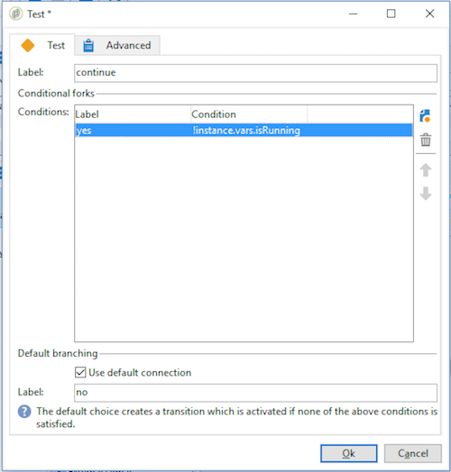

# Überwachen der Workflow-Ausführung {#monitoring-workflow-execution}


Dieser Abschnitt enthält Informationen zur Überwachung der Ausführung Ihrer Workflows.

Ein Anwendungsbeispiel zum Erstellen eines Workflows, mit dem Sie den Status einer Reihe von Workflows überwachen können, die „ausgesetzt“, „angehalten“ oder „Mit Fehlern“ sind, finden Sie zudem in [diesem Abschnitt](workflow-supervision.md#supervising-workflows).

Darüber hinaus können Administratoren der Instanz das **Audit-Protokoll** verwenden, um Aktivitäten und letzte Änderungen an Workflows und somit den Zustand Ihrer Workflows zu überprüfen. Weitere Informationen hierzu finden Sie im Abschnitt  .

Weitere Möglichkeiten zur Überwachung der verschiedenen Campaign-Prozesse finden Sie in .

## Fortschritt anzeigen {#displaying-progress}

Die Ausführung des Workflows kann am Bildschirm verfolgt werden.

Wenn Sie auf das Symbol **[!UICONTROL Fortschritt anzeigen]** klicken, werden Workflow-Ausführung, -Status und Ergebnis der Aktivitäten am Bildschirm dargestellt.


In diesem Fall erscheinen laufende Aktivitäten in Blau, wartende Aktivitäten blinken und Warnhinweise und Fehler werden in Orange bzw. Rot angezeigt. Des Weiteren werden auf den ausgehenden Transitionen die Ergebnisse der Aktivitäten eingeblendet, gefolgt vom in der Aktivität definierten Ergebnistitel sowie der Ausführungsdauer, wenn sie mehr als eine Sekunde beträgt.


## Protokoll anzeigen {#displaying-logs}

Das Protokoll enthält den Verlauf der Workflow-Ausführung. Es speichert die von den Benutzern angeforderten Befehle, ausgeführte Vorgänge und aufgetretene Fehler. Sie haben die Möglichkeit:

* im Tab **[!UICONTROL Verfolgung]** das Workflow-Protokoll einzusehen.

   

* die Protokollnachrichten nach Aktivität zu filtern. Klicken Sie hierzu in der Symbolleiste oberhalb des Diagramms auf die Schaltfläche **[!UICONTROL Aufgaben und Protokoll anzeigen]**. Unter dem Diagramm erscheinen nun die Tabs **[!UICONTROL Protokoll]** und **[!UICONTROL Aufgaben]**. Markieren Sie eine Aktivität, um alle sie betreffenden Nachrichten anzuzeigen. Wenn keine Aktivität markiert wurde, werden alle Nachrichten angezeigt.

   

   >[!NOTE]
   >
   >Durch Klick in den Diagrammhintergrund werden alle Markierungen entfernt.

* Um nur Nachrichten anzuzeigen, die eine bestimmte Aufgabe betreffen, gehen Sie in den Tab **[!UICONTROL Aufgaben]**, und klicken Sie auf eine Aktivität des Diagramms. Auf diese Weise wird die Liste auf die Nachrichten zu einer bestimmten Aktivität begrenzt. Durch Doppelklick auf eine Aufgabe werden alle Informationen angezeigt. Der letzte Tab des Fensters enthält das Protokoll.

   

   Die **[!UICONTROL Details...]** -Schaltfläche können Sie alle zusätzlichen Informationen zur Ausführung einer Aktivität anzeigen. Beispielsweise können Sie den validierenden Benutzer und gegebenenfalls den Kommentar einsehen, den er bei der Validierung eingegeben hat.

>[!NOTE]
>
>Das Protokoll wird bei einem Neustart des Workflows nicht bereinigt. Alle Nachrichten werden beibehalten. Sollten Sie die Nachrichten einer früheren Ausführung nicht beibehalten wollen, müssen Sie den Verlauf bereinigen.

Die Nachrichten bezüglich der Ausführung der Workflow-Aktivitäten werden im Protokoll in chronologischer Reihenfolge aufgelistet.

* Protokoll einer Zielgruppenbestimmung

   Klicken Sie nach einer Zielgruppenbestimmung auf den Tab **[!UICONTROL Verfolgung]**, um die einzelnen Schritte der Ausführung nachzuvollziehen.

   

   Alle Vorgänge, Warnhinweise und Fehler werden protokolliert.

* Protokoll einer Aktivität

   Auch die Ausführung von Aktivitäten wird detailliert protokolliert. Sie haben zwei Möglichkeiten, die Nachrichten einzusehen:

   1. Markieren Sie die gewünschte Aktivität und klicken Sie auf die Schaltfläche **[!UICONTROL Aufgaben und Protokoll anzeigen]**.

      

      Unter dem Diagramm erscheinen nun die Tabs Protokoll und Aufgaben.

      Die Markierung einer Aktivität im Diagramm arbeitet wie ein Filter in Bezug auf das Protokoll und die Aufgabenliste.

      

   1. Klicken Sie mit der rechten Maustaste auf die gewünschte Aktivität und wählen Sie die Option **[!UICONTROL Protokoll anzeigen]**.

      

      Das Protokoll öffnet sich in einem separaten Fenster.

## Verläufe bereinigen {#purging-the-logs}

Workflow-Verläufe werden nicht automatisch bereinigt; alle Nachrichten werden standardmäßig beibehalten. Gehen Sie zur Bereinigung in **[!UICONTROL Datei > Aktionen]** oder klicken Sie auf die Schaltfläche **[!UICONTROL Aktionen]** in der Symbolleiste oberhalb der Workflow-Liste und wählen Sie die Option **[!UICONTROL Verlauf bereinigen]**. Die im Menü **[!UICONTROL Aktionen]** verfügbaren Optionen werden im Abschnitt [Aktionen-Symbolleiste](start-a-workflow.md) beschrieben.


## Arbeitstabellen und Workflow-Schemata {#worktables-and-workflow-schema}

Workflows verwenden diverse Arbeitstabellen, die mithilfe bestimmter Aktivitäten bearbeitet werden können. Adobe Campaign bietet über Data-Management-Aktivitäten die Möglichkeit, Spalten aus Workflow-Arbeitstabellen umzuwandeln, umzubenennen oder anzureichern. Auf diese Weise können beispielsweise Nomenklaturen angepasst oder zusätzliche Informationen erhoben werden.

Es ist des Weiteren möglich, Relationen zwischen verschiedenen Arbeitsdimensionen herzustellen und Dimensionswechsel zu definieren. So können Sie beispielsweise festlegen, dass Kommunikationen an den Beitragszahler einer Police gerichtet werden, dabei aber die Daten des Mitversicherten in den Zusatzinformationen zu berücksichtigen sind.

Die Arbeitstabellen des Workflows werden automatisch gelöscht, wenn der Workflow passiviert. Wenn Sie eine Arbeitstabelle beibehalten möchten, speichern Sie sie über die Aktivität **[!UICONTROL Listen-Update]** in einer Liste (siehe [Listen-Update](list-update.md)).

## Fehler beheben {#managing-errors}

Wenn ein Fehler auftritt, wird der Workflow ausgesetzt und die bei Fehlerauftritt ausgeführte Aktivität blinkt rot. In der Workflow-Übersicht können Sie über den Link **[!UICONTROL Workflows]** im Tab **[!UICONTROL Monitoring]** wie unten dargestellt nur Workflows mit Fehlern anzeigen.


Im Explorer enthält die Listenansicht der Workflows standardmäßig die Spalte **[!UICONTROL Fehlgeschlagen]**.


Wenn ein Workflow aufgrund von Fehlern ausgesetzt wird, werden der oder die mit dem Workflow-Monitoring betrauten Benutzer per E-Mail benachrichtigt, vorrausgesetzt ihre E-Mail-Adresse ist im Benutzerprofil gespeichert. Die zu benachrichtigende Benutzergruppe wird im Feld **[!UICONTROL Supervisor(en)]** der Workflow-Eigenschaften ausgewählt.


Der Benachrichtigungsinhalt wird in der Standardvorlage **[!UICONTROL Benachrichtigung des Workflow-Verantwortlichen]** konfiguriert, welche im Tab **[!UICONTROL Ausführung]** der Workflow-Eigenschaften ausgewählt werden kann. Die Benachrichtigung enthält den Namen des fehlgeschlagenen Workflows und die vom Fehler betroffene Aufgabe.

Beispiel einer Benachrichtigung:


Über den enthaltenen Link wird der Benutzer direkt per Webzugriff auf die Adobe-Campaign-Konsole weitergeleitet. Nach Anmeldung kann er dann den fehlgeschlagenen Workflow bearbeiten.


Es besteht die Möglichkeit, das Aussetzen des Workflows im Falle von Fehlern zu vermeiden und die sich anschließenden Aufgaben wie geplant auszuführen. Öffnen Sie hierzu die Workflow-**[!UICONTROL Eigenschaften]** und wählen Sie im Bereich **[!UICONTROL Umgang mit Fehlern]** des Ausführungs-Tabs im Feld **[!UICONTROL Bei Fehler]** die Option **[!UICONTROL Ignorieren]** aus der Dropdown-Liste aus. Geben Sie dann die maximale Anzahl an aufeinanderfolgenden Fehlern an, die ignoriert werden dürfen, bevor der Workflow ausgesetzt wird.

In diesem Fall wird die fehlerhafte Aufgabe abgebrochen. Dieser Modus ist insbesondere bei Workflows mit wiederkehrenden Vorgängen angebracht.


>[!NOTE]
>
>Es besteht die Möglichkeit, diese Vorgehensweise innerhalb eines Workflows nur für bestimmte Aktivitäten zu konfigurieren. Gehen Sie hierzu in die Eigenschaften der entsprechenden Aktivität und wählen Sie im **[!UICONTROL Erweitert]**-Tab den gewünschten Umgang mit Fehlern aus.

Weiterführende Informationen zur Fehlerbehebung bei der Ausführung von Workflows finden Sie im Abschnitt .

## Fehler verarbeiten {#processing-errors}

Auf Aktivitätsniveau erscheint im Falle von Fehlern eine zusätzliche Transition, wenn die Option **[!UICONTROL Fehler verarbeiten]** aktiviert wurde. Auf diese Weise wird der Workflow nicht ausgesetzt, sondern bis zum Ende ausgeführt.

Dies gilt für Fehler des Dateisystems (Datei kann nicht verschoben werden, Zugriff auf das Verzeichnis nicht möglich usw.).

Fehler, die aus der Konfiguration der Aktivität resultieren, d. h. ungültige Werte (z. B. inexistentes Verzeichnis), aktivieren die zusätzliche Transition nicht.

Die Ausführung eines - manuell oder aufgrund eines Fehlers - ausgesetzten Workflows kann mithilfe der Schaltfläche **[!UICONTROL Starten]** dort wieder aufgenommen werden, wo sie unterbrochen wurde. Die fehlerhafte oder ausgesetzte Aktivität wird erneut ausgeführt, nicht jedoch die vorangehenden Aktivitäten.

Verwenden Sie die Schaltfläche **[!UICONTROL Neu starten]**, um alle Workflow-Aktivitäten erneut auszuführen.

Änderungen an bereits ausgeführten Aktivitäten werden somit nicht berücksichtigt, wenn die Workflow-Ausführung wiederaufgenommen wird.

Änderungen an noch nicht ausgeführten Aktivitäten werden jedoch berücksichtigt, wenn die Workflow-Ausführung wiederaufgenommen wird.

Änderungen an der ausgesetzten Aktivität werden bei der Wiederaufnahme der Workflow-Ausführung unter Umständen nicht korrekt berücksichtigt.

Es wird daher empfohlen, die Workflow-Ausführung nach Änderungen komplett neu zu starten.

## Instanz-Monitoring {#instance-supervision}

Die Seite **[!UICONTROL Instanz-Monitoring]** bietet die Möglichkeit, den Adobe Campaign-Server zu überwachen. Sie enthält die Liste fehlgeschlagener Workflows und Sendungen.

Auf diese Seite können Sie über den Tab **[!UICONTROL Monitoring]** zugreifen. Klicken Sie auf die Schaltfläche **[!UICONTROL Übersicht]**.


Um nur die fehlgeschlagenen Workflows anzuzeigen, klicken Sie auf die Schaltfläche **[!UICONTROL Workflows]** und wählen Sie aus der Dropdown-Liste den Status aus.


Durch Klick auf den Namen eines Workflows öffnet sich dieser und Sie können das Protokoll einsehen.


## Mehrere gleichzeitige Ausführungen verhindern {#preventing-simultaneous-multiple-executions}

Ein einzelner Workflow kann mehrere gleichzeitig ablaufende Ausführungen enthalten. In manchen Situationen sollte dies verhindert werden.

Beispielsweise könnte die Workflow-Ausführung stündlich ausgelöst werden, manchmal aber länger als eine Stunde dauern. Wenn der Workflow bereits ausgeführt wird, ist es empfehlenswert, den Start einer weiteren Ausführung zu überspringen.

Wenn vor dem Beginn eines Workflows eine Signalaktivität erfolgt und der Workflow bereits läuft, sollte das Signal übersprungen werden.

Allgemein gilt:


In dieser Situation wird eine Instanzvariable verwendet, die für alle parallelen Ausführungen von Workflows gültig ist.

Hier ist ein einfacher Test-Workflow:


Die **[!UICONTROL Planung]** löst jede Minute ein Ereignis aus. Mit der folgenden **[!UICONTROL Test]**-Aktivität wird die Instanzvariable **isRunning** getestet, um zu entscheiden, ob die Ausführung fortgesetzt werden soll oder nicht:



>[!NOTE]
>
>**isRunning** ist eine für dieses Beispiel ausgewählte Variable, und keine integrierte Variable.

In der Aktivität, die unmittelbar auf **[!UICONTROL Test]** im Zweig **yes** folgt, muss die Instanzvariable im **Initialisierungsscript** auf true gesetzt werden:

```
instance.vars.isRunning = true
```

In der letzten Aktivität im Zweig **yes** muss die Variable in im **Initialisierungsscript** wieder auf false gesetzt werden:

```
instance.vars.isRunning = false
```

Bitte beachten Sie Folgendes:

* Den aktuellen Wert der Instanzvariable können Sie im Tab **Variablen** im Workflow **Eigenschaften** prüfen.
* Beim erneuten Start eines Workflows werden die Instanzvariablen zurückgesetzt.
* In JavaScript ist ein nicht definierter Wert in einem Test auf false gesetzt. Dadurch kann die Instanzvariable noch vor ihrer Initialisierung geprüft werden.
* Sie können die aufgrund dieses Mechanismus nicht verarbeiteten Aktivitäten überwachten, indem Sie dem Initialisierungsscript des &quot;Nein&quot;-Zweigs eine Protokollierungsanweisung hinzufügen.

   ```
   logInfo("Workflow already running, parallel execution not allowed.");
   ```

Im Abschnitt [Datenaktualisierungen koordinieren](coordinate-data-updates.md) wird ein Anwendungsbeispiel vorgestellt.

## Wartung der Datenbank {#database-maintenance}

Workflows verwenden zahlreiche Arbeitstabellen, die Speicherplatz belegen und die gesamte Plattform verlangsamen, wenn sie nicht gewartet werden. Weiterführende Informationen zur Datenbankwartung finden Sie in diesem .

Der Workflow **Datenbankbereinigung**, auf den Sie über den Knoten **Administration > Produktion > Technische Workflows** zugreifen können, ermöglicht das Löschen veralteter Daten, um das exponentielle Anwachsen der Datenbank zu verhindern. Der Workflow wird automatisch ohne das Eingreifen des Benutzers ausgelöst. Siehe  .

Sie können auch spezifische technische Workflows erstellen, um unnötige Daten zu bereinigen, die Speicherplatz belegen. Siehe und dies [Abschnitt](#purging-the-logs).

## Ausgesetzte Workflows handhaben {#handling-of-paused-workflows}

Die Arbeitstabellen ausgesetzter Workflows werden standardmäßig nie bereinigt. Ab Build 8880 werden Workflows, die zu lange in einem ausgesetzten Zustand angehalten werden, automatisch gestoppt und deren Arbeitstabellen bereinigt. Dieses Verhalten wird wie folgt ausgelöst:

* Sind Workflows länger als sieben Tage ausgesetzt, erscheint ein Warnhinweis im Monitoring-Dashboard (und in der Monitoring-API) und eine Benachrichtigung wird an die Supervisoren-Gruppe gesendet.
* Dasselbe passiert jede Woche, wenn der technische Workflow **[!UICONTROL cleanupPausedWorkflows]** ausgelöst wird. Weiterführende Informationen dazu finden Sie in [diesem Abschnitt](delivery.md).
* Nach vier Benachrichtigungen (d. h. standardmäßig nach einem Monat im ausgesetzten Zustand) wird der Workflow bedingungslos gestoppt. Ein Protokoll wird im Workflow angezeigt, nachdem er angehalten wurde. Die Tabellen werden bei der nächsten Ausführung des Workflows **[!UICONTROL Bereinigung]** bereinigt

Diese Zeiträume können mit der Option NmsServer_PausedWorkflowPeriod konfiguriert werden.

Die Supervisoren des Workflows sowie der Ersteller und der letzte Benutzer, der den Workflow modifiziert hat, werden benachrichtigt. Administratoren erhalten keine Benachrichtigung.

## Filtern von Workflows nach ihrem Status{#filtering-workflows-status}

Mit der Oberfläche von Campaign Classic können Sie den Ausführungsstatus aller Workflows in Ihrer Instanz mithilfe vordefinierter **Ansichten** überwachen. Um auf diese Ansichten zuzugreifen, öffnen Sie den Knoten **[!UICONTROL Administration]** / **[!UICONTROL Verfolgung]** / **[!UICONTROL Status des Workflows]**.

Folgende Ansichten stehen zur Verfügung:

* **[!UICONTROL Wird ausgeführt]**: listet alle ausgeführten Workflows auf.
* **[!UICONTROL Ausgesetzt]**: listet alle ausgesetzten Workflows auf.
* **[!UICONTROL Fehlgeschlagen]**: listet alle fehlgeschlagenen Workflows auf.
* ** ).


Standardmäßig sind diese Ansichten im Ordner **[!UICONTROL Verfolgung]** aufrufbar. Sie können sie jedoch an einer Stelle Ihrer Wahl in der Ordnerstruktur neu erstellen. Auf diese Weise sind sie für Standardbenutzer ohne Administratorrechte verfügbar.

Gehen Sie dazu wie folgt vor:

1. Klicken Sie mit der rechten Maustaste auf den Ordner, in dem Sie die Ansicht hinzufügen möchten.
1. Wählen Sie unter **[!UICONTROL Ordner hinzufügen]** / **[!UICONTROL Administration]** die Ansicht aus, die Sie hinzufügen möchten.
1. Nachdem der Ordner zum Baum hinzugefügt wurde, stellen Sie sicher, dass Sie ihn als Ansicht konfigurieren, damit alle Workflows unabhängig vom Ursprungsordner angezeigt werden. Weiterführende Informationen zur Konfiguration von Ansichten finden Sie im Abschnitt .

Zusätzlich zu diesen Ansichten können Sie Filterordner einrichten, mit denen Sie die Liste der Workflows nach ihrem Ausführungsstatus filtern können. Gehen Sie dazu wie folgt vor:

1. Rufen Sie einen Ordner vom Typ „Workflow“ auf und wählen Sie dann das Menü **[!UICONTROL Filter]** / **[!UICONTROL Erweiterter Filter]**.
1. Konfigurieren Sie den Filter so, dass das Feld **[!UICONTROL @status]** des Workflows dem Status Ihrer Wahl entspricht.
1. Speichern und benennen Sie den Filter. Er ist dann direkt in der Filterliste verfügbar.


Weitere Informationen finden Sie in den folgenden Abschnitten: