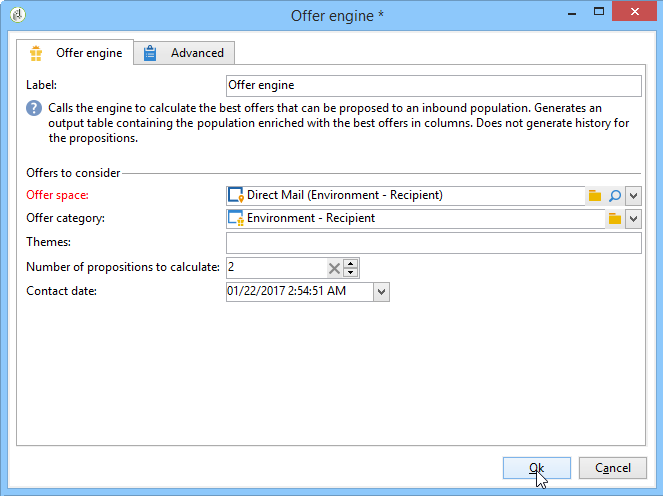

# Angebotsmodul{#offer-engine}

Die Aktivität **[!UICONTROL Angebotsmodul]** ermöglicht den Aufruf des Interaction-Angebotsmoduls im Vorfeld eines Versands.

Das Prinzip dieser Aktivität entspricht dem der Anreicherung. Auch hier werden die Daten der Eingangspopulation mit einem vom Modul berechneten Angebot angereichert, bevor die eigentliche Versandaktivität startet.

Erstellen Sie zunächst Ihre Zielbestimmungsabfrage (siehe diesen [Abschnitt](query.md)). Gehen Sie dann wie folgt vor:

1. Platzieren Sie im Anschluss an die Abfrage ein **[!UICONTROL Angebotsmodul]** und öffnen Sie es zur weiteren Bearbeitung.
1. Konfigurieren Sie die verschiedenen Parameter der Abfrage des Angebotsmoduls (Platzierung, Kategorie oder Themen, Kontaktdatum, Anzahl beizubehaltender Angebote). Das Modul berechnet automatisch die den Parametern entsprechenden Angebote.

   >[!CAUTION]
   >
   >Wenn Sie diese Aktivität nutzen, werden nur die im Versand verwendeten Vorschläge gespeichert.

   

1. Konfigurieren Sie dann eine Versandaktivität, die dem von Ihnen gewählten Kanal entspricht. Siehe [Kanalübergreifender Versand](cross-channel-deliveries.md).
