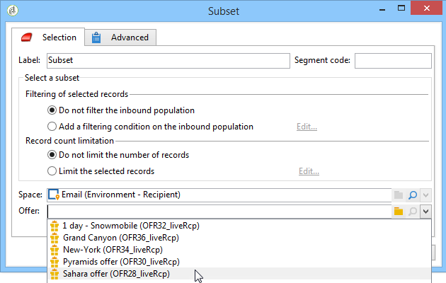

# Angebote pro Segment{#offers-by-cell}

Mithilfe der Aktivität **[!UICONTROL Angebote pro Segment]** lässt sich die eingehende Population (die beispielsweise aus einer Abfrage hervorgeht) in mehrere Zielgruppen aufspalten, um so je Segment spezifische Angebote zu unterbreiten.

Diese Aktivität kann nur mit **Interaktion** verwendet werden. Weitere Informationen zur Angebotsverwaltung finden Sie in [diesem Abschnitt](../../v8/interaction/interaction.md).

Gehen Sie dazu wie folgt vor:

1. Platzieren Sie im Anschluss an die Abfrage der Zielpopulation eine Aktivität **[!UICONTROL Angebote pro Segment]** und öffnen Sie sie zur weiteren Bearbeitung.
1. Wählen Sie auf der Registerkarte **[!UICONTROL Allgemein]** die Platzierung, über die Sie Angebote unterbreiten möchten.
1. Definieren Sie nun auf der Registerkarte **[!UICONTROL Segmente]** über die Schaltfläche **[!UICONTROL Hinzufügen]** die verschiedenen Segmente:

   * Konfigurieren Sie anhand der verfügbaren Filter und Begrenzungen die Population des Segments.
   * Wählen Sie als Nächstes das Angebot aus, das Sie der Untergruppe unterbreiten möchten. Die verfügbaren Angebote sind diejenigen, die für die Platzierung infrage kommen, die im vorherigen Schritt ausgewählt wurde.

     

1. Konfigurieren Sie dann eine Versandaktivität, die dem von Ihnen gewählten Kanal entspricht. Siehe [Kanalübergreifender Versand](cross-channel-deliveries.md).
