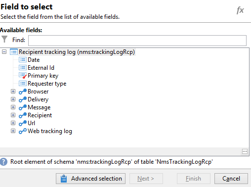
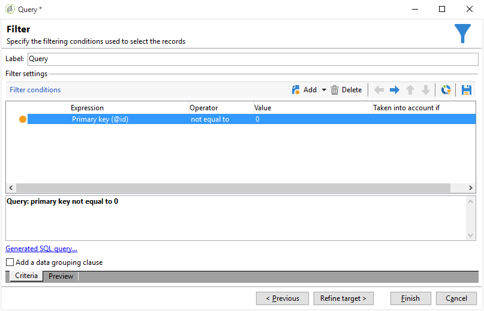

# Abfragen von Informationen zum Versand {#querying-delivery-information}

## Anzahl der Klicks für einen bestimmten Versand {#number-of-clicks-for-a-specific-delivery}

In diesem Beispiel wird die Anzahl der Klicks von Empfängern in einem bestimmten Zeitraum gesucht. Die Klicks werden in den Trackinglogs der Empfänger gespeichert. Letztere werden über die E-Mail-Adresse identifiziert. Diese Abfrage basiert auf der Tabelle **[!UICONTROL Trackinglogs der Empfänger]**.

* Welche Tabelle soll ausgewählt werden?

   Die Trackinglogs der Empfänger (**[!UICONTROL nms:trackingLogRcp]**)

* Felder, die als Ausgabespalten verwendet werden sollen?

   Primärschlüssel (mit Zählung) und E-Mail

* Nach welchen Kriterien werden die Informationen gefiltert?

   Nach einem Zeitraum und einem Element im Versandtitel

Gehen Sie für dieses Beispiel wie folgt vor:

1. Öffnen Sie das **[!UICONTROL generische Abfragetool]** und wählen Sie das Schema **[!UICONTROL Trackinglogs der Empfänger]** aus.

   

1. Erstellen Sie im Fenster **[!UICONTROL Zu extrahierende Daten]** ein Aggregat, um die gesuchten Informationen zu sammeln. Hierzu wird das Feld **[!UICONTROL Primärschlüssel]** benötigt, da die Zählung der Trackinglogs auf diesem Feld basiert. Der entsprechende Ausdruck lautet **[!UICONTROL x=count(Primärschlüssel)]**. Er dient der Zuordnung der verschiedenen Trackinglogs zu einer E-Mail-Adresse.****

   Gehen Sie dazu wie folgt vor:

   * Verwenden Sie die Schaltfläche **[!UICONTROL Hinzufügen]** rechts neben den **[!UICONTROL Ausgabespalten]**. Wählen Sie im Fenster **[!UICONTROL Formeltyp]** die Option **[!UICONTROL Formel von einem Ausdruck ausgehend erstellen]** und danach **[!UICONTROL Weiter]** aus. Verwenden Sie im Fenster **[!UICONTROL Feldauswahl]** die Option **[!UICONTROL Erweiterte Auswahl]**.

      

   * Verwenden Sie im Fenster **[!UICONTROL Formeltyp]** eine Aggregatfunktion. In diesem Fall ist das die Zählung des Primärschlüssels.

      Wählen Sie im Abschnitt **[!UICONTROL Aggregat]** die Option **[!UICONTROL Aggregatfunktionen]** und klicken Sie auf **[!UICONTROL Zählung]**.

      

      Klicken Sie auf **[!UICONTROL Weiter]**.

   * Wählen Sie nun das Feld **[!UICONTROL Primärschlüssel (@id)]** aus. Die Ausgabespalte **[!UICONTROL count(Primärschlüssel)]** wurde konfiguriert.

      

1. Öffnen Sie zur Auswahl der zweiten Ausgabespalte in der Liste **[!UICONTROL Verfügbare Felder]** den Knoten **[!UICONTROL Empfänger (recipient)]** und doppelklicken Sie auf **[!UICONTROL E-Mail (@email)]**. Kreuzen Sie in der Spalte **[!UICONTROL Gruppieren]** das Feld **[!UICONTROL Ja]** an, um die Trackinglogs über die E-Mail-Adresse zu gruppieren. Dies führt zur Zuordnung eines jeden Trackinglogs zum entsprechenden Empfänger.

   

1. Konfigurieren Sie die Listenanzeige, indem Sie in der Spalte **[!UICONTROL Absteigende Sortierung]** der Zeile count(Primärschlüssel) auf **[!UICONTROL Ja]** klicken.

   

1. Im folgenden Schritt können Sie die Abfrageergebnisse weiter einschränken und beispielsweise aus allen Logs jene herausfiltern, die unter 15 Tage alt sind und deren Sendungen sich auf eine Gartenausstellung beziehen.

   Gehen Sie dazu wie folgt vor:

   * Konfigurieren Sie einen Datenfilter. Wählen Sie dazu **[!UICONTROL Filterbedingungen]** und danach **[!UICONTROL Weiter]** aus.

      

   * Drei Filterbedingungen sind erforderlich, um die Ergebnisse wie gewünscht einzuschränken: zwei Datumsfilter zur Eingrenzung des Zeitraums zwischen 15 Tagen vor dem aktuellen Datum und 1 Tag vor dem aktuellen Datum sowie eine weitere Bedingung, um nur Logs bezüglich bestimmter Sendungen zu erfassen.

      Konfigurieren Sie im Fenster **[!UICONTROL Zielelement]** das Datum, ab dem die Trackinglogs berücksichtigt werden sollen. Klicken Sie auf **[!UICONTROL Hinzufügen]**, um eine neue Zeile zur Eingabe einer Bedingung anzuzeigen. Klicken Sie im Feld **[!UICONTROL Ausdruck]** auf die Schaltfläche **[!UICONTROL Ausdruck bearbeiten]**. Wählen Sie im Fenster **[!UICONTROL Feldauswahl]** das Feld **[!UICONTROL Datum (@logDate)]**.

      

      Wählen Sie den Operator **[!UICONTROL später als]** und klicken Sie im Feld **[!UICONTROL Wert]** auf **[!UICONTROL Ausdruck bearbeiten]**. Wählen Sie im **[!UICONTROL Formeltyp]**-Fenster **[!UICONTROL Datumsfunktionen]** aus und geben Sie in der Option **[!UICONTROL Aktuelles Datum abzüglich n Tage]** den Wert &quot;15&quot; ein.

      Klicken Sie auf **[!UICONTROL Beenden]**.

      

   * Zur Suche nach dem Enddatum der gewünschten Trackingperiode ist eine weitere Bedingungszeile erforderlich. Klicken Sie daher erneut auf **[!UICONTROL Hinzufügen]** und wählen Sie im Feld **[!UICONTROL Ausdruck]** wieder **[!UICONTROL Datum (@logDate)]**.

      Wählen Sie den Operator **[!UICONTROL früher als]** und klicken Sie im Feld **[!UICONTROL Wert]** auf die Schaltfläche **[!UICONTROL Ausdruck bearbeiten]**. Wählen Sie im **[!UICONTROL Formeltyp]**-Fenster **[!UICONTROL Datumsfunktionen]** aus und geben Sie in der Option Aktuelles Datum abzüglich n Tage den Wert &quot;1&quot; ein.

      Klicken Sie auf **[!UICONTROL Beenden]**.

      

      Der gewünschte Zeitraum wurde konfiguriert. In der dritten Filterbedingung gilt es, nur einen bestimmten Versand zu berücksichtigen.

   * Klicken Sie auf **[!UICONTROL Hinzufügen]**, um eine dritte Bedingungszeile zu öffnen. Klicken Sie im Feld **[!UICONTROL Ausdruck]** auf **[!UICONTROL Ausdruck bearbeiten]** und wählen Sie im Fenster **[!UICONTROL Feldauswahl]** im Knoten **[!UICONTROL Versand]** das Feld **[!UICONTROL Titel]** aus.

      Klicken Sie auf **[!UICONTROL Beenden]**.

      

      Gesucht wird ein Versand zum Thema &quot;Gartenausstellung&quot;. Wählen Sie den Operator **[!UICONTROL enthält]** und geben Sie im Feld **[!UICONTROL Wert]** &quot;Garten&quot; ein, wenn Sie sich nicht an den genauen Versandtitel erinnern können.

      

1. Da in unserem Beispiel keine spezielle Formatierung erforderlich ist, können Sie im Fenster **[!UICONTROL Datenformatierung]** direkt auf **[!UICONTROL Weiter]** klicken.
1. Klicken Sie nun im **[!UICONTROL Datenvorschau]**-Fenster auf **[!UICONTROL Datenvorschau starten]**, um die Anzahl an Trackinglogs für jeden Versandempfänger abzurufen.

   Die Trackinglogs werden wie gewünscht in absteigender Reihenfolge angezeigt.

   

   Die höchste Loganzahl für einen Benutzer beträgt bei diesem Versand 8. 20 verschiedene Benutzer haben die E-Mail dieses Versands geöffnet oder auf einen Link geklickt.

## Empfänger, die keine Nachricht geöffnet haben {#recipients-who-did-not-open-any-delivery}

In diesem Beispiel möchten wir Empfänger herausfiltern, die in den letzten sieben Tagen keine E-Mail geöffnet haben.

Gehen Sie wie folgt vor:

1. Ziehen Sie eine **[!UICONTROL Abfrage]** in den Workflow-Arbeitsbereich und öffnen Sie sie.
1. Wählen Sie **[!UICONTROL Abfrage bearbeiten]** aus und wählen Sie für die Zielgruppen- und Filterdimension die Option **[!UICONTROL Empfänger]** aus.

   

1. Wählen Sie **[!UICONTROL Filterbedingungen]** und danach **[!UICONTROL Weiter]** aus.
1. Verwenden Sie die Schaltfläche **[!UICONTROL Hinzufügen]** und wählen Sie **[!UICONTROL Trackinglogs]** aus.
1. Wählen Sie für den **[!UICONTROL Operator]** des **[!UICONTROL Trackinglogs]**-Ausdrucks **[!UICONTROL Nicht wie]** aus.

   

1. Fügen Sie einen weiteren Ausdruck hinzu. Wählen Sie in der **[!UICONTROL URL]**-Kategorie die Option **[!UICONTROL Typ]** aus.
1. Wählen Sie dann für den **[!UICONTROL Operator]** die Option **[!UICONTROL Gleich]** und für den **[!UICONTROL Wert]** die Option **[!UICONTROL Offen]** aus.

   

1. Fügen Sie einen weiteren Ausdruck hinzu und wählen Sie **[!UICONTROL Datum]** aus. Der **[!UICONTROL Operator]** sollte **[!UICONTROL Später als]** sein.

   

1. Um als Wert die letzten sieben Tage festzulegen, wählen Sie im Feld **[!UICONTROL Wert]** die Schaltfläche **[!UICONTROL Ausdruck bearbeiten]** aus.
1. Wählen Sie in der Kategorie **[!UICONTROL Funktion]** die Option **[!UICONTROL Aktuelles Datum abzüglich n Tage]** aus und fügen Sie die gewünschte Anzahl der Tage ein. In unserem Fall sind das die letzten sieben Tage.

   

Ihre ausgehende Transition wird Empfänger enthalten, die in den letzten sieben Tagen keine E-Mail geöffnet haben.

Wenn Sie hingegen Empfänger filtern möchten, die mindestens eine E-Mail geöffnet haben, sollte Ihre Abfrage wie folgt lauten. Beachten Sie, dass in diesem Fall die **[!UICONTROL Filterdimension]** auf **[!UICONTROL Trackinglogs (Empfänger)]** gesetzt werden sollte.

## Empfänger, die einen Versand geöffnet haben {#recipients-who-have-opened-a-delivery}

Im folgenden Beispiel erfahren Sie, wie Sie alle Profile auswählen können, die in den vergangenen zwei Wochen einen Versand geöffnet haben.

1. Verwenden Sie Trackinglogs, um Empfänger auszuwählen, die einen Versand geöffnet haben. Trackinglogs werden in einer verknüpften Tabelle gespeichert. Wählen Sie wie unten dargestellt die entsprechende Tabelle aus der Dropdown-Liste der **[!UICONTROL Filterdimension]** aus:

   

1. Wählen Sie aus der Liste der Einschränkungsfilter die Filterbedingungen aus und klicken Sie auf die Schaltfläche **[!UICONTROL Ausdruck bearbeiten]**. Markieren Sie nun im Knoten der Trackinglogs das Feld **[!UICONTROL Datum]**.

   

   Klicken Sie auf **[!UICONTROL Beenden]**, um die Auswahl zu bestätigen.

   Um nur die Trackinglogs der letzten 14 Tage abzurufen, müssen Sie den Operator **[!UICONTROL Größer als]** wählen.

   

   Klicken Sie in der **[!UICONTROL Wert]**-Spalte wiederum auf **[!UICONTROL Ausdruck bearbeiten]**, um die Formel zur Datumsberechnung zu definieren. Kreuzen Sie die Option **[!UICONTROL Aktuelles Datum abzüglich n Tage]** an und geben Sie 15 ein.

   

   Klicken Sie auf **[!UICONTROL Beenden]**, um die Formel zu bestätigen, und im Abfragefenster auf **[!UICONTROL Vorschau]**, um die Liste der ausgewählten Empfänger zu prüfen.

   

## Verhalten der Empfänger nach einem Versand filtern {#filtering-recipients--behavior-folllowing-a-delivery}

In einem Workflow ermöglichen die Aktivitäten **[!UICONTROL Abfrage]** und **[!UICONTROL Aufspaltung]** die Auswahl eines Verhaltens, das auf einen früheren Versand folgt. Diese Auswahl erfolgt mithilfe des Filters **[!UICONTROL Versandempfänger]**.

* Ziel des Beispiels

   In einem Versand-Workflow gibt es mehrere Möglichkeiten des weiteren Vorgehens nach einem ersten E-Mail-Kontakt. Diese werden über die Aktivität **[!UICONTROL Aufspaltung]** gesteuert.

* Kontext

   Ein Versand zum Thema &quot;Sommersport-Angebote&quot;. Vier Tage nach dem Versand werden zwei weitere Sendungen geschaltet: &quot;Wassersport-Angebote&quot; und ein Erinnerungsschreiben bezüglich des ersten Sommersport-Angebots.

   Der Versand &quot;Wassersport-Angebote&quot; richtet sich an Empfänger, die in der ersten E-Mail auf Inhalte zum Thema Wassersport geklickt haben. Diese Klicks zeugen vom Interesse der Empfänger. Ähnliche Angebote könnten daher ebenfalls für diese Interessenten infrage kommen. Empfänger hingegen, die die &quot;Sommersport-Angebote&quot;-E-Mail nicht angeklickt haben, bekommen dieselben Angebote wie zuvor.

Die folgenden Schritte zeigen die Konfiguration der **[!UICONTROL Aufspaltung]** unter Berücksichtigung von zwei Verhaltensmustern:

1. Ziehen Sie die Aktivität **[!UICONTROL Aufspaltung]** in den Workflow. Sie steuert die Zuordnung der Empfänger des ersten Versands zu einer der zwei folgenden Sendungen. Dies geschieht in Abhängigkeit vom Verhalten der Empfänger infolge des ersten Versands.

   

1. Öffnen Sie nun die Aktivität **[!UICONTROL Aufspaltung]**. Geben Sie im Tab **[!UICONTROL Allgemein]** einen Titel ein, z. B. &quot;**Aufspaltung nach Verhalten**&quot;.

   

1. Konfigurieren Sie im Tab **[!UICONTROL Teilmengen]** die erste Verzweigung der Aufspaltung. Nennen Sie diesen Zweig beispielsweise &quot;**Haben geklickt**&quot;.
1. Kreuzen Sie die Option **[!UICONTROL Filterbedingung für die Eingangspopulation hinzufügen]** an und klicken Sie auf **[!UICONTROL Bearbeiten]**.
1. Doppelklicken Sie im Fenster **[!UICONTROL Zielgruppen- und Filterdimension]** auf den Filter **[!UICONTROL Versandempfänger]**.

   

1. Wählen Sie im **[!UICONTROL Zielelement]**-Fenster das auf diesen Zweig zutreffende Verhalten: **[!UICONTROL Empfänger, die geklickt haben (E-Mail)]**.

   Kreuzen Sie unterhalb die Option **[!UICONTROL Von der Transition festgelegter Versand]** an. Hierdurch werden automatisch alle vom ersten Versand angesprochenen Empfänger abgerufen.

   Die Empfänger dieses Zweigs bekommen also den Versand &quot;Wassersport-Angebote&quot;.

   

1. Klicken Sie jetzt im Tab **[!UICONTROL Teilmengen]** auf **[!UICONTROL Hinzufügen]**, um den zweiten Zweig zu erstellen. Die Empfänger dieses Zweigs werden die E-Mail mit der Erinnerung und dem gleichen Inhalt wie der erste Versand erhalten.

   

1. Unten im Fenster erscheint ein neuer Tab. Benennen Sie ihn z. B. &quot;**Haben nicht geklickt**&quot;.
1. Kreuzen Sie die Option **[!UICONTROL Filterbedingung für die Eingangspopulation hinzufügen]** an und klicken Sie auf **[!UICONTROL Bearbeiten...]**.

   

1. Doppelklicken Sie im Fenster **[!UICONTROL Zielgruppen- und Filterdimension]** auf den Filter **[!UICONTROL Versandempfänger]**.
1. Wählen Sie im **[!UICONTROL Zielelement]**-Fenster das auf diesen Zweig zutreffende Verhalten: **[!UICONTROL Empfänger, die nicht geklickt haben (E-Mail)]**. Kreuzen Sie wie für den ersten Zweig die Option **[!UICONTROL Von der Transition festgelegter Versand]** an.

   Die Konfiguration der **[!UICONTROL Aufspaltung]** ist abgeschlossen.

   

Folgende Empfängerverhalten wurden standardmäßig in der Anwendung hinterlegt:

* **[!UICONTROL Alle Empfänger,]**
* **[!UICONTROL Empfänger, denen die Nachricht erfolgreich zugestellt wurde,]**
* **[!UICONTROL Empfänger, die geöffnet oder geklickt haben (E-Mail),]**
* **[!UICONTROL Empfänger, die geklickt haben (E-Mail),]**
* **[!UICONTROL Empfänger, denen die Nachricht nicht zugestellt werden konnte,]**
* **[!UICONTROL Empfänger, die weder geöffnet noch geklickt haben (E-Mail),]**
* **[!UICONTROL Empfänger, die nicht geklickt haben (E-Mail).]**

   
